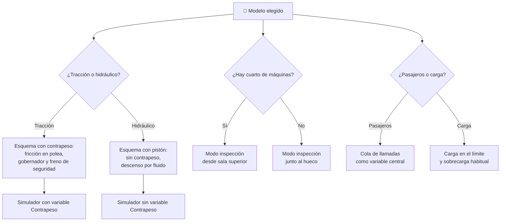

# 🧩 Modelos y variantes del ascensor

[🏠 Inicio](../../../README.md) · [🛗 Curso: Ascensores](../README.md) · 🧩 Modelos

El [Módulo 2](../operacion/caracteristicas-ascensor.md) ya dijo qué tipos de
ascensor existen y para qué sirve cada uno. Este módulo responde a otra cosa:
**no todos se manejan igual**, y esa diferencia no es de matiz. Cambia qué
mandos tiene la máquina y, por tanto, qué debe modelar el simulador.

> 🎯 **La idea que sostiene el módulo.** En el ascensor el "operador" habitual es
> el pasajero, y quien conduce de verdad es el cuadro de maniobra. Por eso los
> modelos casi no tocan la botonera pública: lo que cambian es la física que hay
> detrás del botón y el mando técnico que la gobierna. Un simulador que dé por
> supuesto un contrapeso y una polea de tracción está representando un ascensor
> de tracción, aunque diga representarlos todos.

---

## 🧭 Por qué el modelo decide el simulador

El [Módulo 5](../mandos/manual-mandos-ascensor.md) describe un mapa de controles
con un **modo inspección**, accionado por llave o selector, reservado a personal
competente. El [Módulo 9](../simulacion/diseno-simulador-ascensor.md) expone una
variable `Contrapeso` de tipo numérica y rango fijo, que "equilibra la cabina", y
una variable `Velocidad de descenso` derivada que "dispara el gobernador". Las
tres piezas describen un ascensor **de tracción con cuarto de máquinas**.

En un ascensor hidráulico no hay contrapeso que equilibre nada: el Módulo 2 lo
dice sin rodeos, es "pistón; sin contrapeso en altura". La variable `Contrapeso`
no tiene un valor menor ni distinto: no tiene nada que representar. Y en uno sin
cuarto de máquinas el modo inspección deja de vivir en una sala superior porque
esa sala no existe. Si el simulador se construye sobre el caso de tracción con
sala y luego se le "añade" el hidráulico, el resultado es un hidráulico con
contrapeso, que no existe.

---

## 🗂️ Qué cambia en el manejo

| Modelo | Qué cambia en su operación |
| --- | --- |
| Tracción con cuarto de máquinas | La referencia del curso: contrapeso, tracción por fricción y grupo tractor en sala superior, accesible sin entrar al hueco. |
| Tracción sin cuarto de máquinas | Mismo principio de fricción y contrapeso, pero el motor compacto vive dentro del hueco: toda intervención técnica pasa por el hueco o por un armario de maniobra. |
| Hidráulico | Sube empujado por el pistón y baja por su propio peso liberando fluido. Sin contrapeso, el esfuerzo no es la diferencia de masas sino la carga completa. Propio de edificios bajos. |
| De pasajeros | El uso lo marcan personas que entran y salen: manda el confort, la nivelación precisa y la maniobra colectiva. |
| De carga | La cabina robusta y la gran capacidad hacen que la carga trabaje cerca del límite nominal, no lejos de él. La sobrecarga deja de ser un caso raro. |
| Panorámico | Mecánicamente es un ascensor de tracción; lo que cambia es la cabina con vista y el foco estético, no el manejo. |

---

## 🎛️ Qué cambia en el mando

| Modelo | Qué mando aparece o desaparece | Consecuencia |
| --- | --- | --- |
| Tracción con cuarto de máquinas | Ninguno: el mapa de controles del Módulo 5 aplica tal cual. | Es el caso de referencia. |
| Tracción sin cuarto de máquinas | Ninguno para el pasajero. El **modo inspección se muda**: sin sala, el selector se opera junto al hueco. | El mando técnico cambia de sitio y de contexto de riesgo, no de función. |
| Hidráulico | Ninguno para el pasajero. **Desaparece** el mando que se apoya en el grupo tractor de polea; el descenso lo gobierna el fluido. | La botonera es idéntica y detrás hay otra máquina: el mando público deja de informar del modelo. |
| De pasajeros | Ninguno: botón de apertura, cierre, alarma e intercomunicador tal como los lista el Módulo 5. | Es el uso para el que está pensada la botonera. |
| De carga | El **indicador de sobrecarga** y el **botón de apertura** pasan de accesorios a mandos centrales durante la carga. | No aparece un control nuevo; cambia cuál es el control que se usa todo el rato. |
| Panorámico | Ninguno. | El mapa de controles no distingue este modelo. |

El hallazgo incómodo es este: **ningún modelo cambia la botonera del pasajero**.
Todos comparten llamada, destino, apertura, cierre, alarma y parada de
emergencia. Lo que cambia de modelo a modelo es el mando técnico —el modo
inspección— y el cuadro de maniobra al que ese mando accede. En una moto el
modelo se ve en el manillar; en un ascensor no se ve desde la cabina.

---

## 🎮 Qué cambia en el simulador

Contrastado con las variables del
[Módulo 9](../simulacion/diseno-simulador-ascensor.md):

| Modelo | Variables que cambian | Esquema de control |
| --- | --- | --- |
| Tracción con cuarto de máquinas | Ninguna: es el caso base. | El del Módulo 5. |
| Tracción sin cuarto de máquinas | `Estado de servicio` cambia de significado: pasar a `inspección` implica intervenir el hueco, no una sala aparte. | El mismo, con el modo inspección reubicado. |
| Hidráulico | `Contrapeso` **se elimina**. `Velocidad de descenso` deja de depender del gobernador y pasa a depender del fluido. `Velocidad` reduce su rango útil. | Sin contrapeso ni gobernador de polea; el descenso es el caso a modelar. |
| De pasajeros | `Cola de llamadas` es la variable protagonista: maniobra colectiva con paradas frecuentes. `Carga` se mueve lejos del límite. | El mismo. |
| De carga | `Carga` **deja de ser un margen y pasa a ser la restricción**: el estado de sobrecarga es habitual. `Estado de puerta` domina el ciclo. | El mismo, con el ciclo dominado por la carga y la puerta. |
| Panorámico | Ninguna. | El mismo. |

---

## 🗺️ Del modelo al esquema de control

---

## ⚠️ Qué modelos no comparten simulador

Dos casos no se resuelven con un ajuste de parámetros, porque el modelo físico o
el esquema de control es otro:

- **El hidráulico** frente a los de tracción: desaparece una variable
  (`Contrapeso`) y otra (`Velocidad de descenso`) cambia de causa. El equilibrio
  con contrapeso y la tracción por fricción, los dos primeros principios del
  [Módulo 6](../operacion/principios-ascensor.md), sencillamente no aplican. No
  es un ascensor más lento: es otra máquina bajo la misma botonera.
- **El de carga** frente al de pasajeros: obliga a que la sobrecarga sea un
  estado de trabajo normal y no una excepción. El ciclo pasa a girar en torno a
  la carga y la puerta, no en torno a la cola de llamadas.

El resto de modelos sí caben en un mismo simulador ajustando rangos, tal como
plantean los [niveles de realismo](../../../docs/03-niveles-de-realismo.md): en
el nivel 1 todos se comportan igual, porque llamar, viajar y abrir la puerta es
idéntico en cualquiera de ellos. Las diferencias solo emergen en el nivel 2,
cuando entra el contrapeso, y en el nivel 3, cuando entran el gobernador, el
freno de seguridad y el modo inspección.

---

[⬅️ Anterior: Características](../operacion/caracteristicas-ascensor.md) · [➡️ Siguiente: Sistemas mecánicos](../operacion/sistemas-mecanicos-ascensor.md)
</content>
</invoke>
