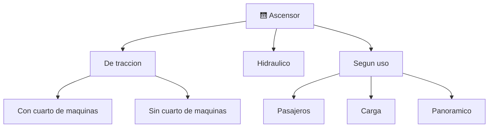

# 📋 Caracteristicas funcionales del ascensor

[🏠 Inicio](../../../README.md) · [🛗 Curso: Ascensores](../README.md) · 📋 Caracteristicas

Que es un ascensor, que tipos existen y para que sirve cada uno. Este modulo da
el contexto antes de abrir la mecanica (Modulo 3).

---

## 🧭 Definicion

Un ascensor es una maquina de transporte vertical fija que mueve una cabina entre
niveles de un edificio por un hueco guiado. No circula por via publica: se instala
en un edificio y su prioridad es mover personas o carga de forma segura, comoda y
repetible.

---

## 🧬 Caracteristicas clave

| Caracteristica | Descripcion |
| --- | --- |
| Equilibrio con contrapeso | El contrapeso compensa la cabina y reduce el esfuerzo del motor. |
| Traccion por friccion | La polea mueve el cable por friccion, no por arrollamiento. |
| Redundancia de seguridad | Freno del motor, freno de seguridad y gobernador de velocidad. |
| Marcha guiada | Guias verticales mantienen la cabina alineada. |
| Precision de parada | Se detiene nivelado con el piso para acceso seguro. |
| Uso intensivo | Muchos ciclos al dia; exige fiabilidad y mantencion. |

---

## 🗂️ Tipos de ascensor

| Tipo | Uso tipico | Rasgo destacado |
| --- | --- | --- |
| Traccion con cuarto de maquinas | Edificios medios y altos | Motor y control en sala superior. |
| Traccion sin cuarto de maquinas | Edificios residenciales | Motor compacto dentro del hueco. |
| Hidraulico | Edificios bajos | Piston; sin contrapeso en altura. |
| De pasajeros | Viviendas y oficinas | Confort y precision de parada. |
| De carga | Industria y bodegas | Cabina robusta y gran capacidad. |
| Panoramico | Centros comerciales | Cabina con vista, foco estetico. |

---

## 🎯 Para que se usa

- Mover personas entre pisos de forma segura y comoda.
- Dar accesibilidad a personas con movilidad reducida.
- Transportar carga en edificios e industria.
- Hacer viable la vida y el trabajo en altura.

---

[⬅️ Anterior: Historia](../historia/historia-ascensor.md) · [➡️ Siguiente: Sistemas mecanicos](sistemas-mecanicos-ascensor.md)
