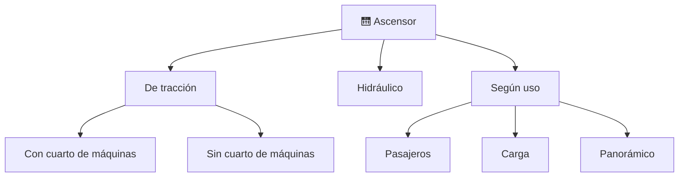

<!-- clase-meta
tipo_documento: clase
clase: 2
codigo: ASCENSORES-02
curso: ascensores
titulo: "Características funcionales del ascensor"
modalidad: "teórica aplicada"
duracion_minutos: 45
nivel: introductorio
prerrequisito: ASCENSORES-01
competencia: "identificacion_funcional"
resultados_aprendizaje:
  - "Explicar definición, rasgos funcionales, tipos y usos con vocabulario propio de Ascensores."
  - "Aplicar esos conceptos a una decisión segura o a un escenario de simulación de Ascensores."
evidencia: "Matriz comparativa y decisión justificada."
criterio_aprobacion: "La elección considera función, límites, mando y efecto en la simulación; no se apoya solo en preferencias."
fuentes: manuales/fuentes.md
ultima_revision: 2026-09-10
-->

# 📋 Características funcionales del ascensor

[🏠 Inicio](../../../README.md) · [🛗 Curso: Ascensores](../README.md) · 📋 Características

Que es un ascensor, que tipos existen y para que sirve cada uno. Esta clase da
el contexto antes de abrir la mecánica (Clase 4).

---

## 🧭 Definición

Un ascensor es una máquina de transporte vertical fija que mueve una cabina entre
niveles de un edificio por un hueco guiado. No circula por vía pública: se instala
en un edificio y su prioridad es mover personas o carga de forma segura, cómoda y
repetible.

---

## 🧬 Características clave

| Característica | Descripción |
| --- | --- |
| Equilibrio con contrapeso | El contrapeso compensa la cabina y reduce el esfuerzo del motor. |
| Tracción por fricción | La polea mueve el cable por fricción, no por arrollamiento. |
| Redundancia de seguridad | Freno del motor, freno de seguridad y gobernador de velocidad. |
| Marcha guiada | Guías verticales mantienen la cabina alineada. |
| Precisión de parada | Se detiene nivelado con el piso para acceso seguro. |
| Uso intensivo | Muchos ciclos al día; exige fiabilidad y mantención. |

---

## 🗂️ Tipos de ascensor

```mermaid
flowchart TD
    Asc[🛗 Ascensor] --> Traccion[De tracción]
    Asc --> Hidraulico[Hidráulico]
    Traccion --> ConCuarto[Con cuarto de máquinas]
    Traccion --> SinCuarto[Sin cuarto de máquinas]
    Asc --> Uso[Según uso]
    Uso --> Pasajeros[Pasajeros]
    Uso --> Carga[Carga]
    Uso --> Panoramico[Panorámico]
```

| Tipo | Uso típico | Rasgo destacado |
| --- | --- | --- |
| Tracción con cuarto de máquinas | Edificios medios y altos | Motor y control en sala superior. |
| Tracción sin cuarto de máquinas | Edificios residenciales | Motor compacto dentro del hueco. |
| Hidráulico | Edificios bajos | Pistón; sin contrapeso en altura. |
| De pasajeros | Viviendas y oficinas | Confort y precisión de parada. |
| De carga | Industria y bodegas | Cabina robusta y gran capacidad. |
| Panorámico | Centros comerciales | Cabina con vista, foco estético. |

---

## 🎯 Para qué se usa

- Mover personas entre pisos de forma segura y cómoda.
- Dar accesibilidad a personas con movilidad reducida.
- Transportar carga en edificios e industria.
- Hacer viable la vida y el trabajo en altura.

## 🧭 Guía de estudio aplicada

### Pregunta guía

¿Cómo ayuda **Definición, Características clave, Tipos de ascensor y Para qué se usa** a **elegir una configuración adecuada para viaje con carga variable seguido de una orden de parada en piso**?

### Explicación razonada

Una característica solo es útil cuando permite anticipar comportamiento. En Ascensores, la relación entre motor, polea tractora, cables y cabina y contrapeso determina capacidad, respuesta y límites. Por eso «ascensor de tracción frente a ascensor hidráulico» no se compara por apariencia: se compara por misión, entorno, carga de trabajo y exposición al riesgo «movimiento con puertas inseguras, mala nivelación o pérdida de tracción».

Esta clase se conecta con el resto del curso mediante **equilibrio de masas y control de aceleración, velocidad, nivelación y frenado**. El hilo de
seguridad consiste en reconocer a tiempo **movimiento con puertas inseguras, mala nivelación o pérdida de tracción** y poder justificar la decisión
**verificar enclavamientos y estado antes de autorizar el movimiento**; en clases posteriores cambiará el ángulo de análisis, no esa relación causal.
La lectura funcional común sigue **motor → polea tractora → cables → cabina y contrapeso**, de modo que cada concepto pueda
ubicarse dentro del funcionamiento completo y no quede como un dato aislado.

**Apoyo documental:** [1917.116 Elevators and Escalators](https://www.osha.gov/laws-regs/regulations/standardnumber/1917/1917.116) aporta inspección y riesgos de transporte vertical;
[Vehicle Safety](https://www.nhtsa.gov/vehicle-safety) se usa para seguridad de vehículos terrestres. Estas fuentes
se contrastan con el alcance de la clase y no sustituyen un manual de equipo concreto.

### Caso resuelto: de la observación a la decisión

1. **Definir la necesidad:** convierte «viaje con carga variable seguido de una orden de parada en piso» en requisitos de capacidad, entorno y respuesta.
2. **Comparar:** contrasta **ascensor de tracción frente a ascensor hidráulico** usando esos requisitos y la cadena **motor → polea tractora → cables → cabina y contrapeso**.
3. **Descartar:** elimina la alternativa que deja menos margen frente a **movimiento con puertas inseguras, mala nivelación o pérdida de tracción**.
4. **Elegir:** declara la variante escogida, la evidencia usada y una limitación que todavía debe respetarse.

### Comprueba tu comprensión

1. ¿Qué característica de **cabina y contrapeso** condiciona primero el caso «viaje con carga variable seguido de una orden de parada en piso»?
2. ¿Qué requisito descartaría una de las alternativas **ascensor de tracción frente a ascensor hidráulico**?
3. ¿Qué límite debe declararse junto con la variante elegida?

Orientación para revisar tus respuestas

- La primera respuesta debe relacionar el eslabón elegido con un efecto posterior, no solo nombrarlo.
- La segunda debe proponer una señal medible u observable y explicar qué tendencia sería preocupante.
- La tercera debe cambiar al menos una variable de capacidad, mando, entorno o margen de seguridad.

## 🎓 Cierre de clase

- **Actividad:** Compara variantes de Ascensores mediante los ejes «definición, rasgos funcionales, tipos y usos» y elige una para un caso de uso razonado.
- **Evidencia:** Matriz comparativa y decisión justificada.
- **Criterio de aprobación:** La elección considera función, límites, mando y efecto en la simulación; no se apoya solo en preferencias.
- **Transferencia:** explica qué cambiaría al pasar a otra variante de esta máquina.

### Fuentes de esta clase

- [OSHA-ELEVATORS](https://www.osha.gov/laws-regs/regulations/standardnumber/1917/1917.116): 1917.116 Elevators and Escalators, OSHA. Uso: inspección y riesgos de transporte vertical.
- [US-NHTSA](https://www.nhtsa.gov/vehicle-safety): Vehicle Safety, NHTSA. Uso: seguridad de vehículos terrestres.

> Las fuentes sostienen el marco conceptual y normativo; esta clase no reemplaza el manual
> del fabricante, la formación certificada ni la habilitación exigida para operar equipos reales.

---

[⬅️ Anterior: Historia](../historia/historia-ascensor.md) · [➡️ Siguiente: Modelos y variantes](../modelos/modelos-ascensor.md)
