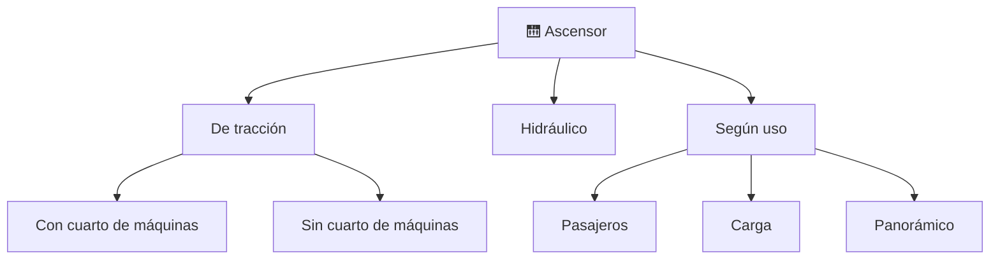

# 📋 Características funcionales del ascensor

[🏠 Inicio](../../../README.md) · [🛗 Curso: Ascensores](../README.md) · 📋 Características

Que es un ascensor, que tipos existen y para que sirve cada uno. Este módulo da
el contexto antes de abrir la mecánica (Módulo 4).

---

## 🧭 Definición

Un ascensor es una máquina de transporte vertical fija que mueve una cabina entre
niveles de un edificio por un hueco guiado. No circula por vía pública: se instala
en un edificio y su prioridad es mover personas o carga de forma segura, cómoda y
repetible.

---

## 🧬 Características clave

| Característica | Descripción |
| --- | --- |
| Equilibrio con contrapeso | El contrapeso compensa la cabina y reduce el esfuerzo del motor. |
| Tracción por fricción | La polea mueve el cable por fricción, no por arrollamiento. |
| Redundancia de seguridad | Freno del motor, freno de seguridad y gobernador de velocidad. |
| Marcha guiada | Guías verticales mantienen la cabina alineada. |
| Precisión de parada | Se detiene nivelado con el piso para acceso seguro. |
| Uso intensivo | Muchos ciclos al día; exige fiabilidad y mantención. |

---

## 🗂️ Tipos de ascensor

```mermaid
flowchart TD
    Asc[🛗 Ascensor] --> Traccion[De tracción]
    Asc --> Hidraulico[Hidráulico]
    Traccion --> ConCuarto[Con cuarto de máquinas]
    Traccion --> SinCuarto[Sin cuarto de máquinas]
    Asc --> Uso[Según uso]
    Uso --> Pasajeros[Pasajeros]
    Uso --> Carga[Carga]
    Uso --> Panoramico[Panorámico]
```

| Tipo | Uso típico | Rasgo destacado |
| --- | --- | --- |
| Tracción con cuarto de máquinas | Edificios medios y altos | Motor y control en sala superior. |
| Tracción sin cuarto de máquinas | Edificios residenciales | Motor compacto dentro del hueco. |
| Hidráulico | Edificios bajos | Pistón; sin contrapeso en altura. |
| De pasajeros | Viviendas y oficinas | Confort y precisión de parada. |
| De carga | Industria y bodegas | Cabina robusta y gran capacidad. |
| Panorámico | Centros comerciales | Cabina con vista, foco estético. |

---

## 🎯 Para qué se usa

- Mover personas entre pisos de forma segura y cómoda.
- Dar accesibilidad a personas con movilidad reducida.
- Transportar carga en edificios e industria.
- Hacer viable la vida y el trabajo en altura.

## 🎓 Cierre de clase

- **Actividad:** Compara variantes de Ascensores mediante los ejes «definición, rasgos funcionales, tipos y usos» y elige una para un caso de uso razonado.
- **Evidencia:** Matriz comparativa y decisión justificada.
- **Criterio de aprobación:** La elección considera función, límites, mando y efecto en la simulación; no se apoya solo en preferencias.
- **Transferencia:** explica qué cambiaría al pasar a otra variante de esta máquina.

### Fuentes de esta clase

- [OSHA-ELEVATORS](https://www.osha.gov/laws-regs/regulations/standardnumber/1917/1917.116): 1917.116 Elevators and Escalators, OSHA. Uso: inspección y riesgos de transporte vertical.
- [US-NHTSA](https://www.nhtsa.gov/vehicle-safety): Vehicle Safety, NHTSA. Uso: seguridad de vehículos terrestres.

> Las fuentes sostienen el marco conceptual y normativo; esta clase no reemplaza el manual
> del fabricante, la formación certificada ni la habilitación exigida para operar equipos reales.

---

[⬅️ Anterior: Historia](../historia/historia-ascensor.md) · [➡️ Siguiente: Modelos y variantes](../modelos/modelos-ascensor.md)
