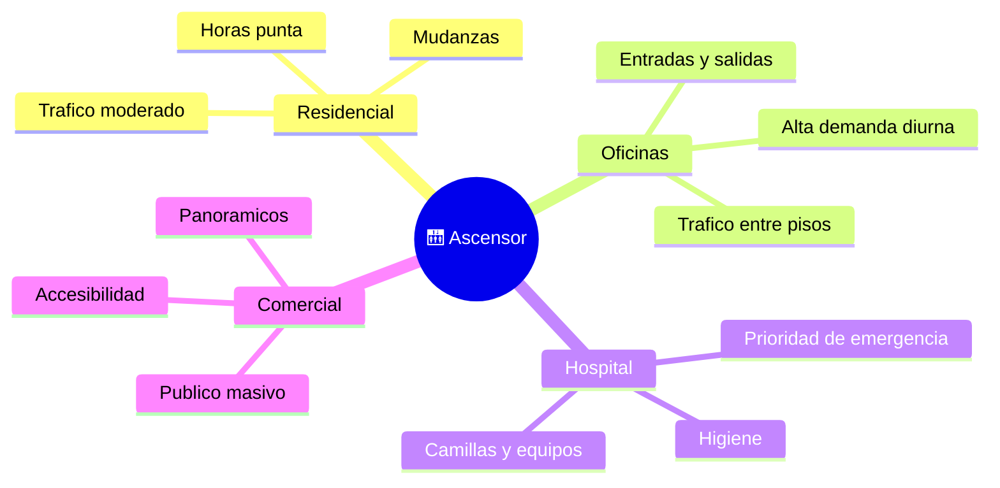

# 🌍 Entornos de trabajo del ascensor

[🏠 Inicio](../../../README.md) · [🛗 Curso: Ascensores](../README.md) · 🌍 Entornos

Donde opera un ascensor y como cambia su uso segun el edificio. Cada entorno
implica patrones de trafico, exigencias y normas distintas, y en simulacion se
traduce en escenarios diferentes.

---

## 🗺️ Entornos principales

| Entorno | Caracteristicas | Exigencias tipicas | Ajuste de operacion |
| --- | --- | --- | --- |
| Residencial | Trafico moderado, mudanzas. | Confort y bajo ruido. | Maniobra simple, cuidado con la carga. |
| Oficinas | Picos de demanda diurnos. | Rapidez y reparto de trafico. | Maniobra colectiva optimizada. |
| Hospital | Camillas, equipos, urgencias. | Cabina amplia, prioridad. | Modo de prioridad y nivelacion exacta. |
| Comercial | Publico masivo, panoramicos. | Accesibilidad y estetica. | Alto flujo, senalizacion clara. |
| Industrial | Carga pesada. | Robustez y capacidad. | Limites de carga estrictos. |

---

## 🌦️ Factores del entorno

- **Trafico**: numero de personas y patron horario definen la maniobra.
- **Altura del edificio**: mas pisos exige mas velocidad y mejor control.
- **Tipo de carga**: personas, camillas o mercancia cambian cabina y limites.
- **Accesibilidad**: braille, voz y espacio para silla de ruedas.

---

## 🎮 Traduccion a simulacion

Cada edificio es un escenario con su numero de pisos, patron de trafico y tipo de
uso. Ver como se modela en el
[Modulo 8: Diseno de simulacion](../simulacion/diseno-simulador-ascensor.md).

---

[⬅️ Anterior: Principios y operacion](principios-ascensor.md) · [➡️ Siguiente: Reglamentos](../reglamentos/reglamentos-ascensor.md)
