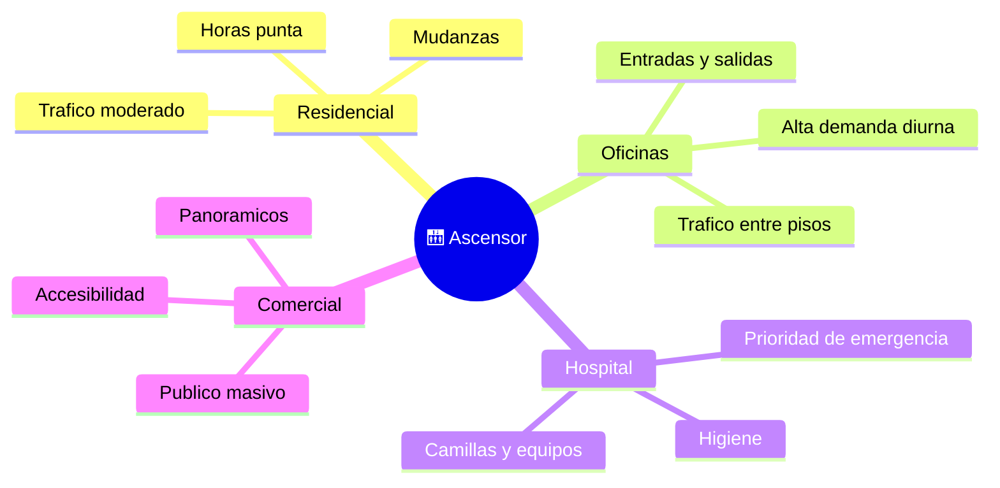

# 🌍 Entornos de trabajo del ascensor

[🏠 Inicio](../../../README.md) · [🛗 Curso: Ascensores](../README.md) · 🌍 Entornos

Dónde opera un ascensor y cómo cambia su uso según el edificio. Cada entorno
implica patrones de tráfico, exigencias y normas distintas, y en simulación se
traduce en escenarios diferentes.

---

## 🗺️ Entornos principales

| Entorno | Características | Exigencias típicas | Ajuste de operación |
| --- | --- | --- | --- |
| Residencial | Tráfico moderado, mudanzas. | Confort y bajo ruido. | Maniobra simple, cuidado con la carga. |
| Oficinas | Picos de demanda diurnos. | Rapidez y reparto de tráfico. | Maniobra colectiva optimizada. |
| Hospital | Camillas, equipos, urgencias. | Cabina amplia, prioridad. | Modo de prioridad y nivelación exacta. |
| Comercial | Público masivo, panorámicos. | Accesibilidad y estética. | Alto flujo, señalización clara. |
| Industrial | Carga pesada. | Robustez y capacidad. | Límites de carga estrictos. |

---

## 🌦️ Factores del entorno

- **Tráfico**: número de personas y patrón horario definen la maniobra.
- **Altura del edificio**: más pisos exige más velocidad y mejor control.
- **Tipo de carga**: personas, camillas o mercancía cambian cabina y límites.
- **Accesibilidad**: braille, voz y espacio para silla de ruedas.

---

## 🎮 Traducción a simulación

Cada edificio es un escenario con su número de pisos, patrón de tráfico y tipo de
uso. Ver cómo se modela en el
[Módulo 9: Diseño de simulación](../simulacion/diseno-simulador-ascensor.md).

---

[⬅️ Anterior: Principios y operación](principios-ascensor.md) · [➡️ Siguiente: Reglamentos](../reglamentos/reglamentos-ascensor.md)
