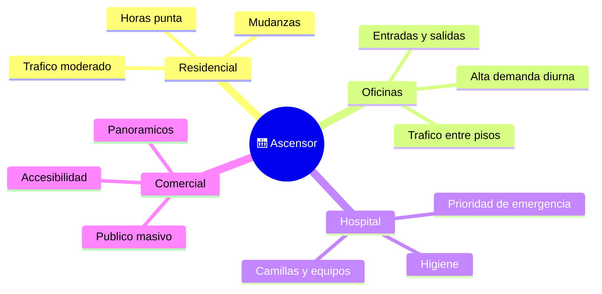

# 🌍 Entornos de trabajo del ascensor

[🏠 Inicio](../../../README.md) · [🛗 Curso: Ascensores](../README.md) · 🌍 Entornos

Dónde opera un ascensor y cómo cambia su uso según el edificio. Cada entorno
implica patrones de tráfico, exigencias y normas distintas, y en simulación se
traduce en escenarios diferentes.

---

## 🗺️ Entornos principales

```mermaid
mindmap
  root((🛗 Ascensor))
    Residencial
      Trafico moderado
      Horas punta
      Mudanzas
    Oficinas
      Alta demanda diurna
      Entradas y salidas
      Trafico entre pisos
    Hospital
      Camillas y equipos
      Prioridad de emergencia
      Higiene
    Comercial
      Publico masivo
      Panoramicos
      Accesibilidad
```

| Entorno | Características | Exigencias típicas | Ajuste de operación |
| --- | --- | --- | --- |
| Residencial | Tráfico moderado, mudanzas. | Confort y bajo ruido. | Maniobra simple, cuidado con la carga. |
| Oficinas | Picos de demanda diurnos. | Rapidez y reparto de tráfico. | Maniobra colectiva optimizada. |
| Hospital | Camillas, equipos, urgencias. | Cabina amplia, prioridad. | Modo de prioridad y nivelación exacta. |
| Comercial | Público masivo, panorámicos. | Accesibilidad y estética. | Alto flujo, señalización clara. |
| Industrial | Carga pesada. | Robustez y capacidad. | Límites de carga estrictos. |

---

## 🌦️ Factores del entorno

- **Tráfico**: número de personas y patrón horario definen la maniobra.
- **Altura del edificio**: más pisos exige más velocidad y mejor control.
- **Tipo de carga**: personas, camillas o mercancía cambian cabina y límites.
- **Accesibilidad**: braille, voz y espacio para silla de ruedas.

---

## 🎮 Traducción a simulación

Cada edificio es un escenario con su número de pisos, patrón de tráfico y tipo de
uso. Ver cómo se modela en el
[Módulo 9: Diseño de simulación](../simulacion/diseno-simulador-ascensor.md).

## 🎓 Cierre de clase

- **Actividad:** Contrasta tres entornos de Ascensores a partir de entornos, factores ambientales, riesgos y respuesta de simulación y determina cómo cambian variables, percepción, riesgos y respuesta.
- **Evidencia:** Matriz entorno–cambio–riesgo–respuesta.
- **Criterio de aprobación:** Cada respuesta se adapta al entorno y distingue riesgos que no son intercambiables entre escenarios.
- **Transferencia:** explica qué cambiaría al pasar a otra variante de esta máquina.

### Fuentes de esta clase

- [OSHA-ELEVATORS](https://www.osha.gov/laws-regs/regulations/standardnumber/1917/1917.116): 1917.116 Elevators and Escalators, OSHA. Uso: inspección y riesgos de transporte vertical.
- [US-NHTSA](https://www.nhtsa.gov/vehicle-safety): Vehicle Safety, NHTSA. Uso: seguridad de vehículos terrestres.

> Las fuentes sostienen el marco conceptual y normativo; esta clase no reemplaza el manual
> del fabricante, la formación certificada ni la habilitación exigida para operar equipos reales.

---

[⬅️ Anterior: Principios y operación](principios-ascensor.md) · [➡️ Siguiente: Reglamentos](../reglamentos/reglamentos-ascensor.md)
