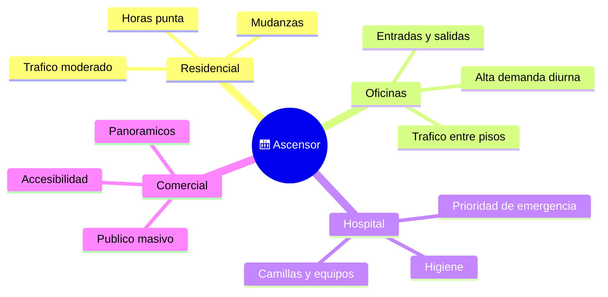

<!-- clase-meta
tipo_documento: clase
clase: 7
codigo: ASCENSORES-07
curso: ascensores
titulo: "Entornos de trabajo del ascensor"
modalidad: "análisis de escenarios"
duracion_minutos: 60
nivel: introductorio
prerrequisito: ASCENSORES-06
competencia: "adaptacion_al_entorno"
resultados_aprendizaje:
  - "Explicar entornos, factores ambientales, riesgos y respuesta de simulación con vocabulario propio de Ascensores."
  - "Aplicar esos conceptos a una decisión segura o a un escenario de simulación de Ascensores."
evidencia: "Matriz entorno–cambio–riesgo–respuesta."
criterio_aprobacion: "Cada respuesta se adapta al entorno y distingue riesgos que no son intercambiables entre escenarios."
fuentes: manuales/fuentes.md
ultima_revision: 2026-09-10
-->

# 🌍 Entornos de trabajo del ascensor

[🏠 Inicio](../../../README.md) · [🛗 Curso: Ascensores](../README.md) · 🌍 Entornos

Dónde opera un ascensor y cómo cambia su uso según el edificio. Cada entorno
implica patrones de tráfico, exigencias y normas distintas, y en simulación se
traduce en escenarios diferentes.

---

## 🗺️ Entornos principales

```mermaid
mindmap
  root((🛗 Ascensor))
    Residencial
      Trafico moderado
      Horas punta
      Mudanzas
    Oficinas
      Alta demanda diurna
      Entradas y salidas
      Trafico entre pisos
    Hospital
      Camillas y equipos
      Prioridad de emergencia
      Higiene
    Comercial
      Publico masivo
      Panoramicos
      Accesibilidad
```

| Entorno | Características | Exigencias típicas | Ajuste de operación |
| --- | --- | --- | --- |
| Residencial | Tráfico moderado, mudanzas. | Confort y bajo ruido. | Maniobra simple, cuidado con la carga. |
| Oficinas | Picos de demanda diurnos. | Rapidez y reparto de tráfico. | Maniobra colectiva optimizada. |
| Hospital | Camillas, equipos, urgencias. | Cabina amplia, prioridad. | Modo de prioridad y nivelación exacta. |
| Comercial | Público masivo, panorámicos. | Accesibilidad y estética. | Alto flujo, señalización clara. |
| Industrial | Carga pesada. | Robustez y capacidad. | Límites de carga estrictos. |

---

## 🌦️ Factores del entorno

- **Tráfico**: número de personas y patrón horario definen la maniobra.
- **Altura del edificio**: más pisos exige más velocidad y mejor control.
- **Tipo de carga**: personas, camillas o mercancía cambian cabina y límites.
- **Accesibilidad**: braille, voz y espacio para silla de ruedas.

---

## 🎮 Traducción a simulación

Cada edificio es un escenario con su número de pisos, patrón de tráfico y tipo de
uso. Ver cómo se modela en el
[Clase 9: Diseño de simulación](../simulacion/diseno-simulador-ascensor.md).

## 🧭 Guía de estudio aplicada

### Pregunta guía

¿Cómo ayuda **Entornos principales, Factores del entorno, Traducción a simulación y Guía de estudio aplicada** a **adaptar viaje con carga variable seguido de una orden de parada en piso a tres condiciones ambientales distintas**?

### Explicación razonada

El entorno no es decoración: modifica las fuerzas, la percepción y el tiempo disponible. En el caso «viaje con carga variable seguido de una orden de parada en piso», cambia el comportamiento de cabina y contrapeso y aumenta la probabilidad de movimiento con puertas inseguras, mala nivelación o pérdida de tracción. La respuesta correcta empieza por reconocer qué variable cambió y después adaptar límites, ruta o misión.

Esta clase se conecta con el resto del curso mediante **equilibrio de masas y control de aceleración, velocidad, nivelación y frenado**. El hilo de
seguridad consiste en reconocer a tiempo **movimiento con puertas inseguras, mala nivelación o pérdida de tracción** y poder justificar la decisión
**verificar enclavamientos y estado antes de autorizar el movimiento**; en clases posteriores cambiará el ángulo de análisis, no esa relación causal.
La lectura funcional común sigue **motor → polea tractora → cables → cabina y contrapeso**, de modo que cada concepto pueda
ubicarse dentro del funcionamiento completo y no quede como un dato aislado.

**Apoyo documental:** [1917.116 Elevators and Escalators](https://www.osha.gov/laws-regs/regulations/standardnumber/1917/1917.116) aporta inspección y riesgos de transporte vertical;
[Vehicle Safety](https://www.nhtsa.gov/vehicle-safety) se usa para seguridad de vehículos terrestres. Estas fuentes
se contrastan con el alcance de la clase y no sustituyen un manual de equipo concreto.

### Caso resuelto: de la observación a la decisión

1. **Escenario base:** conserva la misión «viaje con carga variable seguido de una orden de parada en piso» para poder comparar.
2. **Cambiar una condición:** modifica sucesivamente superficie o medio, visibilidad y perturbación externa.
3. **Recalcular margen:** explica cómo cada cambio afecta **cabina y contrapeso** y acerca o aleja **movimiento con puertas inseguras, mala nivelación o pérdida de tracción**.
4. **Adaptar:** cambia límite, ruta, configuración o incluso cancela; no mantengas la misma respuesta por hábito.

### Comprueba tu comprensión

1. ¿Cómo cambiaría **cabina y contrapeso** si empeora la perturbación externa?
2. ¿Qué condición ambiental acerca más el escenario a **movimiento con puertas inseguras, mala nivelación o pérdida de tracción**?
3. ¿Cuándo adaptarías la maniobra y cuándo la cancelarías?

Orientación para revisar tus respuestas

- La primera respuesta debe relacionar el eslabón elegido con un efecto posterior, no solo nombrarlo.
- La segunda debe proponer una señal medible u observable y explicar qué tendencia sería preocupante.
- La tercera debe cambiar al menos una variable de capacidad, mando, entorno o margen de seguridad.

## 🎓 Cierre de clase

- **Actividad:** Contrasta tres entornos de Ascensores a partir de entornos, factores ambientales, riesgos y respuesta de simulación y determina cómo cambian variables, percepción, riesgos y respuesta.
- **Evidencia:** Matriz entorno–cambio–riesgo–respuesta.
- **Criterio de aprobación:** Cada respuesta se adapta al entorno y distingue riesgos que no son intercambiables entre escenarios.
- **Transferencia:** explica qué cambiaría al pasar a otra variante de esta máquina.

### Fuentes de esta clase

- [OSHA-ELEVATORS](https://www.osha.gov/laws-regs/regulations/standardnumber/1917/1917.116): 1917.116 Elevators and Escalators, OSHA. Uso: inspección y riesgos de transporte vertical.
- [US-NHTSA](https://www.nhtsa.gov/vehicle-safety): Vehicle Safety, NHTSA. Uso: seguridad de vehículos terrestres.

> Las fuentes sostienen el marco conceptual y normativo; esta clase no reemplaza el manual
> del fabricante, la formación certificada ni la habilitación exigida para operar equipos reales.

---

[⬅️ Anterior: Principios y operación](principios-ascensor.md) · [➡️ Siguiente: Reglamentos](../reglamentos/reglamentos-ascensor.md)
