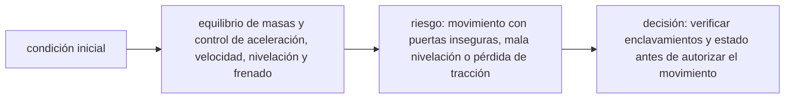

<!-- clase-meta
tipo_documento: clase
clase: 6
codigo: ASCENSORES-06
curso: ascensores
titulo: "Principios y operación del ascensor"
modalidad: "resolución de problemas"
duracion_minutos: 90
nivel: introductorio
prerrequisito: ASCENSORES-05
competencia: "razonamiento_operacional"
resultados_aprendizaje:
  - "Explicar principios físicos, fases de operación, decisiones y errores frecuentes con vocabulario propio de Ascensores."
  - "Aplicar esos conceptos a una decisión segura o a un escenario de simulación de Ascensores."
evidencia: "Resolución argumentada de un escenario operacional."
criterio_aprobacion: "Aplica los principios correctos, anticipa consecuencias y respeta los límites del curso."
fuentes: manuales/fuentes.md
ultima_revision: 2026-09-10
-->

# 🧪 Principios y operación del ascensor

[🏠 Inicio](../../../README.md) · [🛗 Curso: Ascensores](../README.md) · 🧪 Principios

Documento general y educativo. No sustituye la instalación, mantención o
inspección por personal competente ni el manual del fabricante. Describe como
opera un ascensor en simulación y que principios físicos conviene representar.

## Principios de funcionamiento

- **Equilibrio con contrapeso**: el contrapeso compensa la cabina, así el motor
  solo mueve la diferencia de peso y gasta mucho menos.
- **Tracción por fricción**: la polea mueve los cables por agarre en sus ranuras;
  la tensión del contrapeso hace posible esa fricción.
- **Marcha controlada**: el variador acelera y frena suave para el confort y la
  precisión de parada.
- **Seguridad redundante**: freno del motor, gobernador de velocidad y freno de
  seguridad actuan de forma independiente.
- **Nivelación**: el sistema detiene la cabina alineada con el piso para un
  acceso seguro.

## Fases de un viaje

| Fase | Que ocurre | Puntos clave |
| --- | --- | --- |
| Llamada | El usuario pide la cabina | Registrar sentido y piso. |
| Asignación | El control decide la ruta | Maniobra colectiva optimiza viajes. |
| Apertura | Puerta abierta en origen | Enclavamiento y sensor de obstáculo. |
| Aceleración | La cabina inicia marcha | Arranque suave con variador. |
| Marcha | Viaje entre pisos | Velocidad estable, cabina guiada. |
| Frenado | Aproximación al destino | Desaceleración y nivelación precisa. |
| Parada | Puerta abierta en destino | Freno del motor sostiene la cabina. |

## Un viaje seguro: idea general

1. El usuario llama la cabina indicando el sentido.
2. El control asigna el viaje y abre la puerta con enclavamiento.
3. La cabina arranca suave y viaja guiada por las guías.
4. Al aproximarse, desacelera y se nivela con el piso.
5. El freno del motor la sostiene mientras se abren las puertas.

## Errores y riesgos que la simulación puede enseñar a evitar

- Sobrecargar la cabina e intentar arrancar.
- Forzar las puertas o bloquear los sensores de obstáculo.
- Ignorar el cartel de fuera de servicio.
- Confundir la parada de emergencia con un uso normal.
- Omitir la mantención periódica que exige la ley.

## Relación con los niveles de realismo

- **Nivel 1 (educativo)**: llamar, viajar entre pisos y abrir o cerrar puertas.
- **Nivel 2 (simplificado)**: agregar contrapeso, sobrecarga y nivelación.
- **Nivel 3 (técnico)**: sumar gobernador, freno de seguridad, maniobra colectiva
  y modo inspección.

Ver [`docs/03-niveles-de-realismo.md`](../../../docs/03-niveles-de-realismo.md) para el detalle de cada nivel.

## 🧭 Guía de estudio aplicada

### Pregunta guía

¿Cómo ayuda **Principios de funcionamiento, Fases de un viaje, Un viaje seguro: idea general y Errores y riesgos que la simulación puede enseñar a evitar** a **resolver viaje con carga variable seguido de una orden de parada en piso sin agotar el margen operacional**?

### Explicación razonada

El principio rector puede resumirse así: equilibrio de masas y control de aceleración, velocidad, nivelación y frenado. Esto explica por qué una misma orden produce resultados distintos cuando cambian velocidad, carga, configuración o entorno. Operar bien consiste en leer la tendencia antes de agotar el margen y tomar esta decisión: verificar enclavamientos y estado antes de autorizar el movimiento.

Esta clase se conecta con el resto del curso mediante **equilibrio de masas y control de aceleración, velocidad, nivelación y frenado**. El hilo de
seguridad consiste en reconocer a tiempo **movimiento con puertas inseguras, mala nivelación o pérdida de tracción** y poder justificar la decisión
**verificar enclavamientos y estado antes de autorizar el movimiento**; en clases posteriores cambiará el ángulo de análisis, no esa relación causal.
La lectura funcional común sigue **motor → polea tractora → cables → cabina y contrapeso**, de modo que cada concepto pueda
ubicarse dentro del funcionamiento completo y no quede como un dato aislado.

**Apoyo documental:** [1917.116 Elevators and Escalators](https://www.osha.gov/laws-regs/regulations/standardnumber/1917/1917.116) aporta inspección y riesgos de transporte vertical;
[Vehicle Safety](https://www.nhtsa.gov/vehicle-safety) se usa para seguridad de vehículos terrestres. Estas fuentes
se contrastan con el alcance de la clase y no sustituyen un manual de equipo concreto.

### Caso resuelto: de la observación a la decisión

1. **Datos:** reconoce condiciones, configuración y margen disponibles en **viaje con carga variable seguido de una orden de parada en piso**.
2. **Modelo:** aplica **equilibrio de masas y control de aceleración, velocidad, nivelación y frenado** para predecir una tendencia antes de actuar.
3. **Riesgo:** explica mediante qué cadena de causas podría ocurrir **movimiento con puertas inseguras, mala nivelación o pérdida de tracción**.
4. **Decisión:** ejecuta mentalmente **verificar enclavamientos y estado antes de autorizar el movimiento** y define qué observación confirmaría que funcionó.

### Comprueba tu comprensión

1. ¿Qué variable del principio «equilibrio de masas y control de aceleración, velocidad, nivelación y frenado» cambia primero en el caso?
2. ¿Cómo se propaga ese cambio hasta **cabina y contrapeso**?
3. ¿Qué evidencia confirmaría que **verificar enclavamientos y estado antes de autorizar el movimiento** conservó margen operacional?

Orientación para revisar tus respuestas

- La primera respuesta debe relacionar el eslabón elegido con un efecto posterior, no solo nombrarlo.
- La segunda debe proponer una señal medible u observable y explicar qué tendencia sería preocupante.
- La tercera debe cambiar al menos una variable de capacidad, mando, entorno o margen de seguridad.

## 🎓 Cierre de clase

- **Actividad:** Resuelve un escenario de Ascensores explicando, paso a paso, cómo intervienen principios físicos, fases de operación, decisiones y errores frecuentes.
- **Evidencia:** Resolución argumentada de un escenario operacional.
- **Criterio de aprobación:** Aplica los principios correctos, anticipa consecuencias y respeta los límites del curso.
- **Transferencia:** explica qué cambiaría al pasar a otra variante de esta máquina.

### Fuentes de esta clase

- [OSHA-ELEVATORS](https://www.osha.gov/laws-regs/regulations/standardnumber/1917/1917.116): 1917.116 Elevators and Escalators, OSHA. Uso: inspección y riesgos de transporte vertical.
- [US-NHTSA](https://www.nhtsa.gov/vehicle-safety): Vehicle Safety, NHTSA. Uso: seguridad de vehículos terrestres.

> Las fuentes sostienen el marco conceptual y normativo; esta clase no reemplaza el manual
> del fabricante, la formación certificada ni la habilitación exigida para operar equipos reales.

---

[⬅️ Anterior: Mandos](../mandos/manual-mandos-ascensor.md) · [➡️ Siguiente: Entornos de trabajo](entornos-ascensor.md)
