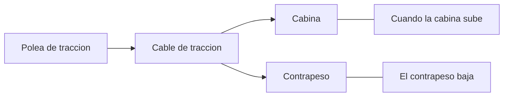
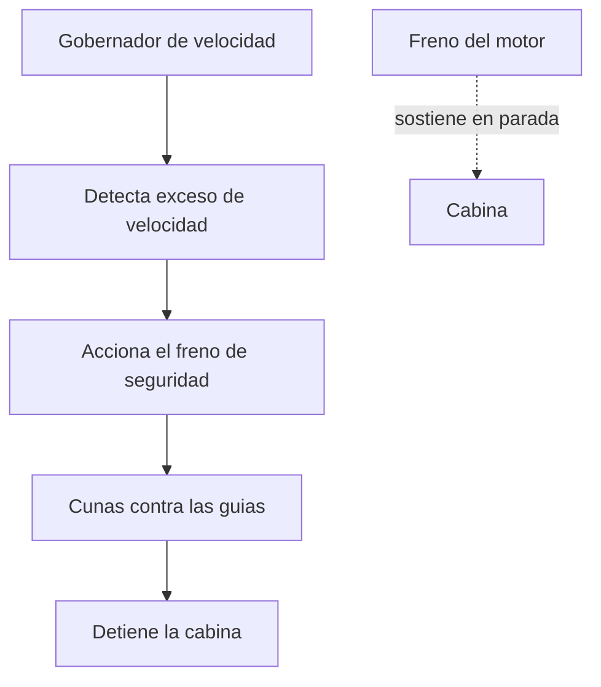

# 🔧 Sistemas mecanicos del ascensor

[🏠 Inicio](../../../README.md) · [🛗 Curso: Ascensores](../README.md) · 🔧 Sistemas mecanicos

Este modulo abre el ascensor por dentro. Explica cada sistema, como funciona y
como se conecta con los demas. Es la base tecnica para entender los mandos
(Modulo 4) y la fisica del transporte vertical (Modulo 5).

---

## 1. 🛗 Cabina y contrapeso

La cabina lleva a las personas o la carga; el contrapeso equilibra el sistema.

- **Cabina**: habitaculo guiado que transporta la carga util.
- **Contrapeso**: masa que equilibra la cabina mas parte de la carga nominal.
- **Ventaja del contrapeso**: el motor solo mueve la diferencia de peso, no toda
  la cabina; asi consume mucho menos.

| Elemento | Funcion |
| --- | --- |
| Cabina | Transporta personas o carga. |
| Contrapeso | Equilibra la cabina y reduce el esfuerzo del motor. |
| Bastidor | Estructura que sostiene cabina y contrapeso en las guias. |

---

## 2. 🔗 Cables y polea de traccion

La cabina no cuelga de un tambor: se mueve por friccion sobre una polea.

- **Cables de traccion**: varios cables de acero por redundancia.
- **Polea de traccion**: rueda ranurada que mueve los cables por friccion.
- **Friccion, no arrollamiento**: la polea aprovecha el agarre del cable en las
  ranuras; el contrapeso da la tension necesaria.
- **Cable del gobernador**: cable independiente que vigila la velocidad.

| Componente | Funcion |
| --- | --- |
| Cables de traccion | Sostienen y mueven cabina y contrapeso. |
| Polea de traccion | Transmite el giro del motor a los cables por friccion. |
| Poleas de desvio | Reconducen los cables segun la geometria del hueco. |

---

## 3. ⚙️ Motor y reductor

El grupo tractor entrega el giro que mueve la polea.

- **Motor**: normalmente electrico; hoy con variador de frecuencia para marcha
  suave.
- **Reductor**: adapta velocidad y fuerza entre motor y polea; algunos equipos
  modernos son sin reductor (gearless).
- **Variador de frecuencia**: controla arranque y parada suaves y una nivelacion
  precisa.

| Parametro | Efecto en el ascensor |
| --- | --- |
| Potencia del motor | Capacidad de mover la carga nominal. |
| Reductor o gearless | Tamano, ruido y eficiencia del grupo. |
| Variador | Suavidad de marcha y precision de parada. |

---

## 4. 🛤️ Guias y amortiguadores

Mantienen la cabina alineada y protegen los extremos del recorrido.

- **Guias verticales**: rieles que guian cabina y contrapeso; evitan balanceo.
- **Rozaderas o rodillos**: unen el bastidor a las guias.
- **Amortiguadores de foso**: al fondo del hueco, absorben un descenso extremo.
- **Finales de carrera**: sensores que limitan el recorrido arriba y abajo.

---

## 5. 🛑 Freno de seguridad y gobernador de velocidad

Es el sistema que hace confiable al ascensor: detiene la cabina si baja mas
rapido de lo permitido.

- **Freno del motor**: mantiene la cabina detenida en cada piso.
- **Gobernador de velocidad**: vigila la velocidad; si se excede, actua.
- **Freno de seguridad (paracaidas)**: cunas que muerden las guias y detienen la
  cabina de forma mecanica.
- **Redundancia**: varios sistemas independientes evitan la caida libre.

---

## 6. 🚪 Puertas y control de llamadas

- **Puertas automaticas**: de cabina y de piso, con sensor de obstaculo.
- **Enclavamiento**: la cabina no se mueve con una puerta abierta.
- **Controlador**: recibe las llamadas, decide paradas y ordena el movimiento.
- **Maniobra colectiva**: agrupa llamadas para optimizar los viajes.

---

## 🔁 Como se conecta todo

1. El **motor** y el **reductor** giran la **polea de traccion**.
2. Los **cables** mueven **cabina** y **contrapeso**, que se equilibran.
3. Las **guias** mantienen todo alineado en el hueco.
4. El **freno del motor** sostiene la cabina en cada parada.
5. El **gobernador** y el **freno de seguridad** protegen ante un exceso de
   velocidad.
6. El **controlador** y las **puertas** gestionan las llamadas y el acceso seguro.

Con esto entendido, el
[Modulo 4: Mandos](../mandos/manual-mandos-ascensor.md) muestra como el usuario y
el sistema operan estos elementos.

---

[⬅️ Anterior: Caracteristicas](caracteristicas-ascensor.md) · [➡️ Siguiente: Mandos e instrumentos](../mandos/manual-mandos-ascensor.md)
