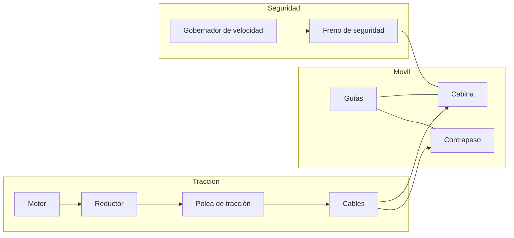

# 🔧 Sistemas mecánicos del ascensor

[🏠 Inicio](../../../README.md) · [🛗 Curso: Ascensores](../README.md) · 🔧 Sistemas mecánicos

Este módulo abre el ascensor por dentro. Explica cada sistema, como funciona y
como se conecta con los demás. Es la base técnica para entender los mandos
(Módulo 5) y la física del transporte vertical (Módulo 6).

---

## 1. 🛗 Cabina y contrapeso

La cabina lleva a las personas o la carga; el contrapeso equilibra el sistema.

- **Cabina**: habitáculo guiado que transporta la carga útil.
- **Contrapeso**: masa que equilibra la cabina más parte de la carga nominal.
- **Ventaja del contrapeso**: el motor solo mueve la diferencia de peso, no toda
  la cabina; así consume mucho menos.

| Elemento | Función |
| --- | --- |
| Cabina | Transporta personas o carga. |
| Contrapeso | Equilibra la cabina y reduce el esfuerzo del motor. |
| Bastidor | Estructura que sostiene cabina y contrapeso en las guías. |

---

## 2. 🔗 Cables y polea de tracción

La cabina no cuelga de un tambor: se mueve por fricción sobre una polea.

- **Cables de tracción**: varios cables de acero por redundancia.
- **Polea de tracción**: rueda ranurada que mueve los cables por fricción.
- **Fricción, no arrollamiento**: la polea aprovecha el agarre del cable en las
  ranuras; el contrapeso da la tensión necesaria.
- **Cable del gobernador**: cable independiente que vigila la velocidad.

| Componente | Función |
| --- | --- |
| Cables de tracción | Sostienen y mueven cabina y contrapeso. |
| Polea de tracción | Transmite el giro del motor a los cables por fricción. |
| Poleas de desvío | Reconducen los cables según la geometría del hueco. |

---

## 3. ⚙️ Motor y reductor

El grupo tractor entrega el giro que mueve la polea.

- **Motor**: normalmente eléctrico; hoy con variador de frecuencia para marcha
  suave.
- **Reductor**: adapta velocidad y fuerza entre motor y polea; algunos equipos
  modernos son sin reductor (gearless).
- **Variador de frecuencia**: controla arranque y parada suaves y una nivelación
  precisa.

| Parámetro | Efecto en el ascensor |
| --- | --- |
| Potencia del motor | Capacidad de mover la carga nominal. |
| Reductor o gearless | Tamaño, ruido y eficiencia del grupo. |
| Variador | Suavidad de marcha y precisión de parada. |

---

## 4. 🛤️ Guías y amortiguadores

Mantienen la cabina alineada y protegen los extremos del recorrido.

- **Guías verticales**: rieles que guian cabina y contrapeso; evitan balanceo.
- **Rozaderas o rodillos**: unen el bastidor a las guías.
- **Amortiguadores de foso**: al fondo del hueco, absorben un descenso extremo.
- **Finales de carrera**: sensores que limitan el recorrido arriba y abajo.

---

## 5. 🛑 Freno de seguridad y gobernador de velocidad

Es el sistema que hace confiable al ascensor: detiene la cabina si baja más
rápido de lo permitido.

- **Freno del motor**: mantiene la cabina detenida en cada piso.
- **Gobernador de velocidad**: vigila la velocidad; si se excede, actua.
- **Freno de seguridad (paracaídas)**: cunas que muerden las guías y detienen la
  cabina de forma mecánica.
- **Redundancia**: varios sistemas independientes evitan la caída libre.

---

## 6. 🚪 Puertas y control de llamadas

- **Puertas automáticas**: de cabina y de piso, con sensor de obstáculo.
- **Enclavamiento**: la cabina no se mueve con una puerta abierta.
- **Controlador**: recibe las llamadas, decide paradas y ordena el movimiento.
- **Maniobra colectiva**: agrupa llamadas para optimizar los viajes.

---

## 🔁 Cómo se conecta todo

1. El **motor** y el **reductor** giran la **polea de tracción**.
2. Los **cables** mueven **cabina** y **contrapeso**, que se equilibran.
3. Las **guías** mantienen todo alineado en el hueco.
4. El **freno del motor** sostiene la cabina en cada parada.
5. El **gobernador** y el **freno de seguridad** protegen ante un exceso de
   velocidad.
6. El **controlador** y las **puertas** gestionan las llamadas y el acceso seguro.

Con esto entendido, el
[Módulo 5: Mandos](../mandos/manual-mandos-ascensor.md) muestra como el usuario y
el sistema operan estos elementos.

---

[⬅️ Anterior: Modelos y variantes](../modelos/modelos-ascensor.md) · [➡️ Siguiente: Mandos e instrumentos](../mandos/manual-mandos-ascensor.md)
