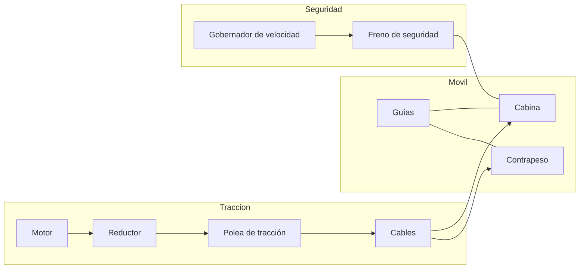
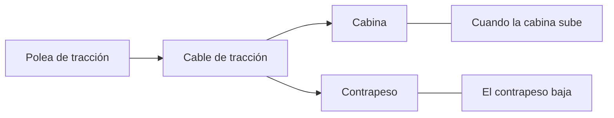
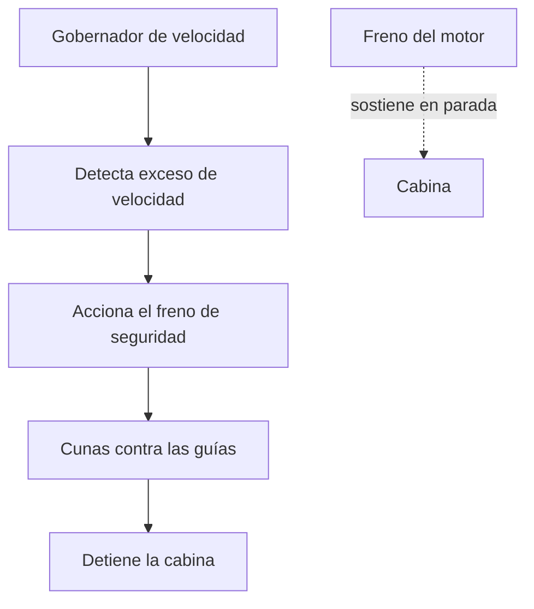
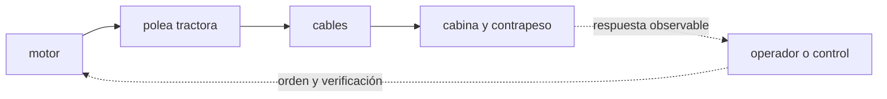

<!-- clase-meta
tipo_documento: clase
clase: 4
codigo: ASCENSORES-04
curso: ascensores
titulo: "Sistemas mecánicos del ascensor"
modalidad: "teórica aplicada"
duracion_minutos: 90
nivel: introductorio
prerrequisito: ASCENSORES-03
competencia: "comprension_de_sistemas"
resultados_aprendizaje:
  - "Explicar Cabina y contrapeso, Cables y polea de tracción, Motor y reductor y Guías y amortiguadores con vocabulario propio de Ascensores."
  - "Aplicar esos conceptos a una decisión segura o a un escenario de simulación de Ascensores."
evidencia: "Esquema con flujos de energía, materia o información anotados."
criterio_aprobacion: "Las conexiones esenciales son correctas y la consecuencia de la falla se propaga de manera coherente."
fuentes: manuales/fuentes.md
ultima_revision: 2026-09-10
-->

# 🔧 Sistemas mecánicos del ascensor

[🏠 Inicio](../../../README.md) · [🛗 Curso: Ascensores](../README.md) · 🔧 Sistemas mecánicos

Esta clase abre el ascensor por dentro. Explica cada sistema, como funciona y
como se conecta con los demás. Es la base técnica para entender los mandos
(Clase 5) y la física del transporte vertical (Clase 6).

```mermaid
flowchart LR
    subgraph Traccion
        Mo[Motor] --> Re[Reductor] --> Po[Polea de tracción]
        Po --> Ca[Cables]
    end
    subgraph Movil
        Ca --> Cab[Cabina]
        Ca --> Con[Contrapeso]
        Gu[Guías] --- Cab
        Gu --- Con
    end
    subgraph Seguridad
        Go[Gobernador de velocidad] --> Pa[Freno de seguridad]
        Pa --- Cab
    end
```

---

## 1. 🛗 Cabina y contrapeso

La cabina lleva a las personas o la carga; el contrapeso equilibra el sistema.

```mermaid
flowchart LR
    Polea[Polea de tracción] --> Cable[Cable de tracción]
    Cable --> Cabina[Cabina]
    Cable --> Contrapeso[Contrapeso]
    Cabina --- Sube[Cuando la cabina sube]
    Contrapeso --- Baja[El contrapeso baja]
```

- **Cabina**: habitáculo guiado que transporta la carga útil.
- **Contrapeso**: masa que equilibra la cabina más parte de la carga nominal.
- **Ventaja del contrapeso**: el motor solo mueve la diferencia de peso, no toda
  la cabina; así consume mucho menos.

| Elemento | Función |
| --- | --- |
| Cabina | Transporta personas o carga. |
| Contrapeso | Equilibra la cabina y reduce el esfuerzo del motor. |
| Bastidor | Estructura que sostiene cabina y contrapeso en las guías. |

---

## 2. 🔗 Cables y polea de tracción

La cabina no cuelga de un tambor: se mueve por fricción sobre una polea.

- **Cables de tracción**: varios cables de acero por redundancia.
- **Polea de tracción**: rueda ranurada que mueve los cables por fricción.
- **Fricción, no arrollamiento**: la polea aprovecha el agarre del cable en las
  ranuras; el contrapeso da la tensión necesaria.
- **Cable del gobernador**: cable independiente que vigila la velocidad.

| Componente | Función |
| --- | --- |
| Cables de tracción | Sostienen y mueven cabina y contrapeso. |
| Polea de tracción | Transmite el giro del motor a los cables por fricción. |
| Poleas de desvío | Reconducen los cables según la geometría del hueco. |

---

## 3. ⚙️ Motor y reductor

El grupo tractor entrega el giro que mueve la polea.

- **Motor**: normalmente eléctrico; hoy con variador de frecuencia para marcha
  suave.
- **Reductor**: adapta velocidad y fuerza entre motor y polea; algunos equipos
  modernos son sin reductor (gearless).
- **Variador de frecuencia**: controla arranque y parada suaves y una nivelación
  precisa.

| Parámetro | Efecto en el ascensor |
| --- | --- |
| Potencia del motor | Capacidad de mover la carga nominal. |
| Reductor o gearless | Tamaño, ruido y eficiencia del grupo. |
| Variador | Suavidad de marcha y precisión de parada. |

---

## 4. 🛤️ Guías y amortiguadores

Mantienen la cabina alineada y protegen los extremos del recorrido.

- **Guías verticales**: rieles que guian cabina y contrapeso; evitan balanceo.
- **Rozaderas o rodillos**: unen el bastidor a las guías.
- **Amortiguadores de foso**: al fondo del hueco, absorben un descenso extremo.
- **Finales de carrera**: sensores que limitan el recorrido arriba y abajo.

---

## 5. 🛑 Freno de seguridad y gobernador de velocidad

Es el sistema que hace confiable al ascensor: detiene la cabina si baja más
rápido de lo permitido.

```mermaid
flowchart TD
    Gobernador[Gobernador de velocidad] --> Detecta[Detecta exceso de velocidad]
    Detecta --> Acciona[Acciona el freno de seguridad]
    Acciona --> Cunas[Cunas contra las guías]
    Cunas --> Detiene[Detiene la cabina]
    FrenoMotor[Freno del motor] -. sostiene en parada .-> Cabina[Cabina]
```

- **Freno del motor**: mantiene la cabina detenida en cada piso.
- **Gobernador de velocidad**: vigila la velocidad; si se excede, actua.
- **Freno de seguridad (paracaídas)**: cunas que muerden las guías y detienen la
  cabina de forma mecánica.
- **Redundancia**: varios sistemas independientes evitan la caída libre.

---

## 6. 🚪 Puertas y control de llamadas

- **Puertas automáticas**: de cabina y de piso, con sensor de obstáculo.
- **Enclavamiento**: la cabina no se mueve con una puerta abierta.
- **Controlador**: recibe las llamadas, decide paradas y ordena el movimiento.
- **Maniobra colectiva**: agrupa llamadas para optimizar los viajes.

---

## 🔁 Cómo se conecta todo

1. El **motor** y el **reductor** giran la **polea de tracción**.
2. Los **cables** mueven **cabina** y **contrapeso**, que se equilibran.
3. Las **guías** mantienen todo alineado en el hueco.
4. El **freno del motor** sostiene la cabina en cada parada.
5. El **gobernador** y el **freno de seguridad** protegen ante un exceso de
   velocidad.
6. El **controlador** y las **puertas** gestionan las llamadas y el acceso seguro.

Con esto entendido, el
[Clase 5: Mandos](../mandos/manual-mandos-ascensor.md) muestra como el usuario y
el sistema operan estos elementos.

## 🧭 Guía de estudio aplicada

### Pregunta guía

¿Cómo ayuda **Cabina y contrapeso, Cables y polea de tracción, Motor y reductor y Guías y amortiguadores** a **seguir una alteración desde motor hasta cabina y contrapeso durante viaje con carga variable seguido de una orden de parada en piso**?

### Explicación razonada

El funcionamiento puede leerse como una cadena causal: motor entrega o transforma energía; polea tractora la adapta; cables la transmite o gobierna; y cabina y contrapeso produce el efecto observable. La cadena no es lineal en sentido estricto: sensores, estructura y operador cierran el lazo. Si un eslabón se degrada, la señal importante es cómo cambia el estado de cabina y contrapeso y qué margen queda.

```mermaid
flowchart LR
    A["motor"] --> B["polea tractora"] --> C["cables"] --> D["cabina y contrapeso"]
    D -. respuesta observable .-> O["operador o control"]
    O -. orden y verificación .-> A
```

Esta clase se conecta con el resto del curso mediante **equilibrio de masas y control de aceleración, velocidad, nivelación y frenado**. El hilo de
seguridad consiste en reconocer a tiempo **movimiento con puertas inseguras, mala nivelación o pérdida de tracción** y poder justificar la decisión
**verificar enclavamientos y estado antes de autorizar el movimiento**; en clases posteriores cambiará el ángulo de análisis, no esa relación causal.
La lectura funcional común sigue **motor → polea tractora → cables → cabina y contrapeso**, de modo que cada concepto pueda
ubicarse dentro del funcionamiento completo y no quede como un dato aislado.

**Apoyo documental:** [1917.116 Elevators and Escalators](https://www.osha.gov/laws-regs/regulations/standardnumber/1917/1917.116) aporta inspección y riesgos de transporte vertical;
[Vehicle Safety](https://www.nhtsa.gov/vehicle-safety) se usa para seguridad de vehículos terrestres. Estas fuentes
se contrastan con el alcance de la clase y no sustituyen un manual de equipo concreto.

### Caso resuelto: de la observación a la decisión

1. **Entrada:** identifica el estado inicial de **motor** durante **viaje con carga variable seguido de una orden de parada en piso**.
2. **Transformación:** explica qué hacen **polea tractora** y **cables**, y qué magnitud cambia en cada paso.
3. **Salida:** comprueba el efecto esperado en **cabina y contrapeso** y busca una desviación temprana.
4. **Falla razonada:** si aparece **movimiento con puertas inseguras, mala nivelación o pérdida de tracción**, retrocede por la cadena antes de ordenar otra acción.

### Comprueba tu comprensión

1. Si se degrada **polea tractora**, ¿qué efecto esperarías primero en **cables** y después en **cabina y contrapeso**?
2. ¿Qué observación ayudaría a diferenciar una falla de **motor** de una falla de **cables**?
3. ¿Por qué una segunda orden podría agravar **movimiento con puertas inseguras, mala nivelación o pérdida de tracción**?

Orientación para revisar tus respuestas

- La primera respuesta debe relacionar el eslabón elegido con un efecto posterior, no solo nombrarlo.
- La segunda debe proponer una señal medible u observable y explicar qué tendencia sería preocupante.
- La tercera debe cambiar al menos una variable de capacidad, mando, entorno o margen de seguridad.

## 🎓 Cierre de clase

- **Actividad:** Dibuja un esquema funcional de Ascensores que conecte Cabina y contrapeso, Cables y polea de tracción, Motor y reductor y Guías y amortiguadores; después predice el efecto de una falla simulada.
- **Evidencia:** Esquema con flujos de energía, materia o información anotados.
- **Criterio de aprobación:** Las conexiones esenciales son correctas y la consecuencia de la falla se propaga de manera coherente.
- **Transferencia:** explica qué cambiaría al pasar a otra variante de esta máquina.

### Fuentes de esta clase

- [OSHA-ELEVATORS](https://www.osha.gov/laws-regs/regulations/standardnumber/1917/1917.116): 1917.116 Elevators and Escalators, OSHA. Uso: inspección y riesgos de transporte vertical.
- [US-NHTSA](https://www.nhtsa.gov/vehicle-safety): Vehicle Safety, NHTSA. Uso: seguridad de vehículos terrestres.

> Las fuentes sostienen el marco conceptual y normativo; esta clase no reemplaza el manual
> del fabricante, la formación certificada ni la habilitación exigida para operar equipos reales.

---

[⬅️ Anterior: Modelos y variantes](../modelos/modelos-ascensor.md) · [➡️ Siguiente: Mandos e instrumentos](../mandos/manual-mandos-ascensor.md)
