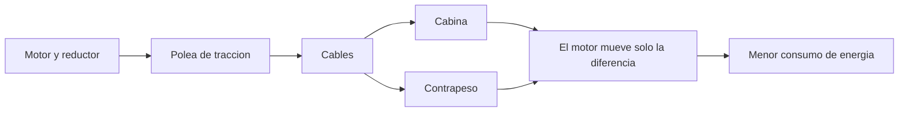

# 🧰 Recursos del ascensor

[🏠 Inicio](../../../README.md) · [🛗 Curso: Ascensores](../README.md) · 🧰 Recursos

Glosario especifico, enlaces y diagramas de apoyo del curso de ascensores. Amplia
el [glosario general](../../../docs/05-glosario-general.md).

---

## 📖 Glosario especifico

| Termino | Definicion |
| --- | --- |
| Contrapeso | Masa que equilibra la cabina para reducir el esfuerzo del motor. |
| Polea de traccion | Rueda ranurada que mueve los cables por friccion. |
| Cable de traccion | Cable de acero que sostiene y mueve cabina y contrapeso. |
| Gobernador de velocidad | Dispositivo que detecta un exceso de velocidad de descenso. |
| Freno de seguridad | Sistema de cunas que muerde las guias y detiene la cabina. |
| Guias | Rieles verticales que mantienen alineada la cabina. |
| Nivelacion | Detencion de la cabina alineada con el piso. |
| Maniobra colectiva | Logica que agrupa llamadas para optimizar viajes. |
| Modo inspeccion | Operacion reservada al tecnico competente en mantencion. |

---

## 🗺️ Diagrama de equilibrio con contrapeso

---

## 🔗 Enlaces y fuentes

- Marco legal: [⚖️ docs/07-marco-legal-chile.md](../../../docs/07-marco-legal-chile.md)
- Registro de fuentes: [📚 manuales/fuentes.md](../../../manuales/fuentes.md)
- Ley 20.296 y OGUC: ver el registro de fuentes.

Registrar cada recurso nuevo con su origen y licencia, siguiendo
[`recursos/README.md`](../../../recursos/README.md).

---

[🎓 Portada del curso](../README.md) · [⬅️ Anterior: Diseno de simulacion](../simulacion/diseno-simulador-ascensor.md)
