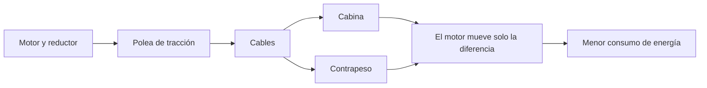

<!-- clase-meta
tipo_documento: clase
clase: 10
codigo: ASCENSORES-10
curso: ascensores
titulo: "Recursos del ascensor"
modalidad: "taller documental"
duracion_minutos: 45
nivel: introductorio
prerrequisito: ASCENSORES-09
competencia: "alfabetizacion_tecnica"
resultados_aprendizaje:
  - "Explicar glosario, esquemas y trazabilidad de fuentes con vocabulario propio de Ascensores."
  - "Aplicar esos conceptos a una decisión segura o a un escenario de simulación de Ascensores."
evidencia: "Glosario aplicado y ficha breve de trazabilidad."
criterio_aprobacion: "Los términos permiten interpretar el curso y las fuentes se distinguen por autoridad, alcance y vigencia."
fuentes: manuales/fuentes.md
ultima_revision: 2026-09-10
-->

# 🧰 Recursos del ascensor

[🏠 Inicio](../../../README.md) · [🛗 Curso: Ascensores](../README.md) · 🧰 Recursos

Glosario específico, enlaces y diagramas de apoyo del curso de ascensores. Amplia
el [glosario general](../../../docs/05-glosario-general.md).

---

## 📖 Glosario específico

| Término | Definición |
| --- | --- |
| Contrapeso | Masa que equilibra la cabina para reducir el esfuerzo del motor. |
| Polea de tracción | Rueda ranurada que mueve los cables por fricción. |
| Cable de tracción | Cable de acero que sostiene y mueve cabina y contrapeso. |
| Gobernador de velocidad | Dispositivo que detecta un exceso de velocidad de descenso. |
| Freno de seguridad | Sistema de cunas que muerde las guías y detiene la cabina. |
| Guías | Rieles verticales que mantienen alineada la cabina. |
| Nivelación | Detención de la cabina alineada con el piso. |
| Maniobra colectiva | Lógica que agrupa llamadas para optimizar viajes. |
| Modo inspección | Operación reservada al técnico competente en mantención. |

---

## 🗺️ Diagrama de equilibrio con contrapeso

```mermaid
flowchart LR
    Motor[Motor y reductor] --> Polea[Polea de tracción]
    Polea --> Cable[Cables]
    Cable --> Cabina[Cabina]
    Cable --> Contrapeso[Contrapeso]
    Cabina --> Equilibrio[El motor mueve solo la diferencia]
    Contrapeso --> Equilibrio
    Equilibrio --> Ahorro[Menor consumo de energía]
```

---

## 🔗 Enlaces y fuentes

- Marco legal: [⚖️ docs/07-marco-legal-chile.md](../../../docs/07-marco-legal-chile.md)
- Registro de fuentes: [📚 manuales/fuentes.md](../../../manuales/fuentes.md)
- Ley 20.296 y OGUC: ver el registro de fuentes.

Registrar cada recurso nuevo con su origen y licencia, siguiendo
[`recursos/README.md`](../../../recursos/README.md).

## 🧭 Guía de estudio aplicada

### Pregunta guía

¿Cómo ayuda **Glosario específico, Diagrama de equilibrio con contrapeso, Enlaces y fuentes y Guía de estudio aplicada** a **explicar con fuentes los términos motor, polea tractora, cables y cabina y contrapeso**?

### Explicación razonada

El vocabulario técnico organiza relaciones: motor, polea tractora, cables y cabina y contrapeso nombran partes distintas de una misma cadena funcional. Una fuente se usa para sostener una afirmación concreta —principio, límite, procedimiento o contexto— y debe distinguirse del manual particular de un fabricante o de una regla narrativa.

Esta clase se conecta con el resto del curso mediante **equilibrio de masas y control de aceleración, velocidad, nivelación y frenado**. El hilo de
seguridad consiste en reconocer a tiempo **movimiento con puertas inseguras, mala nivelación o pérdida de tracción** y poder justificar la decisión
**verificar enclavamientos y estado antes de autorizar el movimiento**; en clases posteriores cambiará el ángulo de análisis, no esa relación causal.
La lectura funcional común sigue **motor → polea tractora → cables → cabina y contrapeso**, de modo que cada concepto pueda
ubicarse dentro del funcionamiento completo y no quede como un dato aislado.

**Apoyo documental:** [1917.116 Elevators and Escalators](https://www.osha.gov/laws-regs/regulations/standardnumber/1917/1917.116) aporta inspección y riesgos de transporte vertical;
[Vehicle Safety](https://www.nhtsa.gov/vehicle-safety) se usa para seguridad de vehículos terrestres. Estas fuentes
se contrastan con el alcance de la clase y no sustituyen un manual de equipo concreto.

### Caso resuelto: de la observación a la decisión

1. **Definir en contexto:** explica **motor**, **polea tractora**, **cables** y **cabina y contrapeso** por su función y relación.
2. **Respaldar:** enlaza cada afirmación importante con una fuente identificable y declara su alcance.
3. **Contrastar:** separa principios generales, requisitos locales, manual de fabricante y —si aplica— canon ficticio.
4. **Reformular:** convierte una definición copiada en una explicación propia con un ejemplo de **Ascensores**.

### Comprueba tu comprensión

1. Explica la diferencia funcional entre **polea tractora** y **cables** sin copiar una definición.
2. ¿Qué fuente respalda el principio «equilibrio de masas y control de aceleración, velocidad, nivelación y frenado» y cuál es su alcance?
3. ¿Qué dato exigiría un manual de fabricante en vez de una fuente general?

Orientación para revisar tus respuestas

- La primera respuesta debe relacionar el eslabón elegido con un efecto posterior, no solo nombrarlo.
- La segunda debe proponer una señal medible u observable y explicar qué tendencia sería preocupante.
- La tercera debe cambiar al menos una variable de capacidad, mando, entorno o margen de seguridad.

## 🎓 Cierre de clase

- **Actividad:** Selecciona términos de glosario, esquemas y trazabilidad de fuentes, explícalos en contexto de Ascensores y verifica la procedencia de las fuentes utilizadas.
- **Evidencia:** Glosario aplicado y ficha breve de trazabilidad.
- **Criterio de aprobación:** Los términos permiten interpretar el curso y las fuentes se distinguen por autoridad, alcance y vigencia.
- **Transferencia:** explica qué cambiaría al pasar a otra variante de esta máquina.

### Fuentes de esta clase

- [OSHA-ELEVATORS](https://www.osha.gov/laws-regs/regulations/standardnumber/1917/1917.116): 1917.116 Elevators and Escalators, OSHA. Uso: inspección y riesgos de transporte vertical.
- [US-NHTSA](https://www.nhtsa.gov/vehicle-safety): Vehicle Safety, NHTSA. Uso: seguridad de vehículos terrestres.

> Las fuentes sostienen el marco conceptual y normativo; esta clase no reemplaza el manual
> del fabricante, la formación certificada ni la habilitación exigida para operar equipos reales.

---

[🎓 Portada del curso](../README.md) · [⬅️ Anterior: Diseño de simulación](../simulacion/diseno-simulador-ascensor.md) · [➡️ Siguiente: Ejercicios](../ejercicios/ejercicios-ascensor.md)
