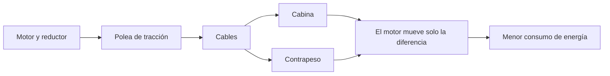

# 🧰 Recursos del ascensor

[🏠 Inicio](../../../README.md) · [🛗 Curso: Ascensores](../README.md) · 🧰 Recursos

Glosario específico, enlaces y diagramas de apoyo del curso de ascensores. Amplia
el [glosario general](../../../docs/05-glosario-general.md).

---

## 📖 Glosario específico

| Término | Definición |
| --- | --- |
| Contrapeso | Masa que equilibra la cabina para reducir el esfuerzo del motor. |
| Polea de tracción | Rueda ranurada que mueve los cables por fricción. |
| Cable de tracción | Cable de acero que sostiene y mueve cabina y contrapeso. |
| Gobernador de velocidad | Dispositivo que detecta un exceso de velocidad de descenso. |
| Freno de seguridad | Sistema de cunas que muerde las guías y detiene la cabina. |
| Guías | Rieles verticales que mantienen alineada la cabina. |
| Nivelación | Detención de la cabina alineada con el piso. |
| Maniobra colectiva | Lógica que agrupa llamadas para optimizar viajes. |
| Modo inspección | Operación reservada al técnico competente en mantención. |

---

## 🗺️ Diagrama de equilibrio con contrapeso

```mermaid
flowchart LR
    Motor[Motor y reductor] --> Polea[Polea de tracción]
    Polea --> Cable[Cables]
    Cable --> Cabina[Cabina]
    Cable --> Contrapeso[Contrapeso]
    Cabina --> Equilibrio[El motor mueve solo la diferencia]
    Contrapeso --> Equilibrio
    Equilibrio --> Ahorro[Menor consumo de energía]
```

---

## 🔗 Enlaces y fuentes

- Marco legal: [⚖️ docs/07-marco-legal-chile.md](../../../docs/07-marco-legal-chile.md)
- Registro de fuentes: [📚 manuales/fuentes.md](../../../manuales/fuentes.md)
- Ley 20.296 y OGUC: ver el registro de fuentes.

Registrar cada recurso nuevo con su origen y licencia, siguiendo
[`recursos/README.md`](../../../recursos/README.md).

## 🎓 Cierre de clase

- **Actividad:** Selecciona términos de glosario, esquemas y trazabilidad de fuentes, explícalos en contexto de Ascensores y verifica la procedencia de las fuentes utilizadas.
- **Evidencia:** Glosario aplicado y ficha breve de trazabilidad.
- **Criterio de aprobación:** Los términos permiten interpretar el curso y las fuentes se distinguen por autoridad, alcance y vigencia.
- **Transferencia:** explica qué cambiaría al pasar a otra variante de esta máquina.

### Fuentes de esta clase

- [OSHA-ELEVATORS](https://www.osha.gov/laws-regs/regulations/standardnumber/1917/1917.116): 1917.116 Elevators and Escalators, OSHA. Uso: inspección y riesgos de transporte vertical.
- [US-NHTSA](https://www.nhtsa.gov/vehicle-safety): Vehicle Safety, NHTSA. Uso: seguridad de vehículos terrestres.

> Las fuentes sostienen el marco conceptual y normativo; esta clase no reemplaza el manual
> del fabricante, la formación certificada ni la habilitación exigida para operar equipos reales.

---

[🎓 Portada del curso](../README.md) · [⬅️ Anterior: Diseño de simulación](../simulacion/diseno-simulador-ascensor.md) · [➡️ Siguiente: Ejercicios](../ejercicios/ejercicios-ascensor.md)
