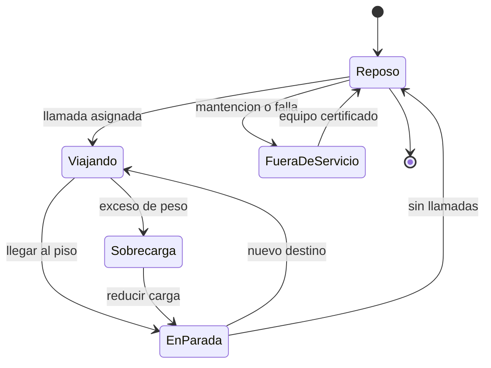

# 🎮 Diseño de simulación del ascensor

[🏠 Inicio](../../../README.md) · [🛗 Curso: Ascensores](../README.md) · 🎮 Simulación

## Objetivo de la simulación

Que el usuario entienda cómo funciona un ascensor: llamar la cabina, viajar entre
pisos con contrapeso, respetar la carga máxima y el rol de los frenos de
seguridad, de forma segura y progresiva.

## Nivel de realismo

- Nivel elegido: se ofrece del 1 al 3 (ver `docs/03-niveles-de-realismo.md`).
- Justificación: el ascensor permite enseñar equilibrio con contrapeso, tracción
  por fricción y seguridad redundante con baja complejidad.

## Variables principales

| Variable | Tipo | Rango | Afecta a | Comentarios |
| --- | --- | --- | --- | --- |
| Posición | numérica | piso 0..n | Estado del viaje | Nivel actual de la cabina. |
| Velocidad | numérica | 0-3 m/s | Confort y tiempo | Perfil suave con variador. |
| Carga | numérica | 0-100% nominal | Arranque y consumo | Sobre el límite, no arranca. |
| Contrapeso | numérica | fijo | Esfuerzo del motor | Equilibra la cabina. |
| Estado de puerta | discreta | abierta/cerrada | Seguridad | Enclavamiento activo. |
| Cola de llamadas | lista | pisos pedidos | Ruta de la cabina | Maniobra colectiva. |
| Estado de servicio | discreta | operativo/inspección | Disponibilidad | Depende de mantención. |
| Velocidad de descenso | numérica | derivada | Freno de seguridad | Dispara el gobernador. |

## Ciclo básico

1. Leer entradas (llamadas de piso y de cabina, puertas).
2. Actualizar la cola de llamadas con la maniobra colectiva.
3. Calcular esfuerzo del motor según carga y contrapeso.
4. Aplicar límites (sobrecarga, finales de carrera, enclavamiento).
5. Actualizar posición, velocidad y estado de puertas.
6. Refrescar indicadores y retroalimentación (posición, flechas, alarmas).

## Modos de juego futuros

- Tutorial guiado de llamadas y viajes.
- Gestión de tráfico en hora punta de oficinas.
- Escenario de hospital con prioridad de camillas.
- Desafíos de eficiencia con maniobra colectiva.
- Situaciones de mantención y fuera de servicio, sin contenido sensible.

## Elementos fuera de alcance

- Instrucciones para intervenir un ascensor real sin personal competente.
- Anular o burlar los sistemas de seguridad.
- Datos técnicos que permitan alterar equipos reales.

## Pendientes

- [ ] Definir valores por defecto por tipo de edificio.
- [ ] Prototipar la maniobra colectiva en un motor simple.
- [ ] Ajustar el perfil de velocidad y nivelación.
- [ ] Agregar fuentes técnicas públicas a [`manuales/fuentes.md`](../../../manuales/fuentes.md).

---

[⬅️ Anterior: Reglamentos](../reglamentos/reglamentos-ascensor.md) · [➡️ Siguiente: Recursos](../recursos/recursos-ascensor.md)
