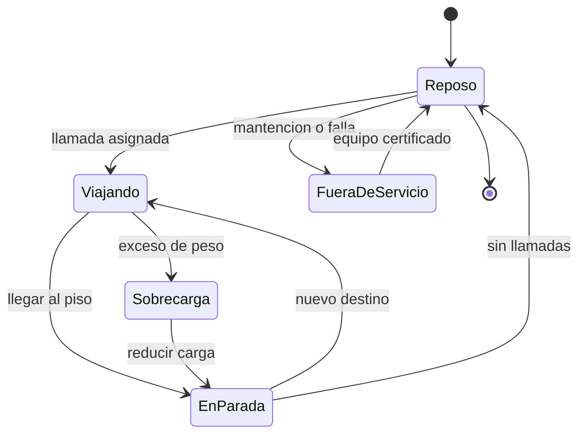
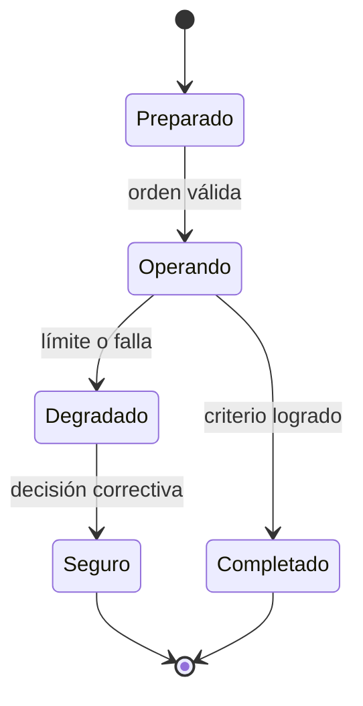

<!-- clase-meta
tipo_documento: clase
clase: 9
codigo: ASCENSORES-09
curso: ascensores
titulo: "Diseño de simulación del ascensor"
modalidad: "laboratorio de diseño"
duracion_minutos: 90
nivel: introductorio
prerrequisito: ASCENSORES-08
competencia: "modelado_de_simulacion"
resultados_aprendizaje:
  - "Explicar objetivo, variables, estados, ciclo y escenarios de simulación con vocabulario propio de Ascensores."
  - "Aplicar esos conceptos a una decisión segura o a un escenario de simulación de Ascensores."
evidencia: "Ficha de escenario y diagrama de estados."
criterio_aprobacion: "El modelo es específico de la máquina, medible, seguro y trazable a clases anteriores."
fuentes: manuales/fuentes.md
ultima_revision: 2026-09-10
-->

# 🎮 Diseño de simulación del ascensor

[🏠 Inicio](../../../README.md) · [🛗 Curso: Ascensores](../README.md) · 🎮 Simulación

```mermaid
stateDiagram-v2
    [*] --> Reposo
    Reposo --> Viajando: llamada asignada
    Viajando --> EnParada: llegar al piso
    EnParada --> Viajando: nuevo destino
    EnParada --> Reposo: sin llamadas
    Viajando --> Sobrecarga: exceso de peso
    Sobrecarga --> EnParada: reducir carga
    Reposo --> FueraDeServicio: mantencion o falla
    FueraDeServicio --> Reposo: equipo certificado
    Reposo --> [*]
```

## Objetivo de la simulación

Que el usuario entienda cómo funciona un ascensor: llamar la cabina, viajar entre
pisos con contrapeso, respetar la carga máxima y el rol de los frenos de
seguridad, de forma segura y progresiva.

## Nivel de realismo

- Nivel elegido: se ofrece del 1 al 3 (ver `docs/03-niveles-de-realismo.md`).
- Justificación: el ascensor permite enseñar equilibrio con contrapeso, tracción
  por fricción y seguridad redundante con baja complejidad.

## Variables principales

| Variable | Tipo | Rango | Afecta a | Comentarios |
| --- | --- | --- | --- | --- |
| Posición | numérica | piso 0..n | Estado del viaje | Nivel actual de la cabina. |
| Velocidad | numérica | 0-3 m/s | Confort y tiempo | Perfil suave con variador. |
| Carga | numérica | 0-100% nominal | Arranque y consumo | Sobre el límite, no arranca. |
| Contrapeso | numérica | fijo | Esfuerzo del motor | Equilibra la cabina. |
| Estado de puerta | discreta | abierta/cerrada | Seguridad | Enclavamiento activo. |
| Cola de llamadas | lista | pisos pedidos | Ruta de la cabina | Maniobra colectiva. |
| Estado de servicio | discreta | operativo/inspección | Disponibilidad | Depende de mantención. |
| Velocidad de descenso | numérica | derivada | Freno de seguridad | Dispara el gobernador. |

## Ciclo básico

1. Leer entradas (llamadas de piso y de cabina, puertas).
2. Actualizar la cola de llamadas con la maniobra colectiva.
3. Calcular esfuerzo del motor según carga y contrapeso.
4. Aplicar límites (sobrecarga, finales de carrera, enclavamiento).
5. Actualizar posición, velocidad y estado de puertas.
6. Refrescar indicadores y retroalimentación (posición, flechas, alarmas).

## Modos de juego futuros

- Tutorial guiado de llamadas y viajes.
- Gestión de tráfico en hora punta de oficinas.
- Escenario de hospital con prioridad de camillas.
- Desafíos de eficiencia con maniobra colectiva.
- Situaciones de mantención y fuera de servicio, sin contenido sensible.

## Elementos fuera de alcance

- Instrucciones para intervenir un ascensor real sin personal competente.
- Anular o burlar los sistemas de seguridad.
- Datos técnicos que permitan alterar equipos reales.

## Pendientes

- [ ] Definir valores por defecto por tipo de edificio.
- [ ] Prototipar la maniobra colectiva en un motor simple.
- [ ] Ajustar el perfil de velocidad y nivelación.
- [ ] Agregar fuentes técnicas públicas a [`manuales/fuentes.md`](../../../manuales/fuentes.md).

## 🧭 Guía de estudio aplicada

### Pregunta guía

¿Cómo ayuda **Objetivo de la simulación, Nivel de realismo, Variables principales y Ciclo básico** a **modelar viaje con carga variable seguido de una orden de parada en piso como estados, variables y decisiones observables**?

### Explicación razonada

Una simulación de Ascensores es educativa si representa decisiones y consecuencias. Como mínimo debe modelar el estado de motor, la respuesta de polea tractora, la transición en cables y el resultado en cabina y contrapeso. El escenario «viaje con carga variable seguido de una orden de parada en piso» es valioso porque obliga a observar, formular una hipótesis, actuar y comprobar.

```mermaid
stateDiagram-v2
    [*] --> Preparado
    Preparado --> Operando: orden válida
    Operando --> Degradado: límite o falla
    Degradado --> Seguro: decisión correctiva
    Operando --> Completado: criterio logrado
    Seguro --> [*]
    Completado --> [*]
```

Esta clase se conecta con el resto del curso mediante **equilibrio de masas y control de aceleración, velocidad, nivelación y frenado**. El hilo de
seguridad consiste en reconocer a tiempo **movimiento con puertas inseguras, mala nivelación o pérdida de tracción** y poder justificar la decisión
**verificar enclavamientos y estado antes de autorizar el movimiento**; en clases posteriores cambiará el ángulo de análisis, no esa relación causal.
La lectura funcional común sigue **motor → polea tractora → cables → cabina y contrapeso**, de modo que cada concepto pueda
ubicarse dentro del funcionamiento completo y no quede como un dato aislado.

**Apoyo documental:** [1917.116 Elevators and Escalators](https://www.osha.gov/laws-regs/regulations/standardnumber/1917/1917.116) aporta inspección y riesgos de transporte vertical;
[Vehicle Safety](https://www.nhtsa.gov/vehicle-safety) se usa para seguridad de vehículos terrestres. Estas fuentes
se contrastan con el alcance de la clase y no sustituyen un manual de equipo concreto.

### Caso resuelto: de la observación a la decisión

1. **Estado inicial:** representa viaje con carga variable seguido de una orden de parada en piso con valores observables para **motor**, **polea tractora**, **cables** y **cabina y contrapeso**.
2. **Decisión del estudiante:** ofrece una elección que cambie el estado, no una animación automática.
3. **Consecuencia:** modela la tendencia hacia **movimiento con puertas inseguras, mala nivelación o pérdida de tracción** y una señal previa que permita corregir.
4. **Cierre:** evalúa la explicación de la decisión, además de si el estudiante “ganó” el escenario.

### Comprueba tu comprensión

1. ¿Qué cuatro estados mínimos necesita el escenario «viaje con carga variable seguido de una orden de parada en piso»?
2. ¿Qué variable anticipa **movimiento con puertas inseguras, mala nivelación o pérdida de tracción** antes de llegar al estado de falla?
3. ¿Cómo evaluarías la explicación del estudiante y no solo el resultado final?

Orientación para revisar tus respuestas

- La primera respuesta debe relacionar el eslabón elegido con un efecto posterior, no solo nombrarlo.
- La segunda debe proponer una señal medible u observable y explicar qué tendencia sería preocupante.
- La tercera debe cambiar al menos una variable de capacidad, mando, entorno o margen de seguridad.

## 🎓 Cierre de clase

- **Actividad:** Diseña un escenario educativo de Ascensores basado en objetivo, variables, estados, ciclo y escenarios de simulación, con entradas, estados, variables y criterio de cierre.
- **Evidencia:** Ficha de escenario y diagrama de estados.
- **Criterio de aprobación:** El modelo es específico de la máquina, medible, seguro y trazable a clases anteriores.
- **Transferencia:** explica qué cambiaría al pasar a otra variante de esta máquina.

### Fuentes de esta clase

- [OSHA-ELEVATORS](https://www.osha.gov/laws-regs/regulations/standardnumber/1917/1917.116): 1917.116 Elevators and Escalators, OSHA. Uso: inspección y riesgos de transporte vertical.
- [US-NHTSA](https://www.nhtsa.gov/vehicle-safety): Vehicle Safety, NHTSA. Uso: seguridad de vehículos terrestres.

> Las fuentes sostienen el marco conceptual y normativo; esta clase no reemplaza el manual
> del fabricante, la formación certificada ni la habilitación exigida para operar equipos reales.

---

[⬅️ Anterior: Reglamentos](../reglamentos/reglamentos-ascensor.md) · [➡️ Siguiente: Recursos](../recursos/recursos-ascensor.md)
