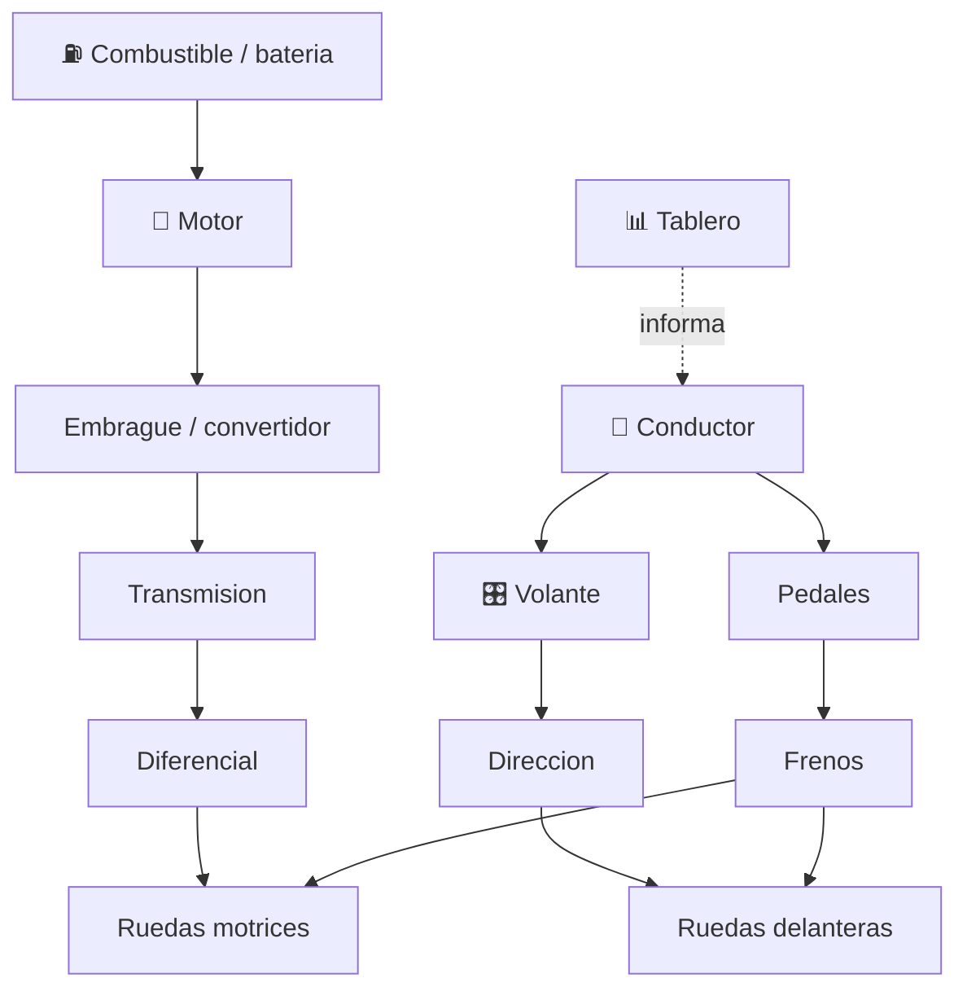

# 🚗 Curso: Automoviles

[🏠 Inicio](../../README.md) · [🚙 Catalogo de vehiculos](../README.md) · [🎓 Guia de curso](../../docs/08-guia-de-estilo-y-curso.md)

> **Curso del automovil de principio a fin.** Documenta el vehiculo mas comun de
> la via: historia, caracteristicas, mecanica en profundidad, mandos, fisica de
> la conduccion, entornos, reglamentos chilenos y diseno de simulacion. Sigue la
> plantilla de oro del curso de motocicletas.

---

## 🎯 Objetivos de aprendizaje

Al terminar este curso deberias poder:

- Explicar como un automovil acelera, frena, gira y transmite la fuerza al suelo.
- Identificar sus sistemas mecanicos y como se conectan entre si.
- Reconocer todos los mandos e instrumentos del puesto de conduccion.
- Comprender la fisica de la conduccion (traccion, adherencia, transferencia de peso).
- Conocer los reglamentos chilenos aplicables (licencia clase B, cinturon, seguridad).
- Traducir todo lo anterior en variables de un simulador educativo.

---

## 🗺️ Mapa del vehiculo

---

## 📚 Modulos del curso

| # | Modulo | Contenido | Enlace |
| :-: | --- | --- | --- |
| 1 | 📜 Historia | Origen y evolucion del automovil, linea de tiempo. | [Abrir](historia/historia-automovil.md) |
| 2 | 📋 Caracteristicas | Que es, tipos de automovil y para que sirve cada uno. | [Abrir](operacion/caracteristicas-automovil.md) |
| 3 | 🔧 Sistemas mecanicos | Motor, transmision, direccion, frenos, suspension, electrico. | [Abrir](operacion/sistemas-mecanicos-automovil.md) |
| 4 | 🎛️ Mandos e instrumentos | Puesto de conduccion, controles y tablero. | [Abrir](mandos/manual-mandos-automovil.md) |
| 5 | 🧪 Principios y operacion | Fisica de la conduccion y fases de operacion. | [Abrir](operacion/principios-automovil.md) |
| 6 | 🌍 Entornos de trabajo | Ciudad, carretera, autopista, montana, lluvia. | [Abrir](operacion/entornos-automovil.md) |
| 7 | ⚖️ Reglamentos | Ley chilena: licencia clase B, cinturon, seguridad. | [Abrir](reglamentos/reglamentos-automovil.md) |
| 8 | 🎮 Diseno de simulacion | Variables, ciclo y modos de juego. | [Abrir](simulacion/diseno-simulador-automovil.md) |
| 9 | 🧰 Recursos | Glosario, enlaces y diagramas. | [Abrir](recursos/recursos-automovil.md) |

---

## 🧩 Requisitos previos

Ninguno obligatorio. Conviene revisar antes el curso de
[🏍️ Motocicletas](../motos/README.md) porque explica aceleracion, frenado y
transmision con menor complejidad. El automovil agrega carroceria, cuatro ruedas,
transferencia de peso lateral y mas ayudas electronicas. Marco legal comun en
[⚖️ docs/07-marco-legal-chile.md](../../docs/07-marco-legal-chile.md).

---

[➡️ Empezar por el Modulo 1: Historia](historia/historia-automovil.md)
