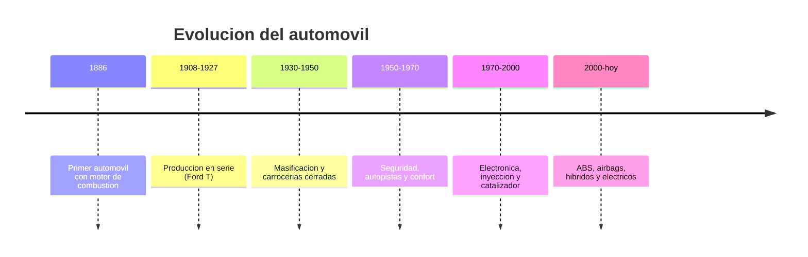

# 📜 Historia del automovil

[🏠 Inicio](../../../README.md) · [🚗 Curso: Automoviles](../README.md) · 📜 Historia

## Origen

El automovil moderno nace a finales del siglo XIX cuando se monta un motor de
combustion interna sobre un chasis con ruedas. El vehiculo de tres ruedas de Karl
Benz (1886) suele citarse como el primer automovil practico. La idea era
transportar personas y carga por caminos sin depender de la traccion animal.

## Linea de tiempo

| Periodo | Hito | Importancia |
| --- | --- | --- |
| 1886 | Primer automovil con motor de combustion | Prueba del concepto de auto. |
| 1908-1927 | Produccion en serie del Ford T | Precio accesible, movilidad masiva. |
| 1930-1950 | Carrocerias cerradas y masificacion | El auto se vuelve familiar. |
| 1950-1970 | Autopistas, confort y primeras normas | Foco en velocidad y comodidad. |
| 1970-2000 | Inyeccion, catalizador y electronica | Menos consumo y emisiones. |
| 2000-presente | ABS, airbag, hibridos y electricos | Mas seguridad y nuevas propulsiones. |

## Evolucion tecnologica

- **Materiales**: del acero pesado a aceros de alta resistencia, aluminio y
  compuestos que reducen peso y mejoran la seguridad.
- **Propulsion**: del carburador a la inyeccion electronica, y de alli a hibridos
  y motores electricos de bateria.
- **Mandos**: de controles mecanicos duros a direccion y frenos asistidos, y hoy
  a mandos electronicos y pantallas.
- **Instrumentos**: de relojes analogicos a tableros digitales configurables.
- **Seguridad**: cinturon, ABS, airbags, control de estabilidad y ayudas ADAS.
- **Automatizacion**: cajas automaticas, asistentes de carril y frenado autonomo.

## Tipos representativos

| Tipo | Uso tipico | Caracteristica destacada |
| --- | --- | --- |
| Ciudadano / hatchback | Ciudad y trayectos cortos | Compacto, facil de estacionar. |
| Sedan | Uso familiar y trabajo | Maletero cerrado, comodidad. |
| SUV / crossover | Mixto y familiar | Altura libre y espacio interior. |
| Pickup / camioneta | Carga y trabajo | Zona de carga abierta, robustez. |
| Deportivo | Placer de conduccion | Alta potencia, bajo y ligero. |
| Electrico | Ciudad y viaje limpio | Cero emisiones locales, par inmediato. |

## Impacto social y economico

El automovil transformo las ciudades, el trabajo y el ocio: permitio vivir lejos
del centro, movio la economia industrial y creo empleo en toda su cadena. Tambien
trajo desafios de congestion, contaminacion y seguridad vial, que hoy impulsan la
electrificacion, el transporte compartido y normas de trafico mas estrictas.

## Fuentes

- Registrar aqui las fuentes publicas consultadas.
- Enlazar cada fuente tambien en [`manuales/fuentes.md`](../../../manuales/fuentes.md).

---

[🎓 Portada del curso](../README.md) · [➡️ Siguiente: Caracteristicas](../operacion/caracteristicas-automovil.md)
