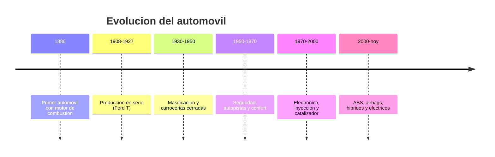

# 📜 Historia del automóvil

[🏠 Inicio](../../../README.md) · [🚗 Curso: Automóviles](../README.md) · 📜 Historia

## Origen

El automóvil moderno nace a finales del siglo XIX cuando se monta un motor de
combustión interna sobre un chasis con ruedas. El vehículo de tres ruedas de Karl
Benz (1886) suele citarse como el primer automóvil práctico. La idea era
transportar personas y carga por caminos sin depender de la tracción animal.

## Línea de tiempo

| Periodo | Hito | Importancia |
| --- | --- | --- |
| 1886 | Primer automóvil con motor de combustión | Prueba del concepto de auto. |
| 1908-1927 | Producción en serie del Ford T | Precio accesible, movilidad masiva. |
| 1930-1950 | Carrocerías cerradas y masificación | El auto se vuelve familiar. |
| 1950-1970 | Autopistas, confort y primeras normas | Foco en velocidad y comodidad. |
| 1970-2000 | Inyección, catalizador y electrónica | Menos consumo y emisiones. |
| 2000-presente | ABS, airbag, híbridos y eléctricos | Más seguridad y nuevas propulsiones. |

## Evolución tecnológica

- **Materiales**: del acero pesado a aceros de alta resistencia, aluminio y
  compuestos que reducen peso y mejoran la seguridad.
- **Propulsión**: del carburador a la inyección electrónica, y de allí a híbridos
  y motores eléctricos de batería.
- **Mandos**: de controles mecánicos duros a dirección y frenos asistidos, y hoy
  a mandos electrónicos y pantallas.
- **Instrumentos**: de relojes analogicos a tableros digitales configurables.
- **Seguridad**: cinturón, ABS, airbags, control de estabilidad y ayudas ADAS.
- **Automatización**: cajas automáticas, asistentes de carril y frenado autónomo.

## Tipos representativos

| Tipo | Uso típico | Característica destacada |
| --- | --- | --- |
| Ciudadano / hatchback | Ciudad y trayectos cortos | Compacto, fácil de estacionar. |
| Sedan | Uso familiar y trabajo | Maletero cerrado, comodidad. |
| SUV / crossover | Mixto y familiar | Altura libre y espacio interior. |
| Pickup / camioneta | Carga y trabajo | Zona de carga abierta, robustez. |
| Deportivo | Placer de conducción | Alta potencia, bajo y ligero. |
| Eléctrico | Ciudad y viaje limpio | Cero emisiones locales, par inmediato. |

## Impacto social y económico

El automóvil transformó las ciudades, el trabajo y el ocio: permitió vivir lejos
del centro, movió la economía industrial y creó empleo en toda su cadena. También
trajo desafíos de congestión, contaminación y seguridad vial, que hoy impulsan la
electrificación, el transporte compartido y normas de tráfico más estrictas.

## Fuentes

- Registrar aquí las fuentes públicas consultadas.
- Enlazar cada fuente también en [`manuales/fuentes.md`](../../../manuales/fuentes.md).

---

[🎓 Portada del curso](../README.md) · [➡️ Siguiente: Características](../operacion/caracteristicas-automovil.md)
