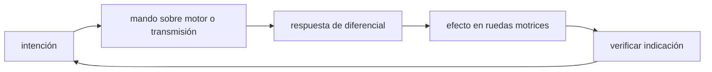

<!-- clase-meta
tipo_documento: clase
clase: 5
codigo: AUTOMOVILES-05
curso: automoviles
titulo: "Mandos e instrumentos del automóvil"
modalidad: "taller de simulación"
duracion_minutos: 60
nivel: introductorio
prerrequisito: AUTOMOVILES-04
competencia: "lectura_y_mando"
resultados_aprendizaje:
  - "Explicar controles, instrumentos, entradas y estados del sistema con vocabulario propio de Automóviles."
  - "Aplicar esos conceptos a una decisión segura o a un escenario de simulación de Automóviles."
evidencia: "Mapa de mandos y resolución de dos estados del tablero."
criterio_aprobacion: "Reconoce los controles críticos y responde a los estados sin introducir acciones inseguras."
fuentes: manuales/fuentes.md
ultima_revision: 2026-09-10
-->

# 🎛️ Mandos e instrumentos del automóvil

[🏠 Inicio](../../../README.md) · [🚗 Curso: Automóviles](../README.md) · 🎛️ Mandos

## Vista general

El puesto de conducción de un automóvil reune el volante, los pedales, la palanca
selectora y un conjunto de mandos secundarios al alcance de la mano. A diferencia
de una moto, el conductor va sentado y protegido, y opera la dirección con ambas
manos sobre el volante y la propulsión y frenado con los pies. El tablero, hoy
digital o mixto, se ubica frente al conductor.

## Mapa de controles

| Zona | Control | Tipo | Función | Prioridad | Comentarios |
| --- | --- | --- | --- | --- | --- |
| Volante | Volante | Aro giratorio | Orientar las ruedas delanteras | Alta | Se maneja con ambas manos. |
| Pie derecho | Acelerador | Pedal | Regular potencia del motor | Alta | Progresivo, no on/off. |
| Pie derecho | Freno | Pedal | Reducir velocidad | Alta | Modula la fuerza de frenado. |
| Pie izquierdo | Embrague | Pedal | Desconectar motor y caja | Alta | Solo en transmisión manual. |
| Consola | Palanca selectora | Palanca | Elegir marcha o modo (P R N D) | Alta | Manual o automática. |
| Consola | Freno de mano | Palanca / botón | Inmovilizar detenido | Media | Mecánico o eléctrico (EPB). |
| Volante izq | Luces e intermitentes | Palanca | Señalizar y alumbrar | Media | Cruce, carretera y giros. |
| Volante der | Limpiaparabrisas | Palanca | Limpiar el vidrio | Media | Con lluvia o suciedad. |
| Volante | Bocina | Botón | Advertir | Media | Uso de seguridad. |
| Tablero | Climatización | Perillas / pantalla | Regular temperatura | Baja | Confort y desempano. |
| Tablero | Instrumentos | Pantalla | Mostrar estado | Alta | Ver sección de instrumentos. |

## Instrumentos principales

| Instrumento | Mide o muestra | Unidad | Importancia | Notas |
| --- | --- | --- | --- | --- |
| Velocímetro | Velocidad | km/h | Alta | Central para circular seguro. |
| Tacómetro | Régimen del motor | rpm | Media | Ayuda a elegir la marcha. |
| Indicador de marcha | Marcha o modo actual | P R N D / número | Media | Común en cajas automáticas. |
| Nivel de combustible | Energía restante | fracción / % | Alta | Incluye autonomía estimada. |
| Temperatura motor | Estado térmico | grados | Media | Alerta de sobrecalentamiento. |
| Testigos | Estado de sistemas | luz | Alta | Aceite, ABS, airbag, cinturón. |
| Odómetro | Distancia recorrida | km | Baja | Total y parcial. |

## Entradas de simulación

| Acción | Teclado | Controlador | Pantalla táctil | Comentarios |
| --- | --- | --- | --- | --- |
| Acelerar | Flecha arriba | Gatillo derecho | Zona derecha | Progresivo, no on/off. |
| Frenar | Flecha abajo | Gatillo izquierdo | Botón freno | Modula la fuerza. |
| Embragar | Shift | Botón lateral | Botón embrague | Solo en modo manual. |
| Girar | Flechas izq/der | Stick izquierdo | Inclinar / arrastrar | Proporcional al ángulo. |
| Cambiar marcha | E / Q | Cruceta arriba/abajo | Botones +/- | Manual o modo D. |
| Luces / intermitentes | Tecla L | Cruceta lateral | Botón luces | Señalizar maniobras. |
| Freno de mano | Barra espacio | Botón inferior | Botón freno mano | Al detenerse o estacionar. |

## Estados del sistema

| Estado | Descripción | Indicadores | Acciones disponibles |
| --- | --- | --- | --- |
| Apagado | Motor detenido | Tablero off | Encender, ajustar posición. |
| Preparado | Motor encendido, detenido | Testigos activos | Poner marcha, soltar freno. |
| En movimiento | Circulando | Velocímetro activo | Acelerar, frenar, girar, cambiar. |
| Emergencia | Riesgo o falla | Testigos de alerta | Frenar, orillar, encender balizas. |

## Observaciones ergonomicas

- El velocímetro y los testigos deben verse siempre sin apartar la vista del camino.
- Acelerador y freno comparten el pie derecho: la interfaz debe dejar claro que no
  se accionan a la vez.
- El freno de mano y las balizas deben ser accesibles y reconocibles.
- La interfaz de simulación debería exigir el cinturón antes de partir y penalizar
  el uso del teléfono en los niveles de realismo más altos.

## 🧭 Guía de estudio aplicada

### Pregunta guía

¿Cómo ayuda **Vista general, Mapa de controles, Instrumentos principales y Entradas de simulación** a **interpretar mandos e indicaciones durante frenada de emergencia en una calzada con adherencia desigual**?

### Explicación razonada

Un mando no se aprende memorizando su nombre, sino recorriendo el ciclo intención → acción → indicación → verificación. En Automóviles, el operador actúa sobre motor o transmisión, observa la respuesta en diferencial y confirma el efecto en ruedas motrices. Una indicación inesperada exige detener la secuencia mental, identificar el modo activo y evitar una segunda orden que agrave el estado.

Esta clase se conecta con el resto del curso mediante **transferencia de carga y reparto del círculo de adherencia entre frenar, girar y acelerar**. El hilo de
seguridad consiste en reconocer a tiempo **perder estabilidad por combinar exceso de velocidad, giro y frenado tardío** y poder justificar la decisión
**crear margen de detención y dosificar dirección y freno según la superficie**; en clases posteriores cambiará el ángulo de análisis, no esa relación causal.
La lectura funcional común sigue **motor → transmisión → diferencial → ruedas motrices**, de modo que cada concepto pueda
ubicarse dentro del funcionamiento completo y no quede como un dato aislado.

**Apoyo documental:** [Ley de Tránsito 18.290](https://www.bcn.cl/leychile/navegar?idNorma=29708) aporta marco legal chileno;
[Manuales para conductores](https://www.conaset.cl/manuales/) se usa para formación vial y seguridad. Estas fuentes
se contrastan con el alcance de la clase y no sustituyen un manual de equipo concreto.

### Caso resuelto: de la observación a la decisión

1. **Intención:** formula qué cambio se necesita durante **frenada de emergencia en una calzada con adherencia desigual**.
2. **Mando:** identifica el control que actúa sobre **motor** o **transmisión** y el modo que debe estar activo.
3. **Lectura:** localiza la indicación que confirma la respuesta de **diferencial** y el efecto en **ruedas motrices**.
4. **Verificación:** si la lectura no coincide, no acumules órdenes; estabiliza e investiga el estado.

### Comprueba tu comprensión

1. ¿Qué mando inicia la respuesta y qué instrumento confirma que el modo correcto está activo?
2. ¿Qué indicación temprana advertiría **perder estabilidad por combinar exceso de velocidad, giro y frenado tardío**?
3. ¿Qué secuencia usarías si la respuesta de **ruedas motrices** no coincide con la orden?

Orientación para revisar tus respuestas

- La primera respuesta debe relacionar el eslabón elegido con un efecto posterior, no solo nombrarlo.
- La segunda debe proponer una señal medible u observable y explicar qué tendencia sería preocupante.
- La tercera debe cambiar al menos una variable de capacidad, mando, entorno o margen de seguridad.

## 🎓 Cierre de clase

- **Actividad:** Recorre el puesto de mando simulado de Automóviles: localiza los controles de controles, instrumentos, entradas y estados del sistema y asocia cada indicación con una decisión.
- **Evidencia:** Mapa de mandos y resolución de dos estados del tablero.
- **Criterio de aprobación:** Reconoce los controles críticos y responde a los estados sin introducir acciones inseguras.
- **Transferencia:** explica qué cambiaría al pasar a otra variante de esta máquina.

### Fuentes de esta clase

- [CL-LEY-18290](https://www.bcn.cl/leychile/navegar?idNorma=29708): Ley de Tránsito 18.290, BCN Chile. Uso: marco legal chileno.
- [CL-CONASET](https://www.conaset.cl/manuales/): Manuales para conductores, CONASET. Uso: formación vial y seguridad.
- [US-NHTSA](https://www.nhtsa.gov/vehicle-safety): Vehicle Safety, NHTSA. Uso: seguridad de vehículos terrestres.

> Las fuentes sostienen el marco conceptual y normativo; esta clase no reemplaza el manual
> del fabricante, la formación certificada ni la habilitación exigida para operar equipos reales.

---

[⬅️ Anterior: Sistemas mecánicos](../operacion/sistemas-mecanicos-automovil.md) · [➡️ Siguiente: Principios y operación](../operacion/principios-automovil.md)
