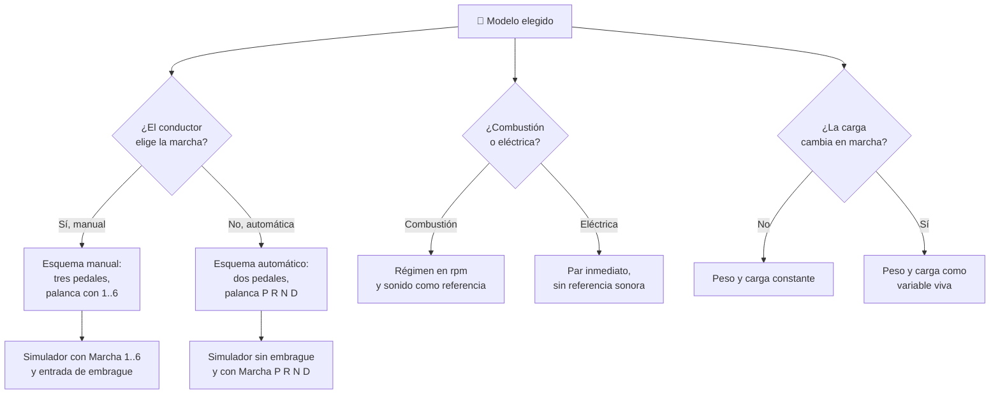

# 🧩 Modelos y variantes del automóvil

[🏠 Inicio](../../../README.md) · [🚗 Curso: Automóviles](../README.md) · 🧩 Modelos

El [Módulo 2](../operacion/caracteristicas-automovil.md) ya dijo qué tipos de
automóvil existen y para qué sirve cada uno. Este módulo responde a lo siguiente:
**no todos se conducen igual**, y esa diferencia no es de matiz. Cambia qué mandos
tiene la máquina y, por tanto, qué debe modelar el simulador.

> 🎯 **La idea que sostiene el módulo.** "Un automóvil" no es una sola máquina
> desde el punto de vista del mando. Un eléctrico no tiene embrague ni caja de
> marchas: no es que los tenga más fáciles, es que **no existen**. Un simulador
> que presente un solo esquema de control está representando un automóvil
> concreto aunque diga representarlos todos.

---

## 🧭 Por qué el modelo decide el simulador

El [Módulo 5](../mandos/manual-mandos-automovil.md) describe un puesto de
conducción con **embrague en el pedal del pie izquierdo** y una palanca selectora
para elegir marcha. El propio módulo lo acota: el embrague existe "solo en
transmisión manual". El [Módulo 9](../simulacion/diseno-simulador-automovil.md)
expone una variable `Marcha / modo` con rango `P,R,N,D,1..6` y una variable
`Régimen del motor` con rango `0-7000 rpm`, ligada a la marcha. Ambos describen un
automóvil **de combustión y transmisión manual**.

En un eléctrico ese pedal izquierdo no existe: el pie izquierdo se queda sin
función. La variable `Marcha / modo` pierde el tramo `1..6` y se reduce a
`P,R,N,D`. Y `Régimen del motor` no tiene nada a lo que ligarse, porque no hay
marcha que elegir ni tacómetro que leer. Si el simulador se construye sobre el
esquema manual y luego se le "añade" un eléctrico, el resultado es un eléctrico
con embrague, que no existe.

---

## 🗂️ Qué cambia en el manejo

| Modelo | Qué cambia al conducirlo |
| --- | --- |
| Hatchback / ciudad | La referencia del curso: compacto, ágil, respuesta neutra y fácil de situar en la calzada. |
| Sedan | Más largo y con maletero cerrado: mejor confort en ruta, pero hay que anticipar más el estacionamiento. |
| SUV / crossover | Centro de gravedad alto y visión elevada: más balanceo lateral en curva, aunque se ve mejor el tráfico. |
| Pickup / camioneta | La zona de carga cambia el reparto de peso durante la jornada: vacía atrás, el eje trasero agarra menos. |
| Furgón / van | Gran volumen y masa alta: más inercia, más distancia de frenado y sensibilidad al viento lateral. |
| Deportivo | Potencia alta y centro de gravedad bajo: la transferencia de peso es más brusca y el margen de error se acorta. |
| Eléctrico / híbrido | Par inmediato desde parado y sin ruido de motor: se pierde la referencia sonora del régimen y la frenada regenerativa retiene sola. |

---

## 🎛️ Qué cambia en el mando

| Modelo | Qué mando aparece o desaparece | Consecuencia |
| --- | --- | --- |
| Hatchback, Sedan, SUV, Deportivo | Ninguno: el mapa de controles del Módulo 5 aplica tal cual. | Cambian los rangos, no los controles. |
| Pickup / camioneta | **Aparece** la zona de carga como masa que el conductor gestiona. Puede aparecer el selector de tracción (AWD / 4x4). | La carga no es un mando, pero altera el resultado de todos los demás. |
| Furgón / van | **Aparece** la carga variable del reparto; los espejos sustituyen a la visión trasera directa. | La referencia visual del conductor cambia de sitio. |
| Eléctrico | **Desaparece** el pedal de embrague y **desaparece** el tramo de marchas de la palanca selectora, que queda en `P R N D`. El acelerador pasa a mandar par directo y a gestionar la regeneración al soltarlo. | El pie izquierdo deja de tener función y el tacómetro pierde sentido. |
| Híbrido | **Desaparece** el embrague en las variantes de caja automática o CVT. El motor térmico arranca y para solo. | El conductor deja de decidir cuándo hay motor encendido. |

---

## 🎮 Qué cambia en el simulador

Contrastado con las variables del
[Módulo 9](../simulacion/diseno-simulador-automovil.md):

| Modelo | Variables que cambian | Esquema de control |
| --- | --- | --- |
| Hatchback / ciudad | Ninguna: es el caso base. | El del Módulo 5. |
| Sedan | `Peso y carga` sube algo; `Velocidad` mantiene su rango. | El mismo. |
| SUV / crossover | `Adherencia` se resiente antes en curva por el balanceo; `Peso y carga` sube. | El mismo. |
| Pickup / camioneta | `Peso y carga` deja de ser fijo y pasa a variar durante la partida; `Adherencia` del eje trasero depende de esa carga. | El mismo. |
| Furgón / van | `Peso y carga` varía durante la partida; la distancia de frenado ligada a `Velocidad` crece de forma apreciable. | El mismo. |
| Deportivo | `Régimen del motor` y `Velocidad` amplían rango; la transferencia de peso pesa más en el cálculo. | El mismo, con respuesta más sensible. |
| Eléctrico | `Marcha / modo` **pierde** el tramo `1..6` y queda en `P,R,N,D`. `Régimen del motor` **desaparece** o se sustituye por par disponible. `Combustible / energía` pasa a ser carga de batería y se degrada con la temperatura. | Sin entrada de embrague ni de cambio; frenada regenerativa en el acelerador. |
| Híbrido | `Régimen del motor` **se desacopla** de la entrada del usuario: lo decide la gestión del vehículo. `Combustible / energía` pasa a tener dos depósitos, batería y combustible. | Sin embrague en caja automática o CVT. |

---

## 🗺️ Del modelo al esquema de control

---

## ⚠️ Qué modelos no comparten simulador

Dos familias no se resuelven con un ajuste de parámetros, porque su esquema de
control es otro:

- **El eléctrico y el híbrido de caja automática** frente al resto: falta una
  entrada, el embrague, y una segunda cambia de naturaleza, porque la palanca
  deja de ofrecer marchas. Es un modo de control distinto, no una dificultad
  distinta. Además `Régimen del motor` deja de responder al usuario.
- **La pickup y el furgón de reparto** frente a los demás: obligan a que
  `Peso y carga` sea una variable viva durante la partida, no una constante que
  se fija al empezar. Todo el cálculo de frenado y adherencia depende de un valor
  que se mueve.

El resto de modelos sí caben en un mismo simulador ajustando rangos, tal como
plantean los [niveles de realismo](../../../docs/03-niveles-de-realismo.md): en el
nivel 1 casi todos se comportan igual, y las diferencias emergen a medida que el
nivel sube. No es casualidad que el
[Módulo 6](../operacion/principios-automovil.md) sitúe el embrague y las marchas
en el nivel 3: son justo lo que separa un esquema de control del otro.

> ⚖️ **El principio detrás de todo esto.** Cuánto pesa la carga y dónde va no cambia
> solo los números: cambia qué puede hacer el operador. La física común a todas las
> máquinas del catálogo —sostener, girar, equilibrar y la masa que cambia en
> marcha— está en [⚖️ carga y manejo](../../../docs/09-carga-y-manejo.md).

---

[⬅️ Anterior: Características](../operacion/caracteristicas-automovil.md) · [➡️ Siguiente: Sistemas mecánicos](../operacion/sistemas-mecanicos-automovil.md)
