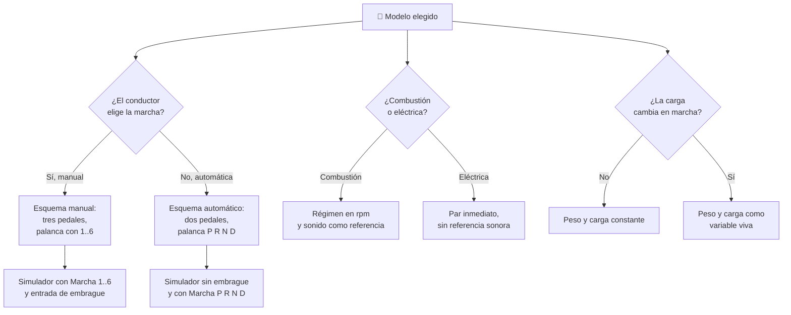

<!-- clase-meta
tipo_documento: clase
clase: 3
codigo: AUTOMOVILES-03
curso: automoviles
titulo: "Modelos y variantes del automóvil"
modalidad: "comparativa guiada"
duracion_minutos: 60
nivel: introductorio
prerrequisito: AUTOMOVILES-02
competencia: "seleccion_de_configuracion"
resultados_aprendizaje:
  - "Explicar manejo, arquitectura de mandos y variables de simulación con vocabulario propio de Automóviles."
  - "Aplicar esos conceptos a una decisión segura o a un escenario de simulación de Automóviles."
evidencia: "Matriz comparativa y decisión justificada."
criterio_aprobacion: "La elección considera función, límites, mando y efecto en la simulación; no se apoya solo en preferencias."
fuentes: manuales/fuentes.md
ultima_revision: 2026-09-10
-->

# 🧩 Modelos y variantes del automóvil

[🏠 Inicio](../../../README.md) · [🚗 Curso: Automóviles](../README.md) · 🧩 Modelos

El [Clase 2](../operacion/caracteristicas-automovil.md) ya dijo qué tipos de
automóvil existen y para qué sirve cada uno. Esta clase responde a lo siguiente:
**no todos se conducen igual**, y esa diferencia no es de matiz. Cambia qué mandos
tiene la máquina y, por tanto, qué debe modelar el simulador.

> 🎯 **La idea que sostiene el módulo.** "Un automóvil" no es una sola máquina
> desde el punto de vista del mando. Un eléctrico no tiene embrague ni caja de
> marchas: no es que los tenga más fáciles, es que **no existen**. Un simulador
> que presente un solo esquema de control está representando un automóvil
> concreto aunque diga representarlos todos.

---

## 🧭 Por qué el modelo decide el simulador

El [Clase 5](../mandos/manual-mandos-automovil.md) describe un puesto de
conducción con **embrague en el pedal del pie izquierdo** y una palanca selectora
para elegir marcha. El propio módulo lo acota: el embrague existe "solo en
transmisión manual". El [Clase 9](../simulacion/diseno-simulador-automovil.md)
expone una variable `Marcha / modo` con rango `P,R,N,D,1..6` y una variable
`Régimen del motor` con rango `0-7000 rpm`, ligada a la marcha. Ambos describen un
automóvil **de combustión y transmisión manual**.

En un eléctrico ese pedal izquierdo no existe: el pie izquierdo se queda sin
función. La variable `Marcha / modo` pierde el tramo `1..6` y se reduce a
`P,R,N,D`. Y `Régimen del motor` no tiene nada a lo que ligarse, porque no hay
marcha que elegir ni tacómetro que leer. Si el simulador se construye sobre el
esquema manual y luego se le "añade" un eléctrico, el resultado es un eléctrico
con embrague, que no existe.

---

## 🗂️ Qué cambia en el manejo

| Modelo | Qué cambia al conducirlo |
| --- | --- |
| Hatchback / ciudad | La referencia del curso: compacto, ágil, respuesta neutra y fácil de situar en la calzada. |
| Sedan | Más largo y con maletero cerrado: mejor confort en ruta, pero hay que anticipar más el estacionamiento. |
| SUV / crossover | Centro de gravedad alto y visión elevada: más balanceo lateral en curva, aunque se ve mejor el tráfico. |
| Pickup / camioneta | La zona de carga cambia el reparto de peso durante la jornada: vacía atrás, el eje trasero agarra menos. |
| Furgón / van | Gran volumen y masa alta: más inercia, más distancia de frenado y sensibilidad al viento lateral. |
| Deportivo | Potencia alta y centro de gravedad bajo: la transferencia de peso es más brusca y el margen de error se acorta. |
| Eléctrico / híbrido | Par inmediato desde parado y sin ruido de motor: se pierde la referencia sonora del régimen y la frenada regenerativa retiene sola. |

---

## 🎛️ Qué cambia en el mando

| Modelo | Qué mando aparece o desaparece | Consecuencia |
| --- | --- | --- |
| Hatchback, Sedan, SUV, Deportivo | Ninguno: el mapa de controles del Clase 5 aplica tal cual. | Cambian los rangos, no los controles. |
| Pickup / camioneta | **Aparece** la zona de carga como masa que el conductor gestiona. Puede aparecer el selector de tracción (AWD / 4x4). | La carga no es un mando, pero altera el resultado de todos los demás. |
| Furgón / van | **Aparece** la carga variable del reparto; los espejos sustituyen a la visión trasera directa. | La referencia visual del conductor cambia de sitio. |
| Eléctrico | **Desaparece** el pedal de embrague y **desaparece** el tramo de marchas de la palanca selectora, que queda en `P R N D`. El acelerador pasa a mandar par directo y a gestionar la regeneración al soltarlo. | El pie izquierdo deja de tener función y el tacómetro pierde sentido. |
| Híbrido | **Desaparece** el embrague en las variantes de caja automática o CVT. El motor térmico arranca y para solo. | El conductor deja de decidir cuándo hay motor encendido. |

---

## 🎮 Qué cambia en el simulador

Contrastado con las variables del
[Clase 9](../simulacion/diseno-simulador-automovil.md):

| Modelo | Variables que cambian | Esquema de control |
| --- | --- | --- |
| Hatchback / ciudad | Ninguna: es el caso base. | El del Clase 5. |
| Sedan | `Peso y carga` sube algo; `Velocidad` mantiene su rango. | El mismo. |
| SUV / crossover | `Adherencia` se resiente antes en curva por el balanceo; `Peso y carga` sube. | El mismo. |
| Pickup / camioneta | `Peso y carga` deja de ser fijo y pasa a variar durante la partida; `Adherencia` del eje trasero depende de esa carga. | El mismo. |
| Furgón / van | `Peso y carga` varía durante la partida; la distancia de frenado ligada a `Velocidad` crece de forma apreciable. | El mismo. |
| Deportivo | `Régimen del motor` y `Velocidad` amplían rango; la transferencia de peso pesa más en el cálculo. | El mismo, con respuesta más sensible. |
| Eléctrico | `Marcha / modo` **pierde** el tramo `1..6` y queda en `P,R,N,D`. `Régimen del motor` **desaparece** o se sustituye por par disponible. `Combustible / energía` pasa a ser carga de batería y se degrada con la temperatura. | Sin entrada de embrague ni de cambio; frenada regenerativa en el acelerador. |
| Híbrido | `Régimen del motor` **se desacopla** de la entrada del usuario: lo decide la gestión del vehículo. `Combustible / energía` pasa a tener dos depósitos, batería y combustible. | Sin embrague en caja automática o CVT. |

---

## 🗺️ Del modelo al esquema de control

```mermaid
flowchart TD
    Modelo[🧩 Modelo elegido] --> Trans{¿El conductor<br/>elige la marcha?}
    Trans -- Sí, manual --> Manual[Esquema manual:<br/>tres pedales,<br/>palanca con 1..6]
    Trans -- No, automática --> Auto[Esquema automático:<br/>dos pedales,<br/>palanca P R N D]
    Manual --> Var1[Simulador con Marcha 1..6<br/>y entrada de embrague]
    Auto --> Var2[Simulador sin embrague<br/>y con Marcha P R N D]
    Modelo --> Energia{¿Combustión<br/>o eléctrica?}
    Energia -- Combustión --> Reg[Régimen en rpm<br/>y sonido como referencia]
    Energia -- Eléctrica --> Par[Par inmediato,<br/>sin referencia sonora]
    Modelo --> Carga{¿La carga<br/>cambia en marcha?}
    Carga -- No --> Fijo[Peso y carga constante]
    Carga -- Sí --> Vivo[Peso y carga como<br/>variable viva]
```

---

## ⚠️ Qué modelos no comparten simulador

Dos familias no se resuelven con un ajuste de parámetros, porque su esquema de
control es otro:

- **El eléctrico y el híbrido de caja automática** frente al resto: falta una
  entrada, el embrague, y una segunda cambia de naturaleza, porque la palanca
  deja de ofrecer marchas. Es un modo de control distinto, no una dificultad
  distinta. Además `Régimen del motor` deja de responder al usuario.
- **La pickup y el furgón de reparto** frente a los demás: obligan a que
  `Peso y carga` sea una variable viva durante la partida, no una constante que
  se fija al empezar. Todo el cálculo de frenado y adherencia depende de un valor
  que se mueve.

El resto de modelos sí caben en un mismo simulador ajustando rangos, tal como
plantean los [niveles de realismo](../../../docs/03-niveles-de-realismo.md): en el
nivel 1 casi todos se comportan igual, y las diferencias emergen a medida que el
nivel sube. No es casualidad que el
[Clase 6](../operacion/principios-automovil.md) sitúe el embrague y las marchas
en el nivel 3: son justo lo que separa un esquema de control del otro.

> ⚖️ **El principio detrás de todo esto.** Cuánto pesa la carga y dónde va no cambia
> solo los números: cambia qué puede hacer el operador. La física común a todas las
> máquinas del catálogo —sostener, girar, equilibrar y la masa que cambia en
> marcha— está en [⚖️ carga y manejo](../../../docs/09-carga-y-manejo.md).

## 🧭 Guía de estudio aplicada

### Pregunta guía

¿Cómo ayuda **Por qué el modelo decide el simulador, Qué cambia en el manejo, Qué cambia en el mando y Qué cambia en el simulador** a **comparar tracción delantera frente a tracción trasera frente al mismo encargo**?

### Explicación razonada

Las variantes «tracción delantera frente a tracción trasera» resuelven prioridades distintas. Una comparación profesional sigue la cadena motor → transmisión → diferencial → ruedas motrices: cada cambio de arquitectura modifica mandos, respuesta, mantenimiento y variables que una simulación debe representar. Elegir un modelo significa justificar qué compromiso sirve mejor al caso, no declarar un favorito.

Esta clase se conecta con el resto del curso mediante **transferencia de carga y reparto del círculo de adherencia entre frenar, girar y acelerar**. El hilo de
seguridad consiste en reconocer a tiempo **perder estabilidad por combinar exceso de velocidad, giro y frenado tardío** y poder justificar la decisión
**crear margen de detención y dosificar dirección y freno según la superficie**; en clases posteriores cambiará el ángulo de análisis, no esa relación causal.
La lectura funcional común sigue **motor → transmisión → diferencial → ruedas motrices**, de modo que cada concepto pueda
ubicarse dentro del funcionamiento completo y no quede como un dato aislado.

**Apoyo documental:** [Ley de Tránsito 18.290](https://www.bcn.cl/leychile/navegar?idNorma=29708) aporta marco legal chileno;
[Manuales para conductores](https://www.conaset.cl/manuales/) se usa para formación vial y seguridad. Estas fuentes
se contrastan con el alcance de la clase y no sustituyen un manual de equipo concreto.

### Caso resuelto: de la observación a la decisión

1. **Mantener el encargo constante:** ambas variantes deben evaluarse ante **frenada de emergencia en una calzada con adherencia desigual**.
2. **Trazar consecuencias:** para cada variante sigue el efecto desde **motor** hasta **ruedas motrices**.
3. **Comparar el puesto de mando:** determina qué debe percibir y controlar el operador en cada arquitectura.
4. **Justificar:** elige una variante y explica qué sacrifica; toda selección técnica contiene un compromiso.

### Comprueba tu comprensión

1. ¿Qué cambia en la cadena **motor → transmisión → diferencial → ruedas motrices** entre las dos variantes?
2. ¿Qué indicación o mando adicional necesitaría una de ellas?
3. ¿Cuál elegirías para «frenada de emergencia en una calzada con adherencia desigual» y qué desventaja aceptarías?

Orientación para revisar tus respuestas

- La primera respuesta debe relacionar el eslabón elegido con un efecto posterior, no solo nombrarlo.
- La segunda debe proponer una señal medible u observable y explicar qué tendencia sería preocupante.
- La tercera debe cambiar al menos una variable de capacidad, mando, entorno o margen de seguridad.

## 🎓 Cierre de clase

- **Actividad:** Compara variantes de Automóviles mediante los ejes «manejo, arquitectura de mandos y variables de simulación» y elige una para un caso de uso razonado.
- **Evidencia:** Matriz comparativa y decisión justificada.
- **Criterio de aprobación:** La elección considera función, límites, mando y efecto en la simulación; no se apoya solo en preferencias.
- **Transferencia:** explica qué cambiaría al pasar a otra variante de esta máquina.

### Fuentes de esta clase

- [CL-LEY-18290](https://www.bcn.cl/leychile/navegar?idNorma=29708): Ley de Tránsito 18.290, BCN Chile. Uso: marco legal chileno.
- [CL-CONASET](https://www.conaset.cl/manuales/): Manuales para conductores, CONASET. Uso: formación vial y seguridad.
- [US-NHTSA](https://www.nhtsa.gov/vehicle-safety): Vehicle Safety, NHTSA. Uso: seguridad de vehículos terrestres.

> Las fuentes sostienen el marco conceptual y normativo; esta clase no reemplaza el manual
> del fabricante, la formación certificada ni la habilitación exigida para operar equipos reales.

---

[⬅️ Anterior: Características](../operacion/caracteristicas-automovil.md) · [➡️ Siguiente: Sistemas mecánicos](../operacion/sistemas-mecanicos-automovil.md)
