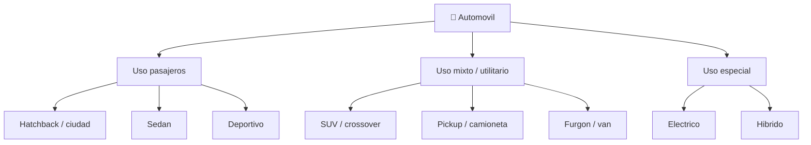

# 📋 Caracteristicas funcionales del automovil

[🏠 Inicio](../../../README.md) · [🚗 Curso: Automoviles](../README.md) · 📋 Caracteristicas

Que es un automovil, que tipos existen y para que sirve cada uno. Este modulo da
el contexto antes de abrir la mecanica (Modulo 3).

---

## 🧭 Definicion

Un automovil es un vehiculo motorizado de cuatro ruedas y carroceria cerrada,
disenado para transportar personas y carga por vias publicas. El conductor va
"dentro" del vehiculo, protegido por una estructura, y opera la direccion con un
volante y la propulsion y frenado con pedales. Su estabilidad no depende del
equilibrio del conductor, a diferencia de una moto.

---

## 🧬 Caracteristicas clave

| Caracteristica | Descripcion |
| --- | --- |
| Estabilidad estatica | Se sostiene solo sobre cuatro ruedas, incluso detenido. |
| Carroceria protectora | Estructura que absorbe impactos y aisla del entorno. |
| Capacidad de carga | Pasajeros, maletero y a veces remolque. |
| Confort | Suspension, climatizacion y aislamiento acustico. |
| Transferencia de peso | Longitudinal al frenar/acelerar y lateral al girar. |
| Ayudas electronicas | ABS, control de estabilidad y asistentes de conduccion. |

---

## 🗂️ Tipos de automovil

| Tipo | Uso tipico | Rasgo destacado |
| --- | --- | --- |
| Hatchback / ciudad | Ciudad y trayectos cortos | Compacto, agil, facil de estacionar. |
| Sedan | Familiar y trabajo | Maletero cerrado, buen confort. |
| SUV / crossover | Mixto y familiar | Altura libre, espacio y vision alta. |
| Pickup / camioneta | Carga y trabajo | Zona de carga abierta, robustez. |
| Furgon / van | Reparto y pasajeros | Gran volumen interior. |
| Deportivo | Placer de conduccion | Potencia alta, centro de gravedad bajo. |
| Electrico / hibrido | Ciudad y viaje eficiente | Bajas emisiones, par inmediato. |

---

## 🎯 Para que se usa

- Transporte diario de personas y familias.
- Traslado de carga ligera y compras.
- Trabajo profesional (reparto, servicios, transporte).
- Viajes de larga distancia por carretera.
- Movilidad en zonas sin transporte publico cercano.

---

[⬅️ Anterior: Historia](../historia/historia-automovil.md) · [➡️ Siguiente: Sistemas mecanicos](sistemas-mecanicos-automovil.md)
