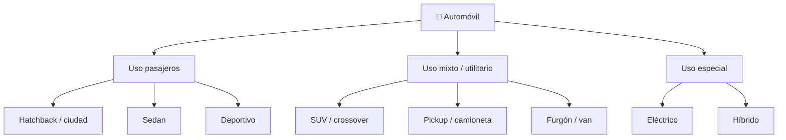

<!-- clase-meta
tipo_documento: clase
clase: 2
codigo: AUTOMOVILES-02
curso: automoviles
titulo: "Características funcionales del automóvil"
modalidad: "teórica aplicada"
duracion_minutos: 45
nivel: introductorio
prerrequisito: AUTOMOVILES-01
competencia: "identificacion_funcional"
resultados_aprendizaje:
  - "Explicar definición, rasgos funcionales, tipos y usos con vocabulario propio de Automóviles."
  - "Aplicar esos conceptos a una decisión segura o a un escenario de simulación de Automóviles."
evidencia: "Matriz comparativa y decisión justificada."
criterio_aprobacion: "La elección considera función, límites, mando y efecto en la simulación; no se apoya solo en preferencias."
fuentes: manuales/fuentes.md
ultima_revision: 2026-09-10
-->

# 📋 Características funcionales del automóvil

[🏠 Inicio](../../../README.md) · [🚗 Curso: Automóviles](../README.md) · 📋 Características

Que es un automóvil, que tipos existen y para que sirve cada uno. Esta clase da
el contexto antes de abrir la mecánica (Clase 4).

---

## 🧭 Definición

Un automóvil es un vehículo motorizado de cuatro ruedas y carrocería cerrada,
disenado para transportar personas y carga por vías públicas. El conductor va
"dentro" del vehículo, protegido por una estructura, y opera la dirección con un
volante y la propulsión y frenado con pedales. Su estabilidad no depende del
equilibrio del conductor, a diferencia de una moto.

---

## 🧬 Características clave

| Característica | Descripción |
| --- | --- |
| Estabilidad estática | Se sostiene solo sobre cuatro ruedas, incluso detenido. |
| Carrocería protectora | Estructura que absorbe impactos y aisla del entorno. |
| Capacidad de carga | Pasajeros, maletero y a veces remolque. |
| Confort | Suspensión, climatización y aislamiento acústico. |
| Transferencia de peso | Longitudinal al frenar/acelerar y lateral al girar. |
| Ayudas electrónicas | ABS, control de estabilidad y asistentes de conducción. |

---

## 🗂️ Tipos de automóvil

```mermaid
flowchart TD
    Auto[🚗 Automóvil] --> Pasajeros[Uso pasajeros]
    Auto --> Utilitario[Uso mixto / utilitario]
    Auto --> Especial[Uso especial]
    Pasajeros --> Hatch[Hatchback / ciudad]
    Pasajeros --> Sedan[Sedan]
    Pasajeros --> Deportivo[Deportivo]
    Utilitario --> SUV[SUV / crossover]
    Utilitario --> Pickup[Pickup / camioneta]
    Utilitario --> Van[Furgón / van]
    Especial --> Electrico[Eléctrico]
    Especial --> Hibrido[Híbrido]
```

| Tipo | Uso típico | Rasgo destacado |
| --- | --- | --- |
| Hatchback / ciudad | Ciudad y trayectos cortos | Compacto, ágil, fácil de estacionar. |
| Sedan | Familiar y trabajo | Maletero cerrado, buen confort. |
| SUV / crossover | Mixto y familiar | Altura libre, espacio y visión alta. |
| Pickup / camioneta | Carga y trabajo | Zona de carga abierta, robustez. |
| Furgón / van | Reparto y pasajeros | Gran volumen interior. |
| Deportivo | Placer de conducción | Potencia alta, centro de gravedad bajo. |
| Eléctrico / híbrido | Ciudad y viaje eficiente | Bajas emisiones, par inmediato. |

---

## 🎯 Para qué se usa

- Transporte diario de personas y familias.
- Traslado de carga ligera y compras.
- Trabajo profesional (reparto, servicios, transporte).
- Viajes de larga distancia por carretera.
- Movilidad en zonas sin transporte público cercano.

## 🧭 Guía de estudio aplicada

### Pregunta guía

¿Cómo ayuda **Definición, Características clave, Tipos de automóvil y Para qué se usa** a **elegir una configuración adecuada para frenada de emergencia en una calzada con adherencia desigual**?

### Explicación razonada

Una característica solo es útil cuando permite anticipar comportamiento. En Automóviles, la relación entre motor, transmisión, diferencial y ruedas motrices determina capacidad, respuesta y límites. Por eso «tracción delantera frente a tracción trasera» no se compara por apariencia: se compara por misión, entorno, carga de trabajo y exposición al riesgo «perder estabilidad por combinar exceso de velocidad, giro y frenado tardío».

Esta clase se conecta con el resto del curso mediante **transferencia de carga y reparto del círculo de adherencia entre frenar, girar y acelerar**. El hilo de
seguridad consiste en reconocer a tiempo **perder estabilidad por combinar exceso de velocidad, giro y frenado tardío** y poder justificar la decisión
**crear margen de detención y dosificar dirección y freno según la superficie**; en clases posteriores cambiará el ángulo de análisis, no esa relación causal.
La lectura funcional común sigue **motor → transmisión → diferencial → ruedas motrices**, de modo que cada concepto pueda
ubicarse dentro del funcionamiento completo y no quede como un dato aislado.

**Apoyo documental:** [Ley de Tránsito 18.290](https://www.bcn.cl/leychile/navegar?idNorma=29708) aporta marco legal chileno;
[Manuales para conductores](https://www.conaset.cl/manuales/) se usa para formación vial y seguridad. Estas fuentes
se contrastan con el alcance de la clase y no sustituyen un manual de equipo concreto.

### Caso resuelto: de la observación a la decisión

1. **Definir la necesidad:** convierte «frenada de emergencia en una calzada con adherencia desigual» en requisitos de capacidad, entorno y respuesta.
2. **Comparar:** contrasta **tracción delantera frente a tracción trasera** usando esos requisitos y la cadena **motor → transmisión → diferencial → ruedas motrices**.
3. **Descartar:** elimina la alternativa que deja menos margen frente a **perder estabilidad por combinar exceso de velocidad, giro y frenado tardío**.
4. **Elegir:** declara la variante escogida, la evidencia usada y una limitación que todavía debe respetarse.

### Comprueba tu comprensión

1. ¿Qué característica de **ruedas motrices** condiciona primero el caso «frenada de emergencia en una calzada con adherencia desigual»?
2. ¿Qué requisito descartaría una de las alternativas **tracción delantera frente a tracción trasera**?
3. ¿Qué límite debe declararse junto con la variante elegida?

Orientación para revisar tus respuestas

- La primera respuesta debe relacionar el eslabón elegido con un efecto posterior, no solo nombrarlo.
- La segunda debe proponer una señal medible u observable y explicar qué tendencia sería preocupante.
- La tercera debe cambiar al menos una variable de capacidad, mando, entorno o margen de seguridad.

## 🎓 Cierre de clase

- **Actividad:** Compara variantes de Automóviles mediante los ejes «definición, rasgos funcionales, tipos y usos» y elige una para un caso de uso razonado.
- **Evidencia:** Matriz comparativa y decisión justificada.
- **Criterio de aprobación:** La elección considera función, límites, mando y efecto en la simulación; no se apoya solo en preferencias.
- **Transferencia:** explica qué cambiaría al pasar a otra variante de esta máquina.

### Fuentes de esta clase

- [CL-LEY-18290](https://www.bcn.cl/leychile/navegar?idNorma=29708): Ley de Tránsito 18.290, BCN Chile. Uso: marco legal chileno.
- [CL-CONASET](https://www.conaset.cl/manuales/): Manuales para conductores, CONASET. Uso: formación vial y seguridad.
- [US-NHTSA](https://www.nhtsa.gov/vehicle-safety): Vehicle Safety, NHTSA. Uso: seguridad de vehículos terrestres.

> Las fuentes sostienen el marco conceptual y normativo; esta clase no reemplaza el manual
> del fabricante, la formación certificada ni la habilitación exigida para operar equipos reales.

---

[⬅️ Anterior: Historia](../historia/historia-automovil.md) · [➡️ Siguiente: Modelos y variantes](../modelos/modelos-automovil.md)
