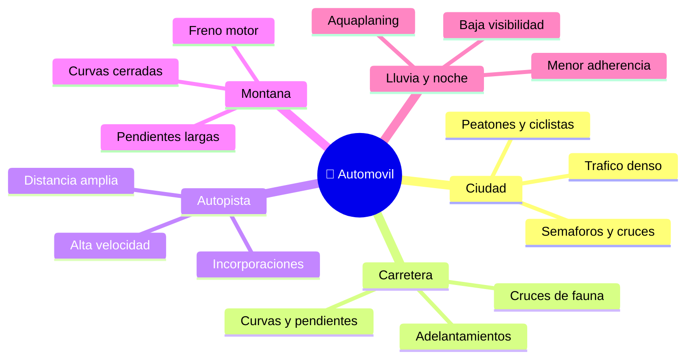

# 🌍 Entornos de trabajo del automóvil

[🏠 Inicio](../../../README.md) · [🚗 Curso: Automóviles](../README.md) · 🌍 Entornos

Dónde opera un automóvil y cómo cambia la conducción según el entorno. Cada
entorno implica reglas, riesgos y ajustes distintos, y en simulación se traduce
en escenarios diferentes.

---

## 🗺️ Entornos principales

| Entorno | Características | Riesgos típicos | Ajuste de conducción |
| --- | --- | --- | --- |
| Ciudad | Tráfico, cruces, peatones. | Puntos ciegos, ciclistas, puertas. | Baja velocidad, anticipación, frenada suave. |
| Carretera | Velocidad sostenida, curvas. | Adelantar, fatiga, animales. | Distancia amplia, curvas progresivas. |
| Autopista | Alta velocidad, incorporaciones. | Cambios de carril, cansancio. | Vigilar espejos, mantener carril. |
| Montaña | Pendientes y curvas cerradas. | Pérdida de frenos, desprendimientos. | Freno motor, marcha corta, prudencia. |
| Lluvia / noche | Baja visibilidad y agarre. | Aquaplaning, deslumbramiento. | Luces, menor velocidad, mayor distancia. |

---

## 🌦️ Factores del entorno

- **Clima**: lluvia, hielo o niebla reducen la adherencia y la visibilidad.
- **Superficie**: asfalto, adoquín, ripio o tierra cambian el agarre.
- **Tráfico**: más vehículos, más puntos ciegos y decisiones.
- **Luz**: de noche o con niebla, ver y ser visto es tan importante como frenar.
- **Pendiente**: subidas y bajadas cambian el frenado y el consumo.

---

## 🎮 Traducción a simulación

Cada entorno es un escenario con su superficie, clima, tráfico y pendiente. Ver
como se modela en el
[Módulo 9: Diseño de simulación](../simulacion/diseno-simulador-automovil.md).

---

[⬅️ Anterior: Principios y operación](principios-automovil.md) · [➡️ Siguiente: Reglamentos](../reglamentos/reglamentos-automovil.md)
