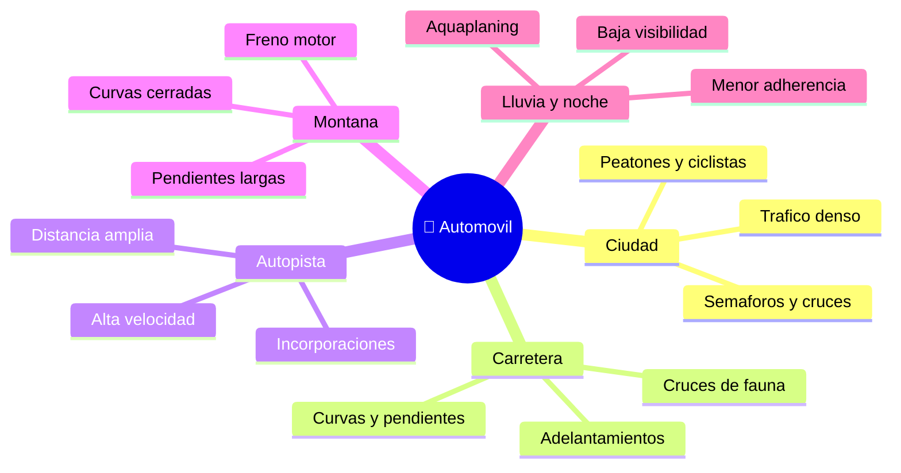

# 🌍 Entornos de trabajo del automóvil

[🏠 Inicio](../../../README.md) · [🚗 Curso: Automóviles](../README.md) · 🌍 Entornos

Dónde opera un automóvil y cómo cambia la conducción según el entorno. Cada
entorno implica reglas, riesgos y ajustes distintos, y en simulación se traduce
en escenarios diferentes.

---

## 🗺️ Entornos principales

```mermaid
mindmap
  root((🚗 Automovil))
    Ciudad
      Trafico denso
      Semaforos y cruces
      Peatones y ciclistas
    Carretera
      Curvas y pendientes
      Adelantamientos
      Cruces de fauna
    Autopista
      Alta velocidad
      Incorporaciones
      Distancia amplia
    Montana
      Pendientes largas
      Curvas cerradas
      Freno motor
    Lluvia y noche
      Baja visibilidad
      Menor adherencia
      Aquaplaning
```

| Entorno | Características | Riesgos típicos | Ajuste de conducción |
| --- | --- | --- | --- |
| Ciudad | Tráfico, cruces, peatones. | Puntos ciegos, ciclistas, puertas. | Baja velocidad, anticipación, frenada suave. |
| Carretera | Velocidad sostenida, curvas. | Adelantar, fatiga, animales. | Distancia amplia, curvas progresivas. |
| Autopista | Alta velocidad, incorporaciones. | Cambios de carril, cansancio. | Vigilar espejos, mantener carril. |
| Montaña | Pendientes y curvas cerradas. | Pérdida de frenos, desprendimientos. | Freno motor, marcha corta, prudencia. |
| Lluvia / noche | Baja visibilidad y agarre. | Aquaplaning, deslumbramiento. | Luces, menor velocidad, mayor distancia. |

---

## 🌦️ Factores del entorno

- **Clima**: lluvia, hielo o niebla reducen la adherencia y la visibilidad.
- **Superficie**: asfalto, adoquín, ripio o tierra cambian el agarre.
- **Tráfico**: más vehículos, más puntos ciegos y decisiones.
- **Luz**: de noche o con niebla, ver y ser visto es tan importante como frenar.
- **Pendiente**: subidas y bajadas cambian el frenado y el consumo.

---

## 🎮 Traducción a simulación

Cada entorno es un escenario con su superficie, clima, tráfico y pendiente. Ver
como se modela en el
[Módulo 9: Diseño de simulación](../simulacion/diseno-simulador-automovil.md).

## 🎓 Cierre de clase

- **Actividad:** Contrasta tres entornos de Automóviles a partir de entornos, factores ambientales, riesgos y respuesta de simulación y determina cómo cambian variables, percepción, riesgos y respuesta.
- **Evidencia:** Matriz entorno–cambio–riesgo–respuesta.
- **Criterio de aprobación:** Cada respuesta se adapta al entorno y distingue riesgos que no son intercambiables entre escenarios.
- **Transferencia:** explica qué cambiaría al pasar a otra variante de esta máquina.

### Fuentes de esta clase

- [CL-LEY-18290](https://www.bcn.cl/leychile/navegar?idNorma=29708): Ley de Tránsito 18.290, BCN Chile. Uso: marco legal chileno.
- [CL-CONASET](https://www.conaset.cl/manuales/): Manuales para conductores, CONASET. Uso: formación vial y seguridad.
- [US-NHTSA](https://www.nhtsa.gov/vehicle-safety): Vehicle Safety, NHTSA. Uso: seguridad de vehículos terrestres.

> Las fuentes sostienen el marco conceptual y normativo; esta clase no reemplaza el manual
> del fabricante, la formación certificada ni la habilitación exigida para operar equipos reales.

---

[⬅️ Anterior: Principios y operación](principios-automovil.md) · [➡️ Siguiente: Reglamentos](../reglamentos/reglamentos-automovil.md)
