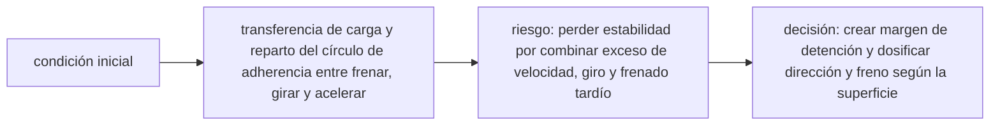

<!-- clase-meta
tipo_documento: clase
clase: 6
codigo: AUTOMOVILES-06
curso: automoviles
titulo: "Principios y operación del automóvil"
modalidad: "resolución de problemas"
duracion_minutos: 90
nivel: introductorio
prerrequisito: AUTOMOVILES-05
competencia: "razonamiento_operacional"
resultados_aprendizaje:
  - "Explicar principios físicos, fases de operación, decisiones y errores frecuentes con vocabulario propio de Automóviles."
  - "Aplicar esos conceptos a una decisión segura o a un escenario de simulación de Automóviles."
evidencia: "Resolución argumentada de un escenario operacional."
criterio_aprobacion: "Aplica los principios correctos, anticipa consecuencias y respeta los límites del curso."
fuentes: manuales/fuentes.md
ultima_revision: 2026-09-10
-->

# 🧪 Principios y operación del automóvil

[🏠 Inicio](../../../README.md) · [🚗 Curso: Automóviles](../README.md) · 🧪 Principios

Documento general y educativo. No sustituye un curso de conducción certificado ni
el manual del fabricante. Describe cómo se opera un automóvil en simulación y que
principios físicos conviene representar.

## Principios de funcionamiento

- **Tracción**: el motor entrega par a las ruedas motrices a través de la
  transmisión y el diferencial. El acelerador regula esa entrega.
- **Dirección**: al girar el volante, las ruedas delanteras cambian su ángulo y
  el auto describe una curva; el radio depende del ángulo y de la velocidad.
- **Transferencia de peso**: al frenar el peso va hacia adelante, al acelerar
  hacia atrás y al girar hacia el exterior de la curva. Esto cambia el agarre de
  cada rueda.
- **Frenado**: los frenos convierten el movimiento en calor; los delanteros
  aportan más capacidad porque reciben más peso al frenar.
- **Adherencia**: el agarre de los cuatro neumáticos limita cuanta aceleración,
  frenado y giro son posibles antes de deslizar (subviraje o sobreviraje).

## Fases de operación

| Fase | Que ocurre | Puntos clave |
| --- | --- | --- |
| Inspección previa | Revisión básica | Neumáticos, luces, frenos, combustible, espejos. |
| Arranque | Encender el motor | Freno pisado, palanca en P o N, cinturón puesto. |
| Puesta en marcha | Iniciar movimiento | Meter marcha, soltar freno, acelerar suave. |
| Conducción | Circular con seguridad | Mirar lejos, mantener distancia, respetar límites. |
| Maniobras | Curvas y cambios | Frenar antes de la curva, girar suave, acelerar a la salida. |
| Detención | Parar de forma segura | Frenar progresivo, dejar en P o punto muerto. |
| Cierre | Dejar seguro | Freno de mano, motor apagado, luces off. |

## Curvas: idea general

1. Ajustar la velocidad **antes** de entrar a la curva.
2. Mirar hacia la salida, no al capo.
3. Trazar suave y progresivo, sin movimientos bruscos del volante.
4. Mantener o abrir levemente el acelerador dentro de la curva.
5. Enderezar y acelerar a la salida.

## Errores comunes que la simulación puede enseñar a evitar

- Frenar dentro de la curva en vez de antes de entrar.
- Girar el volante de golpe y provocar pérdida de agarre.
- Ignorar la transferencia de peso al frenar o acelerar.
- Seguir demasiado cerca del vehículo de adelante.
- No adaptar la velocidad al piso mojado o a la baja visibilidad.

## Relación con los niveles de realismo

- **Nivel 1 (educativo)**: acelerar, frenar, girar y respetar señales.
- **Nivel 2 (simplificado)**: agregar inercia, transferencia de peso y límite de
  adherencia.
- **Nivel 3 (técnico)**: sumar embrague, marchas, subviraje/sobreviraje y frenada
  con ABS.

Ver [`docs/03-niveles-de-realismo.md`](../../../docs/03-niveles-de-realismo.md) para el detalle de cada nivel.

## 🧭 Guía de estudio aplicada

### Pregunta guía

¿Cómo ayuda **Principios de funcionamiento, Fases de operación, Curvas: idea general y Errores comunes que la simulación puede enseñar a evitar** a **resolver frenada de emergencia en una calzada con adherencia desigual sin agotar el margen operacional**?

### Explicación razonada

El principio rector puede resumirse así: transferencia de carga y reparto del círculo de adherencia entre frenar, girar y acelerar. Esto explica por qué una misma orden produce resultados distintos cuando cambian velocidad, carga, configuración o entorno. Operar bien consiste en leer la tendencia antes de agotar el margen y tomar esta decisión: crear margen de detención y dosificar dirección y freno según la superficie.

Esta clase se conecta con el resto del curso mediante **transferencia de carga y reparto del círculo de adherencia entre frenar, girar y acelerar**. El hilo de
seguridad consiste en reconocer a tiempo **perder estabilidad por combinar exceso de velocidad, giro y frenado tardío** y poder justificar la decisión
**crear margen de detención y dosificar dirección y freno según la superficie**; en clases posteriores cambiará el ángulo de análisis, no esa relación causal.
La lectura funcional común sigue **motor → transmisión → diferencial → ruedas motrices**, de modo que cada concepto pueda
ubicarse dentro del funcionamiento completo y no quede como un dato aislado.

**Apoyo documental:** [Ley de Tránsito 18.290](https://www.bcn.cl/leychile/navegar?idNorma=29708) aporta marco legal chileno;
[Manuales para conductores](https://www.conaset.cl/manuales/) se usa para formación vial y seguridad. Estas fuentes
se contrastan con el alcance de la clase y no sustituyen un manual de equipo concreto.

### Caso resuelto: de la observación a la decisión

1. **Datos:** reconoce condiciones, configuración y margen disponibles en **frenada de emergencia en una calzada con adherencia desigual**.
2. **Modelo:** aplica **transferencia de carga y reparto del círculo de adherencia entre frenar, girar y acelerar** para predecir una tendencia antes de actuar.
3. **Riesgo:** explica mediante qué cadena de causas podría ocurrir **perder estabilidad por combinar exceso de velocidad, giro y frenado tardío**.
4. **Decisión:** ejecuta mentalmente **crear margen de detención y dosificar dirección y freno según la superficie** y define qué observación confirmaría que funcionó.

### Comprueba tu comprensión

1. ¿Qué variable del principio «transferencia de carga y reparto del círculo de adherencia entre frenar, girar y acelerar» cambia primero en el caso?
2. ¿Cómo se propaga ese cambio hasta **ruedas motrices**?
3. ¿Qué evidencia confirmaría que **crear margen de detención y dosificar dirección y freno según la superficie** conservó margen operacional?

Orientación para revisar tus respuestas

- La primera respuesta debe relacionar el eslabón elegido con un efecto posterior, no solo nombrarlo.
- La segunda debe proponer una señal medible u observable y explicar qué tendencia sería preocupante.
- La tercera debe cambiar al menos una variable de capacidad, mando, entorno o margen de seguridad.

## 🎓 Cierre de clase

- **Actividad:** Resuelve un escenario de Automóviles explicando, paso a paso, cómo intervienen principios físicos, fases de operación, decisiones y errores frecuentes.
- **Evidencia:** Resolución argumentada de un escenario operacional.
- **Criterio de aprobación:** Aplica los principios correctos, anticipa consecuencias y respeta los límites del curso.
- **Transferencia:** explica qué cambiaría al pasar a otra variante de esta máquina.

### Fuentes de esta clase

- [CL-LEY-18290](https://www.bcn.cl/leychile/navegar?idNorma=29708): Ley de Tránsito 18.290, BCN Chile. Uso: marco legal chileno.
- [CL-CONASET](https://www.conaset.cl/manuales/): Manuales para conductores, CONASET. Uso: formación vial y seguridad.
- [US-NHTSA](https://www.nhtsa.gov/vehicle-safety): Vehicle Safety, NHTSA. Uso: seguridad de vehículos terrestres.

> Las fuentes sostienen el marco conceptual y normativo; esta clase no reemplaza el manual
> del fabricante, la formación certificada ni la habilitación exigida para operar equipos reales.

---

[⬅️ Anterior: Mandos](../mandos/manual-mandos-automovil.md) · [➡️ Siguiente: Entornos de trabajo](entornos-automovil.md)
