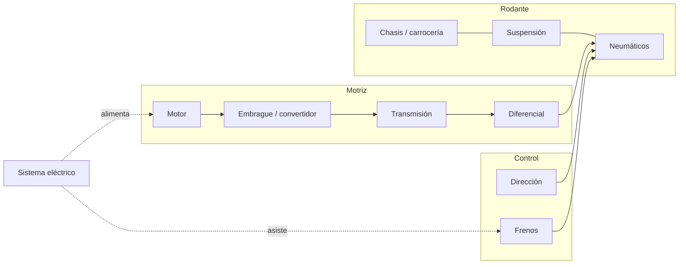
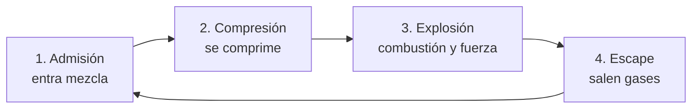
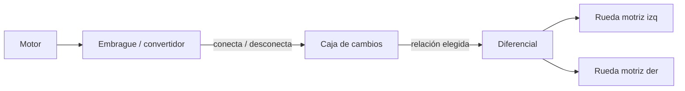
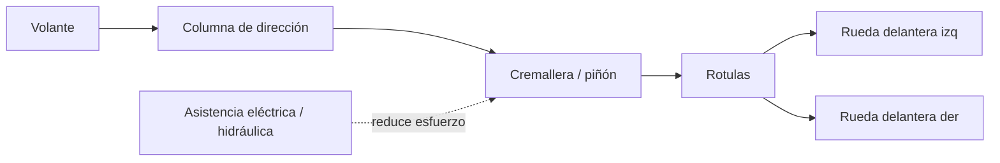
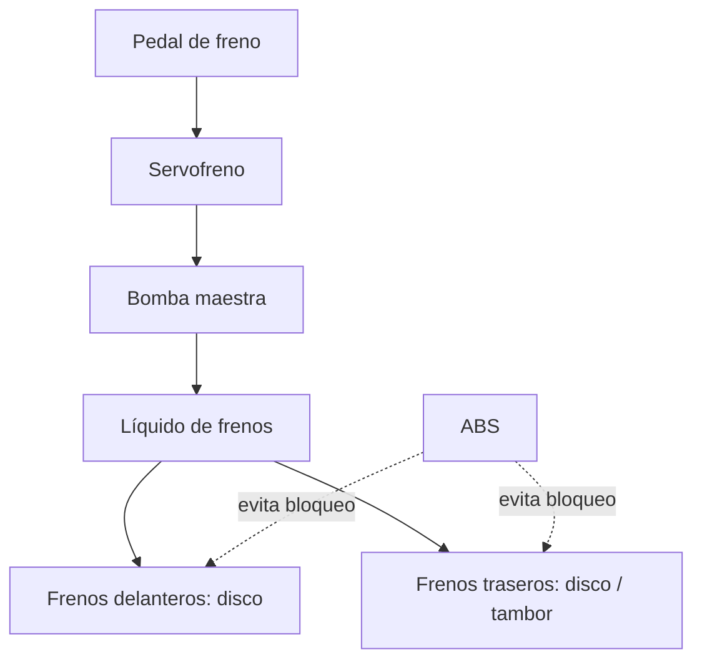

# 🔧 Sistemas mecánicos del automóvil

[🏠 Inicio](../../../README.md) · [🚗 Curso: Automóviles](../README.md) · 🔧 Sistemas mecánicos

Este módulo abre el automóvil por dentro. Explica cada sistema, como funciona y
como se conecta con los demás. Es la base técnica para entender los mandos
(Módulo 5) y la física de la conducción (Módulo 6).

---

## 1. ⚙️ Motor

El motor transforma energía (combustible o electricidad) en giro que impulsa las
ruedas. El más común sigue siendo el motor de combustión interna de cuatro
tiempos.

### Motor de cuatro tiempos (4T)

Completa el ciclo en cuatro carreras del pistón:

| Parámetro | Efecto en el automóvil |
| --- | --- |
| Cilindrada (L / cc) | Mayor cilindrada, más potencia y par potenciales. |
| Número de cilindros | Suavidad y carácter (3, 4, 6 u 8 cilindros). |
| Régimen (rpm) | Zona de potencia; el tacómetro lo muestra. |
| Par (torque, Nm) | Fuerza de empuje, clave para arrancar y remolcar. |
| Potencia (kW / CV) | Trabajo por unidad de tiempo; ligada a velocidad punta. |
| Alimentación | Aspirado o turboalimentado (más par con menor cilindrada). |

### Motor diesel

Enciende la mezcla por compresión, sin bujía. Entrega mucho par a bajas vueltas,
por eso es común en camionetas, furgones y vehículos de trabajo.

### Motor eléctrico e híbrido

Un motor eléctrico alimentado por batería entrega par de forma inmediata y casi
sin caja de cambios. El híbrido combina motor de combustión y eléctrico para
bajar consumo. Cambian el mantenimiento, la autonomía y el modo de recarga.

### Sistemas de apoyo del motor

- **Alimentación**: inyección electrónica de combustible y gestión por
  computadora (ECU).
- **Refrigeración**: circuito de líquido con radiador y termostato.
- **Lubricación**: aceite a presión que reduce desgaste y disipa calor.
- **Escape**: catalizador y filtros que reducen emisiones.

---

## 2. 🔗 Transmisión

Lleva la fuerza del motor a las ruedas motrices y adapta fuerza y velocidad. El
diferencial permite que las ruedas de un mismo eje giren a distinta velocidad al
tomar una curva.

| Tipo de transmisión | Como funciona | Ventaja | Desventaja |
| --- | --- | --- | --- |
| Manual (MT) | El conductor embraga y elige la marcha. | Control directo, económica. | Exige técnica y más atención. |
| Automática (AT) | Convertidor de par y cambios automáticos. | Cómoda en ciudad. | Más peso y coste. |
| CVT | Variador continuo sin marchas fijas. | Suave y eficiente. | Sensación "elástica". |
| Doble embrague (DCT) | Dos embragues preseleccionan marchas. | Cambios muy rápidos. | Cara y compleja. |

- **Embrague**: en la caja manual conecta y desconecta el motor de la caja para
  arrancar y cambiar de marcha.
- **Tracción**: puede ser delantera (FWD), trasera (RWD) o integral (AWD/4x4),
  según que ruedas reciben la fuerza.

---

## 3. 🎯 Dirección

Convierte el giro del volante en el ángulo de las ruedas delanteras.

- **Cremallera y piñón**: mecanismo más común; traduce el giro en desplazamiento
  lateral de las ruedas.
- **Dirección asistida**: hidráulica o eléctrica (EPS); reduce el esfuerzo del
  conductor, sobre todo a baja velocidad.
- **Subviraje**: el auto "sigue de largo" y no gira lo suficiente; las ruedas
  delanteras pierden agarre.
- **Sobreviraje**: la parte trasera se abre y el auto gira más de lo deseado; el
  eje trasero pierde agarre.

---

## 4. 🛑 Frenos

Convierten la energía de movimiento en calor para reducir la velocidad. Al frenar,
el peso se transfiere hacia adelante, por eso los frenos delanteros trabajan más.

| Componente | Función | Nota |
| --- | --- | --- |
| Freno de disco | Pinza que aprieta un disco. | Mejor disipación, común al frente. |
| Freno de tambor | Zapatas contra un tambor. | Económico, común atrás. |
| ABS | Evita el bloqueo de las ruedas. | Mantiene la dirección al frenar fuerte. |
| Reparto (EBD) | Distribuye la fuerza entre ejes. | Optimiza según carga y adherencia. |
| Freno de mano | Inmoviliza detenido. | Mecánico o eléctrico (EPB). |

La **distancia de frenado** crece con el cuadrado de la velocidad: al doble de
velocidad, la distancia se cuadruplica. Depende también de la adherencia del
neumático y del estado del piso.

---

## 5. 🌊 Suspensión

Mantiene los neumáticos en contacto con el suelo, absorbe irregularidades y
controla la transferencia de peso.

| Tipo | Dónde se usa | Rasgo |
| --- | --- | --- |
| McPherson | Eje delantero de la mayoría | Simple, compacta, económica. |
| Doble horquilla | Deportivos y gama alta | Mejor control del neumático. |
| Eje rígido | Camionetas y trabajo | Robusto, ideal con carga. |
| Multibrazo | Traseras modernas | Buen equilibrio confort/agarre. |

- **Resortes**: soportan el peso y absorben golpes.
- **Amortiguadores**: controlan el rebote del resorte.
- **Barra estabilizadora**: reduce el balanceo en curva.

Sin buena suspensión, la rueda "salta" y pierde adherencia, reduciendo el control
al frenar y en curva.

---

## 6. ⚡ Sistema eléctrico y ayudas

Alimenta el arranque, las luces, el confort y toda la electrónica de seguridad.

| Componente | Función |
| --- | --- |
| Batería | Almacena energía y arranca el motor. |
| Alternador | Recarga la batería con el motor en marcha. |
| Motor de arranque | Hace girar el motor para encenderlo. |
| ECU | Computadora que gestiona motor y sistemas. |
| Ayudas ADAS | Asistentes de carril, frenado autónomo, sensores. |

Las ayudas **ADAS** (control de estabilidad ESC, control de tracción TCS,
frenado de emergencia AEB, asistente de carril) usan sensores para intervenir
cuando detectan pérdida de control o riesgo de choque.

---

## 🔁 Cómo se conecta todo

1. El **motor** genera fuerza a partir de combustible o electricidad.
2. El **embrague/convertidor** y la **transmisión** adaptan esa fuerza.
3. El **diferencial** la reparte a las **ruedas motrices**.
4. La **dirección** orienta las ruedas delanteras según el volante.
5. El **chasis**, la **suspensión** y los **neumáticos** mantienen el contacto.
6. Los **frenos** devuelven el control reduciendo la velocidad.
7. El **sistema eléctrico** alimenta y las **ayudas** supervisan todo.

Con esto entendido, el [Módulo 5: Mandos](../mandos/manual-mandos-automovil.md)
muestra como el conductor opera cada uno de estos sistemas.

---

[⬅️ Anterior: Modelos y variantes](../modelos/modelos-automovil.md) · [➡️ Siguiente: Mandos e instrumentos](../mandos/manual-mandos-automovil.md)
