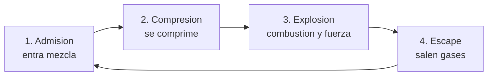

# 🔧 Sistemas mecanicos del automovil

[🏠 Inicio](../../../README.md) · [🚗 Curso: Automoviles](../README.md) · 🔧 Sistemas mecanicos

Este modulo abre el automovil por dentro. Explica cada sistema, como funciona y
como se conecta con los demas. Es la base tecnica para entender los mandos
(Modulo 4) y la fisica de la conduccion (Modulo 5).

---

## 1. ⚙️ Motor

El motor transforma energia (combustible o electricidad) en giro que impulsa las
ruedas. El mas comun sigue siendo el motor de combustion interna de cuatro
tiempos.

### Motor de cuatro tiempos (4T)

Completa el ciclo en cuatro carreras del piston:

| Parametro | Efecto en el automovil |
| --- | --- |
| Cilindrada (L / cc) | Mayor cilindrada, mas potencia y par potenciales. |
| Numero de cilindros | Suavidad y caracter (3, 4, 6 u 8 cilindros). |
| Regimen (rpm) | Zona de potencia; el tacometro lo muestra. |
| Par (torque, Nm) | Fuerza de empuje, clave para arrancar y remolcar. |
| Potencia (kW / CV) | Trabajo por unidad de tiempo; ligada a velocidad punta. |
| Alimentacion | Aspirado o turboalimentado (mas par con menor cilindrada). |

### Motor diesel

Enciende la mezcla por compresion, sin bujia. Entrega mucho par a bajas vueltas,
por eso es comun en camionetas, furgones y vehiculos de trabajo.

### Motor electrico e hibrido

Un motor electrico alimentado por bateria entrega par de forma inmediata y casi
sin caja de cambios. El hibrido combina motor de combustion y electrico para
bajar consumo. Cambian el mantenimiento, la autonomia y el modo de recarga.

### Sistemas de apoyo del motor

- **Alimentacion**: inyeccion electronica de combustible y gestion por
  computadora (ECU).
- **Refrigeracion**: circuito de liquido con radiador y termostato.
- **Lubricacion**: aceite a presion que reduce desgaste y disipa calor.
- **Escape**: catalizador y filtros que reducen emisiones.

---

## 2. 🔗 Transmision

Lleva la fuerza del motor a las ruedas motrices y adapta fuerza y velocidad. El
diferencial permite que las ruedas de un mismo eje giren a distinta velocidad al
tomar una curva.

| Tipo de transmision | Como funciona | Ventaja | Desventaja |
| --- | --- | --- | --- |
| Manual (MT) | El conductor embraga y elige la marcha. | Control directo, economica. | Exige tecnica y mas atencion. |
| Automatica (AT) | Convertidor de par y cambios automaticos. | Comoda en ciudad. | Mas peso y coste. |
| CVT | Variador continuo sin marchas fijas. | Suave y eficiente. | Sensacion "elastica". |
| Doble embrague (DCT) | Dos embragues preseleccionan marchas. | Cambios muy rapidos. | Cara y compleja. |

- **Embrague**: en la caja manual conecta y desconecta el motor de la caja para
  arrancar y cambiar de marcha.
- **Traccion**: puede ser delantera (FWD), trasera (RWD) o integral (AWD/4x4),
  segun que ruedas reciben la fuerza.

---

## 3. 🎯 Direccion

Convierte el giro del volante en el angulo de las ruedas delanteras.

- **Cremallera y pinon**: mecanismo mas comun; traduce el giro en desplazamiento
  lateral de las ruedas.
- **Direccion asistida**: hidraulica o electrica (EPS); reduce el esfuerzo del
  conductor, sobre todo a baja velocidad.
- **Subviraje**: el auto "sigue de largo" y no gira lo suficiente; las ruedas
  delanteras pierden agarre.
- **Sobreviraje**: la parte trasera se abre y el auto gira mas de lo deseado; el
  eje trasero pierde agarre.

---

## 4. 🛑 Frenos

Convierten la energia de movimiento en calor para reducir la velocidad. Al frenar,
el peso se transfiere hacia adelante, por eso los frenos delanteros trabajan mas.

| Componente | Funcion | Nota |
| --- | --- | --- |
| Freno de disco | Pinza que aprieta un disco. | Mejor disipacion, comun al frente. |
| Freno de tambor | Zapatas contra un tambor. | Economico, comun atras. |
| ABS | Evita el bloqueo de las ruedas. | Mantiene la direccion al frenar fuerte. |
| Reparto (EBD) | Distribuye la fuerza entre ejes. | Optimiza segun carga y adherencia. |
| Freno de mano | Inmoviliza detenido. | Mecanico o electrico (EPB). |

La **distancia de frenado** crece con el cuadrado de la velocidad: al doble de
velocidad, la distancia se cuadruplica. Depende tambien de la adherencia del
neumatico y del estado del piso.

---

## 5. 🌊 Suspension

Mantiene los neumaticos en contacto con el suelo, absorbe irregularidades y
controla la transferencia de peso.

| Tipo | Donde se usa | Rasgo |
| --- | --- | --- |
| McPherson | Eje delantero de la mayoria | Simple, compacta, economica. |
| Doble horquilla | Deportivos y gama alta | Mejor control del neumatico. |
| Eje rigido | Camionetas y trabajo | Robusto, ideal con carga. |
| Multibrazo | Traseras modernas | Buen equilibrio confort/agarre. |

- **Resortes**: soportan el peso y absorben golpes.
- **Amortiguadores**: controlan el rebote del resorte.
- **Barra estabilizadora**: reduce el balanceo en curva.

Sin buena suspension, la rueda "salta" y pierde adherencia, reduciendo el control
al frenar y en curva.

---

## 6. ⚡ Sistema electrico y ayudas

Alimenta el arranque, las luces, el confort y toda la electronica de seguridad.

| Componente | Funcion |
| --- | --- |
| Bateria | Almacena energia y arranca el motor. |
| Alternador | Recarga la bateria con el motor en marcha. |
| Motor de arranque | Hace girar el motor para encenderlo. |
| ECU | Computadora que gestiona motor y sistemas. |
| Ayudas ADAS | Asistentes de carril, frenado autonomo, sensores. |

Las ayudas **ADAS** (control de estabilidad ESC, control de traccion TCS,
frenado de emergencia AEB, asistente de carril) usan sensores para intervenir
cuando detectan perdida de control o riesgo de choque.

---

## 🔁 Como se conecta todo

1. El **motor** genera fuerza a partir de combustible o electricidad.
2. El **embrague/convertidor** y la **transmision** adaptan esa fuerza.
3. El **diferencial** la reparte a las **ruedas motrices**.
4. La **direccion** orienta las ruedas delanteras segun el volante.
5. El **chasis**, la **suspension** y los **neumaticos** mantienen el contacto.
6. Los **frenos** devuelven el control reduciendo la velocidad.
7. El **sistema electrico** alimenta y las **ayudas** supervisan todo.

Con esto entendido, el [Modulo 4: Mandos](../mandos/manual-mandos-automovil.md)
muestra como el conductor opera cada uno de estos sistemas.

---

[⬅️ Anterior: Caracteristicas](caracteristicas-automovil.md) · [➡️ Siguiente: Mandos e instrumentos](../mandos/manual-mandos-automovil.md)
