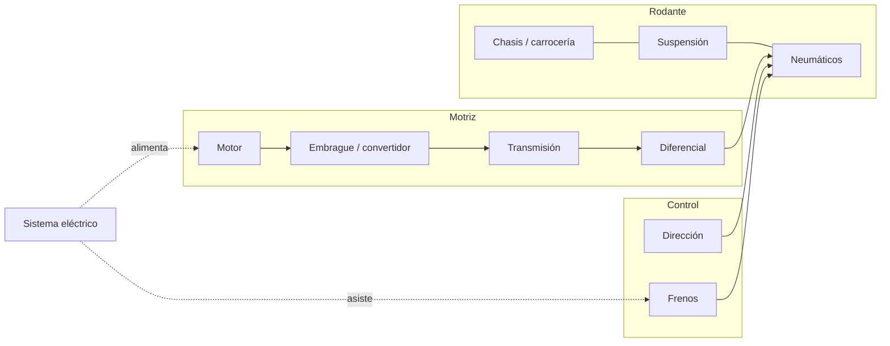
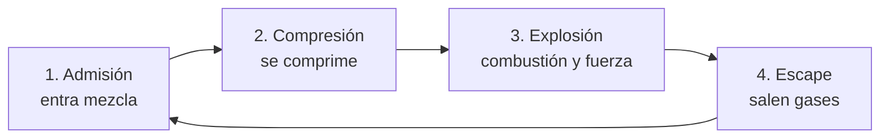
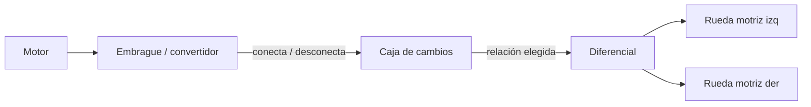
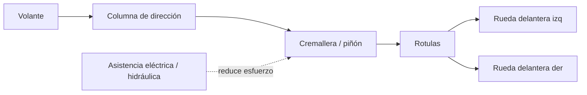
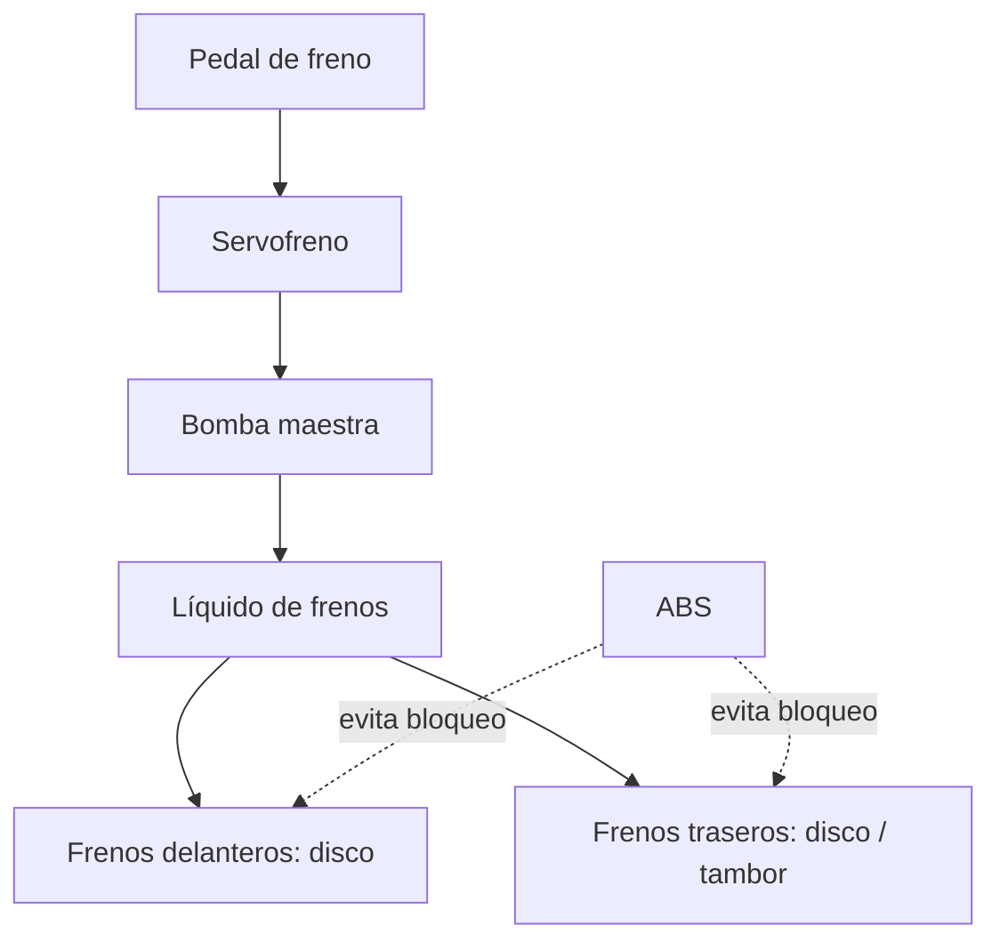
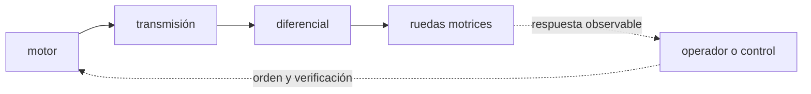

<!-- clase-meta
tipo_documento: clase
clase: 4
codigo: AUTOMOVILES-04
curso: automoviles
titulo: "Sistemas mecánicos del automóvil"
modalidad: "teórica aplicada"
duracion_minutos: 90
nivel: introductorio
prerrequisito: AUTOMOVILES-03
competencia: "comprension_de_sistemas"
resultados_aprendizaje:
  - "Explicar Motor, Transmisión, Dirección y Frenos con vocabulario propio de Automóviles."
  - "Aplicar esos conceptos a una decisión segura o a un escenario de simulación de Automóviles."
evidencia: "Esquema con flujos de energía, materia o información anotados."
criterio_aprobacion: "Las conexiones esenciales son correctas y la consecuencia de la falla se propaga de manera coherente."
fuentes: manuales/fuentes.md
ultima_revision: 2026-09-10
-->

# 🔧 Sistemas mecánicos del automóvil

[🏠 Inicio](../../../README.md) · [🚗 Curso: Automóviles](../README.md) · 🔧 Sistemas mecánicos

Esta clase abre el automóvil por dentro. Explica cada sistema, como funciona y
como se conecta con los demás. Es la base técnica para entender los mandos
(Clase 5) y la física de la conducción (Clase 6).

```mermaid
flowchart LR
    subgraph Motriz
        M[Motor] --> Emb[Embrague / convertidor] --> Cx[Transmisión] --> Dif[Diferencial]
    end
    subgraph Rodante
        Ch[Chasis / carrocería] --- Su[Suspensión]
        Su --- N[Neumáticos]
    end
    subgraph Control
        Dir[Dirección]
        Fr[Frenos]
    end
    Dif --> N
    Dir --> N
    Fr --> N
    Elec[Sistema eléctrico] -. alimenta .-> M
    Elec -. asiste .-> Fr
```

---

## 1. ⚙️ Motor

El motor transforma energía (combustible o electricidad) en giro que impulsa las
ruedas. El más común sigue siendo el motor de combustión interna de cuatro
tiempos.

### Motor de cuatro tiempos (4T)

Completa el ciclo en cuatro carreras del pistón:

```mermaid
flowchart LR
    A[1. Admisión<br/>entra mezcla] --> B[2. Compresión<br/>se comprime]
    B --> C[3. Explosión<br/>combustión y fuerza]
    C --> D[4. Escape<br/>salen gases]
    D --> A
```

| Parámetro | Efecto en el automóvil |
| --- | --- |
| Cilindrada (L / cc) | Mayor cilindrada, más potencia y par potenciales. |
| Número de cilindros | Suavidad y carácter (3, 4, 6 u 8 cilindros). |
| Régimen (rpm) | Zona de potencia; el tacómetro lo muestra. |
| Par (torque, Nm) | Fuerza de empuje, clave para arrancar y remolcar. |
| Potencia (kW / CV) | Trabajo por unidad de tiempo; ligada a velocidad punta. |
| Alimentación | Aspirado o turboalimentado (más par con menor cilindrada). |

### Motor diesel

Enciende la mezcla por compresión, sin bujía. Entrega mucho par a bajas vueltas,
por eso es común en camionetas, furgones y vehículos de trabajo.

### Motor eléctrico e híbrido

Un motor eléctrico alimentado por batería entrega par de forma inmediata y casi
sin caja de cambios. El híbrido combina motor de combustión y eléctrico para
bajar consumo. Cambian el mantenimiento, la autonomía y el modo de recarga.

### Sistemas de apoyo del motor

- **Alimentación**: inyección electrónica de combustible y gestión por
  computadora (ECU).
- **Refrigeración**: circuito de líquido con radiador y termostato.
- **Lubricación**: aceite a presión que reduce desgaste y disipa calor.
- **Escape**: catalizador y filtros que reducen emisiones.

---

## 2. 🔗 Transmisión

Lleva la fuerza del motor a las ruedas motrices y adapta fuerza y velocidad. El
diferencial permite que las ruedas de un mismo eje giren a distinta velocidad al
tomar una curva.

```mermaid
flowchart LR
    Motor --> Acople[Embrague / convertidor]
    Acople -->|conecta / desconecta| Caja[Caja de cambios]
    Caja -->|relación elegida| Final[Diferencial]
    Final --> RuedaI[Rueda motriz izq]
    Final --> RuedaD[Rueda motriz der]
```

| Tipo de transmisión | Como funciona | Ventaja | Desventaja |
| --- | --- | --- | --- |
| Manual (MT) | El conductor embraga y elige la marcha. | Control directo, económica. | Exige técnica y más atención. |
| Automática (AT) | Convertidor de par y cambios automáticos. | Cómoda en ciudad. | Más peso y coste. |
| CVT | Variador continuo sin marchas fijas. | Suave y eficiente. | Sensación "elástica". |
| Doble embrague (DCT) | Dos embragues preseleccionan marchas. | Cambios muy rápidos. | Cara y compleja. |

- **Embrague**: en la caja manual conecta y desconecta el motor de la caja para
  arrancar y cambiar de marcha.
- **Tracción**: puede ser delantera (FWD), trasera (RWD) o integral (AWD/4x4),
  según que ruedas reciben la fuerza.

---

## 3. 🎯 Dirección

Convierte el giro del volante en el ángulo de las ruedas delanteras.

```mermaid
flowchart LR
    Volante --> Columna[Columna de dirección]
    Columna --> Cremallera[Cremallera / piñón]
    Cremallera --> Rotulas[Rotulas]
    Rotulas --> RuedaI[Rueda delantera izq]
    Rotulas --> RuedaD[Rueda delantera der]
    Asist[Asistencia eléctrica / hidráulica] -. reduce esfuerzo .-> Cremallera
```

- **Cremallera y piñón**: mecanismo más común; traduce el giro en desplazamiento
  lateral de las ruedas.
- **Dirección asistida**: hidráulica o eléctrica (EPS); reduce el esfuerzo del
  conductor, sobre todo a baja velocidad.
- **Subviraje**: el auto "sigue de largo" y no gira lo suficiente; las ruedas
  delanteras pierden agarre.
- **Sobreviraje**: la parte trasera se abre y el auto gira más de lo deseado; el
  eje trasero pierde agarre.

---

## 4. 🛑 Frenos

Convierten la energía de movimiento en calor para reducir la velocidad. Al frenar,
el peso se transfiere hacia adelante, por eso los frenos delanteros trabajan más.

```mermaid
flowchart TD
    Pedal[Pedal de freno] --> Servo[Servofreno]
    Servo --> Bomba[Bomba maestra]
    Bomba --> Liquido[Líquido de frenos]
    Liquido --> PinzaD[Frenos delanteros: disco]
    Liquido --> PinzaT[Frenos traseros: disco / tambor]
    ABS[ABS] -. evita bloqueo .-> PinzaD
    ABS -. evita bloqueo .-> PinzaT
```

| Componente | Función | Nota |
| --- | --- | --- |
| Freno de disco | Pinza que aprieta un disco. | Mejor disipación, común al frente. |
| Freno de tambor | Zapatas contra un tambor. | Económico, común atrás. |
| ABS | Evita el bloqueo de las ruedas. | Mantiene la dirección al frenar fuerte. |
| Reparto (EBD) | Distribuye la fuerza entre ejes. | Optimiza según carga y adherencia. |
| Freno de mano | Inmoviliza detenido. | Mecánico o eléctrico (EPB). |

La **distancia de frenado** crece con el cuadrado de la velocidad: al doble de
velocidad, la distancia se cuadruplica. Depende también de la adherencia del
neumático y del estado del piso.

---

## 5. 🌊 Suspensión

Mantiene los neumáticos en contacto con el suelo, absorbe irregularidades y
controla la transferencia de peso.

| Tipo | Dónde se usa | Rasgo |
| --- | --- | --- |
| McPherson | Eje delantero de la mayoría | Simple, compacta, económica. |
| Doble horquilla | Deportivos y gama alta | Mejor control del neumático. |
| Eje rígido | Camionetas y trabajo | Robusto, ideal con carga. |
| Multibrazo | Traseras modernas | Buen equilibrio confort/agarre. |

- **Resortes**: soportan el peso y absorben golpes.
- **Amortiguadores**: controlan el rebote del resorte.
- **Barra estabilizadora**: reduce el balanceo en curva.

Sin buena suspensión, la rueda "salta" y pierde adherencia, reduciendo el control
al frenar y en curva.

---

## 6. ⚡ Sistema eléctrico y ayudas

Alimenta el arranque, las luces, el confort y toda la electrónica de seguridad.

| Componente | Función |
| --- | --- |
| Batería | Almacena energía y arranca el motor. |
| Alternador | Recarga la batería con el motor en marcha. |
| Motor de arranque | Hace girar el motor para encenderlo. |
| ECU | Computadora que gestiona motor y sistemas. |
| Ayudas ADAS | Asistentes de carril, frenado autónomo, sensores. |

Las ayudas **ADAS** (control de estabilidad ESC, control de tracción TCS,
frenado de emergencia AEB, asistente de carril) usan sensores para intervenir
cuando detectan pérdida de control o riesgo de choque.

---

## 🔁 Cómo se conecta todo

1. El **motor** genera fuerza a partir de combustible o electricidad.
2. El **embrague/convertidor** y la **transmisión** adaptan esa fuerza.
3. El **diferencial** la reparte a las **ruedas motrices**.
4. La **dirección** orienta las ruedas delanteras según el volante.
5. El **chasis**, la **suspensión** y los **neumáticos** mantienen el contacto.
6. Los **frenos** devuelven el control reduciendo la velocidad.
7. El **sistema eléctrico** alimenta y las **ayudas** supervisan todo.

Con esto entendido, el [Clase 5: Mandos](../mandos/manual-mandos-automovil.md)
muestra como el conductor opera cada uno de estos sistemas.

## 🧭 Guía de estudio aplicada

### Pregunta guía

¿Cómo ayuda **Motor, Transmisión, Dirección y Frenos** a **seguir una alteración desde motor hasta ruedas motrices durante frenada de emergencia en una calzada con adherencia desigual**?

### Explicación razonada

El funcionamiento puede leerse como una cadena causal: motor entrega o transforma energía; transmisión la adapta; diferencial la transmite o gobierna; y ruedas motrices produce el efecto observable. La cadena no es lineal en sentido estricto: sensores, estructura y operador cierran el lazo. Si un eslabón se degrada, la señal importante es cómo cambia el estado de ruedas motrices y qué margen queda.

```mermaid
flowchart LR
    A["motor"] --> B["transmisión"] --> C["diferencial"] --> D["ruedas motrices"]
    D -. respuesta observable .-> O["operador o control"]
    O -. orden y verificación .-> A
```

Esta clase se conecta con el resto del curso mediante **transferencia de carga y reparto del círculo de adherencia entre frenar, girar y acelerar**. El hilo de
seguridad consiste en reconocer a tiempo **perder estabilidad por combinar exceso de velocidad, giro y frenado tardío** y poder justificar la decisión
**crear margen de detención y dosificar dirección y freno según la superficie**; en clases posteriores cambiará el ángulo de análisis, no esa relación causal.
La lectura funcional común sigue **motor → transmisión → diferencial → ruedas motrices**, de modo que cada concepto pueda
ubicarse dentro del funcionamiento completo y no quede como un dato aislado.

**Apoyo documental:** [Ley de Tránsito 18.290](https://www.bcn.cl/leychile/navegar?idNorma=29708) aporta marco legal chileno;
[Manuales para conductores](https://www.conaset.cl/manuales/) se usa para formación vial y seguridad. Estas fuentes
se contrastan con el alcance de la clase y no sustituyen un manual de equipo concreto.

### Caso resuelto: de la observación a la decisión

1. **Entrada:** identifica el estado inicial de **motor** durante **frenada de emergencia en una calzada con adherencia desigual**.
2. **Transformación:** explica qué hacen **transmisión** y **diferencial**, y qué magnitud cambia en cada paso.
3. **Salida:** comprueba el efecto esperado en **ruedas motrices** y busca una desviación temprana.
4. **Falla razonada:** si aparece **perder estabilidad por combinar exceso de velocidad, giro y frenado tardío**, retrocede por la cadena antes de ordenar otra acción.

### Comprueba tu comprensión

1. Si se degrada **transmisión**, ¿qué efecto esperarías primero en **diferencial** y después en **ruedas motrices**?
2. ¿Qué observación ayudaría a diferenciar una falla de **motor** de una falla de **diferencial**?
3. ¿Por qué una segunda orden podría agravar **perder estabilidad por combinar exceso de velocidad, giro y frenado tardío**?

Orientación para revisar tus respuestas

- La primera respuesta debe relacionar el eslabón elegido con un efecto posterior, no solo nombrarlo.
- La segunda debe proponer una señal medible u observable y explicar qué tendencia sería preocupante.
- La tercera debe cambiar al menos una variable de capacidad, mando, entorno o margen de seguridad.

## 🎓 Cierre de clase

- **Actividad:** Dibuja un esquema funcional de Automóviles que conecte Motor, Transmisión, Dirección y Frenos; después predice el efecto de una falla simulada.
- **Evidencia:** Esquema con flujos de energía, materia o información anotados.
- **Criterio de aprobación:** Las conexiones esenciales son correctas y la consecuencia de la falla se propaga de manera coherente.
- **Transferencia:** explica qué cambiaría al pasar a otra variante de esta máquina.

### Fuentes de esta clase

- [CL-LEY-18290](https://www.bcn.cl/leychile/navegar?idNorma=29708): Ley de Tránsito 18.290, BCN Chile. Uso: marco legal chileno.
- [CL-CONASET](https://www.conaset.cl/manuales/): Manuales para conductores, CONASET. Uso: formación vial y seguridad.
- [US-NHTSA](https://www.nhtsa.gov/vehicle-safety): Vehicle Safety, NHTSA. Uso: seguridad de vehículos terrestres.

> Las fuentes sostienen el marco conceptual y normativo; esta clase no reemplaza el manual
> del fabricante, la formación certificada ni la habilitación exigida para operar equipos reales.

---

[⬅️ Anterior: Modelos y variantes](../modelos/modelos-automovil.md) · [➡️ Siguiente: Mandos e instrumentos](../mandos/manual-mandos-automovil.md)
