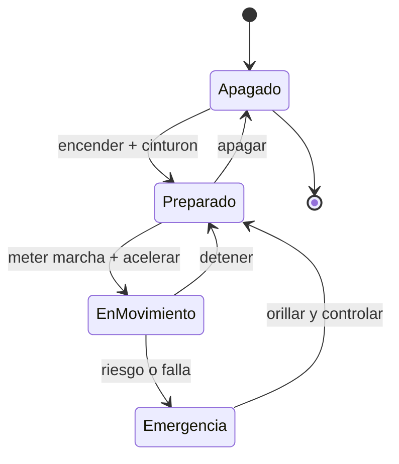

# 🎮 Diseño de simulación del automóvil

[🏠 Inicio](../../../README.md) · [🚗 Curso: Automóviles](../README.md) · 🎮 Simulación

## Objetivo de la simulación

Que el usuario aprenda a arrancar, acelerar, frenar de forma progresiva, tomar
curvas ajustando la velocidad y respetar las normas básicas de tránsito, de forma
segura y progresiva, entendiendo la transferencia de peso y la adherencia.

## Nivel de realismo

- Nivel elegido: se ofrece del 1 al 3 (ver `docs/03-niveles-de-realismo.md`).
- Justificación: el automóvil no exige equilibrio como la moto, pero agrega cuatro
  ruedas, transferencia de peso lateral, cajas automáticas y ayudas electrónicas,
  lo que permite escalar la dificultad de forma clara.

## Variables principales

| Variable | Tipo | Rango | Afecta a | Comentarios |
| --- | --- | --- | --- | --- |
| Velocidad | numérica | 0-200 km/h | Movimiento y distancia de frenado | Central para todo. |
| Régimen del motor | numérica | 0-7000 rpm | Potencia disponible | Ligado a la marcha. |
| Marcha / modo | discreta | P,R,N,D,1..6 | Aceleración y freno motor | Manual o automática. |
| Ángulo de dirección | numérica | -540..540 grados | Radio de giro | Limitado por adherencia. |
| Adherencia | numérica | 0-1 | Freno, giro, aceleración | Baja con lluvia o ripio. |
| Combustible / energía | numérica | 0-100% | Autonomía | Incluye reserva. |
| Peso y carga | numérica | fijo + carga | Inercia y frenado | Afecta transferencia de peso. |

## Ciclo básico

1. Leer entrada del usuario (acelerador, freno, embrague, marcha, dirección).
2. Actualizar estado del motor y la transmisión.
3. Calcular fuerzas: tracción, frenado, gravedad, aerodinámica y adherencia.
4. Aplicar restricciones del entorno (piso, pendiente, clima, tráfico).
5. Actualizar velocidad, posición y orientación del vehículo.
6. Refrescar instrumentos y retroalimentación (sonido, vibración, testigos).

## Modos de juego futuros

- Tutorial guiado de mandos y arranque.
- Práctica libre en circuito cerrado.
- Misiones educativas de tránsito urbano.
- Desafíos de frenado y control de distancia.
- Situaciones de riesgo controladas (piso mojado, obstáculo) sin contenido sensible.

## Elementos fuera de alcance

- Maniobras temerarias presentadas como recomendables.
- Reproducción de conducción imprudente como objetivo del juego.
- Datos técnicos que permitan alterar sistemas reales de un automóvil.

## Pendientes

- [ ] Definir valores por defecto de cada variable por tipo de automóvil.
- [ ] Prototipar el ciclo básico en un motor simple.
- [ ] Ajustar el modelo de adherencia con lluvia y ripio.
- [ ] Agregar fuentes técnicas públicas a [`manuales/fuentes.md`](../../../manuales/fuentes.md).

---

[⬅️ Anterior: Reglamentos](../reglamentos/reglamentos-automovil.md) · [➡️ Siguiente: Recursos](../recursos/recursos-automovil.md)
