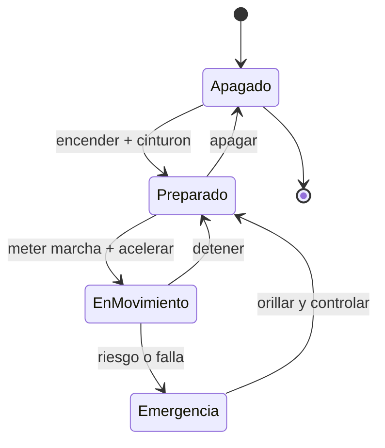

# 🎮 Diseno de simulacion del automovil

[🏠 Inicio](../../../README.md) · [🚗 Curso: Automoviles](../README.md) · 🎮 Simulacion

## Objetivo de la simulacion

Que el usuario aprenda a arrancar, acelerar, frenar de forma progresiva, tomar
curvas ajustando la velocidad y respetar las normas basicas de transito, de forma
segura y progresiva, entendiendo la transferencia de peso y la adherencia.

## Nivel de realismo

- Nivel elegido: se ofrece del 1 al 3 (ver `docs/03-niveles-de-realismo.md`).
- Justificacion: el automovil no exige equilibrio como la moto, pero agrega cuatro
  ruedas, transferencia de peso lateral, cajas automaticas y ayudas electronicas,
  lo que permite escalar la dificultad de forma clara.

## Variables principales

| Variable | Tipo | Rango | Afecta a | Comentarios |
| --- | --- | --- | --- | --- |
| Velocidad | numerica | 0-200 km/h | Movimiento y distancia de frenado | Central para todo. |
| Regimen del motor | numerica | 0-7000 rpm | Potencia disponible | Ligado a la marcha. |
| Marcha / modo | discreta | P,R,N,D,1..6 | Aceleracion y freno motor | Manual o automatica. |
| Angulo de direccion | numerica | -540..540 grados | Radio de giro | Limitado por adherencia. |
| Adherencia | numerica | 0-1 | Freno, giro, aceleracion | Baja con lluvia o ripio. |
| Combustible / energia | numerica | 0-100% | Autonomia | Incluye reserva. |
| Peso y carga | numerica | fijo + carga | Inercia y frenado | Afecta transferencia de peso. |

## Ciclo basico

1. Leer entrada del usuario (acelerador, freno, embrague, marcha, direccion).
2. Actualizar estado del motor y la transmision.
3. Calcular fuerzas: traccion, frenado, gravedad, aerodinamica y adherencia.
4. Aplicar restricciones del entorno (piso, pendiente, clima, trafico).
5. Actualizar velocidad, posicion y orientacion del vehiculo.
6. Refrescar instrumentos y retroalimentacion (sonido, vibracion, testigos).

## Modos de juego futuros

- Tutorial guiado de mandos y arranque.
- Practica libre en circuito cerrado.
- Misiones educativas de transito urbano.
- Desafios de frenado y control de distancia.
- Situaciones de riesgo controladas (piso mojado, obstaculo) sin contenido sensible.

## Elementos fuera de alcance

- Maniobras temerarias presentadas como recomendables.
- Reproduccion de conduccion imprudente como objetivo del juego.
- Datos tecnicos que permitan alterar sistemas reales de un automovil.

## Pendientes

- [ ] Definir valores por defecto de cada variable por tipo de automovil.
- [ ] Prototipar el ciclo basico en un motor simple.
- [ ] Ajustar el modelo de adherencia con lluvia y ripio.
- [ ] Agregar fuentes tecnicas publicas a [`manuales/fuentes.md`](../../../manuales/fuentes.md).

---

[⬅️ Anterior: Reglamentos](../reglamentos/reglamentos-automovil.md) · [➡️ Siguiente: Recursos](../recursos/recursos-automovil.md)
