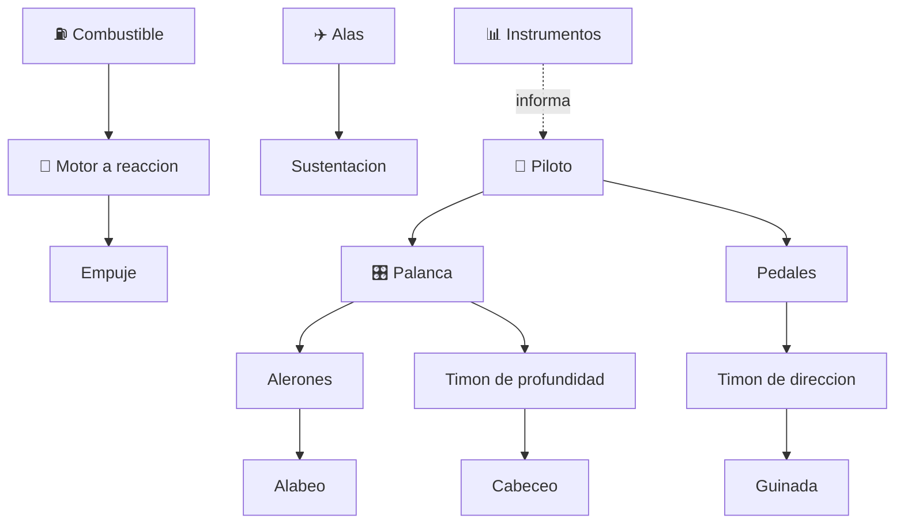

# ✈️ Curso: Aviones de combate

[🏠 Inicio](../../README.md) · [🚙 Catalogo de vehiculos](../README.md) · [🎓 Guia de curso](../../docs/08-guia-de-estilo-y-curso.md)

> **Curso de marco publico e historico.** Documenta el avion de combate solo
> desde la fisica del vuelo, la historia publica y los principios generales de
> una aeronave a reaccion. **No** incluye sistemas de armas, tactica, doctrina ni
> procedimientos operativos sensibles. Ver
> [🦺 docs/04-seguridad-y-limites.md](../../docs/04-seguridad-y-limites.md).

---

## 🎯 Objetivos de aprendizaje

Al terminar este curso deberias poder:

- Explicar como vuela un avion a reaccion: sustentacion, empuje y control.
- Conocer la historia publica de la aviacion militar y su evolucion tecnica.
- Identificar la celula, las alas y las superficies de control de un reactor.
- Comprender los principios fisicos del vuelo a alta velocidad, a nivel divulgativo.
- Distinguir el marco institucional civil del militar en Chile.
- Traducir la fisica del vuelo en variables de un simulador educativo.

---

## 🛡️ Alcance y limites

Este curso se mantiene en el **marco publico y divulgativo**. Solo trata fisica
del vuelo, historia y principios generales. Quedan **fuera** los sistemas de
armas, la tactica, la doctrina y los procedimientos operativos sensibles, segun
[🦺 docs/04-seguridad-y-limites.md](../../docs/04-seguridad-y-limites.md).

---

## 🗺️ Mapa del vehiculo

---

## 📚 Modulos del curso

| # | Modulo | Contenido | Enlace |
| :-: | --- | --- | --- |
| 1 | 📜 Historia | Historia publica de la aviacion militar, linea de tiempo. | [Abrir](historia/historia-avion-combate.md) |
| 2 | 📋 Caracteristicas | Que es, generaciones y roles generales de la aeronave. | [Abrir](operacion/caracteristicas-avion-combate.md) |
| 3 | 🔧 Sistemas mecanicos | Celula, alas, superficies de control y motor a reaccion. | [Abrir](operacion/sistemas-mecanicos-avion-combate.md) |
| 4 | 🎛️ Mandos e instrumentos | Cabina, controles de vuelo y panel de instrumentos. | [Abrir](mandos/manual-mandos-avion-combate.md) |
| 5 | 🧪 Principios y operacion | Fisica del vuelo a reaccion y fases generales. | [Abrir](operacion/principios-avion-combate.md) |
| 6 | 🌍 Entornos de trabajo | Base aerea, espacio aereo y meteorologia. | [Abrir](operacion/entornos-avion-combate.md) |
| 7 | ⚖️ Reglamentos | Marco institucional publico (FACH, defensa). | [Abrir](reglamentos/reglamentos-avion-combate.md) |
| 8 | 🎮 Diseno de simulacion | Variables de vuelo, ciclo y modos educativos. | [Abrir](simulacion/diseno-simulador-avion-combate.md) |
| 9 | 🧰 Recursos | Glosario, enlaces y diagramas. | [Abrir](recursos/recursos-avion-combate.md) |

---

## 🧩 Requisitos previos

Se recomienda haber revisado antes el curso de
[🛩️ aviones pequenos](../aviones-pequenos/README.md), que introduce la fisica del
vuelo con menor velocidad y complejidad. Este curso extiende esos principios al
vuelo a reaccion desde un enfoque solo divulgativo. Marco legal comun en
[⚖️ docs/07-marco-legal-chile.md](../../docs/07-marco-legal-chile.md).

---

[➡️ Empezar por el Modulo 1: Historia](historia/historia-avion-combate.md)
