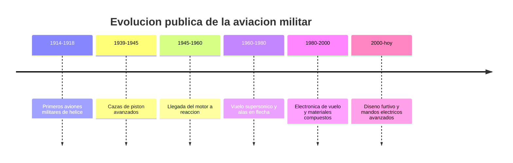

# 📜 Historia del avión de combate

[🏠 Inicio](../../../README.md) · [✈️ Curso: Aviones de combate](../README.md) · 📜 Historia

Historia pública y divulgativa de la aviación militar. Este módulo trata la
evolución técnica y su contexto, sin doctrina, táctica ni sistemas de armas.

## Origen

La aviación militar nació pocos años después del primer vuelo motorizado. Al
principio los aviones se usaban para observación; luego evolucionaron en
estructura, potencia y aerodinámica. Desde una perspectiva pública, su historia
es sobre todo una historia de avances en propulsión, materiales y control de vuelo.

## Línea de tiempo

| Periodo | Hito técnico público | Importancia |
| --- | --- | --- |
| 1914-1918 | Aviones militares de hélice | Primer uso masivo de la aeronave. |
| 1939-1945 | Cazas de pistón avanzados | Cabinas cerradas, más potencia y velocidad. |
| 1945-1960 | Motor a reacción | Salto de velocidad y altitud. |
| 1960-1980 | Vuelo supersónico | Alas en flecha y nuevos perfiles. |
| 1980-2000 | Avionica y compuestos | Mandos eléctricos y estructuras ligeras. |
| 2000-presente | Diseño furtivo | Formas y materiales que reducen la firma radar. |

## Evolución tecnológica pública

- **Propulsión**: del motor a pistón al turborreactor y el turbofan.
- **Aerodinámica**: de las alas rectas a las alas en flecha y delta.
- **Materiales**: del aluminio a los compuestos avanzados.
- **Control**: de los mandos mecánicos a los mandos eléctricos (fly-by-wire).
- **Instrumentos**: de los relojes analogicos a las pantallas y el HUD.
- **Estructura**: mayor resistencia para soportar cargas de maniobra.

## Generaciones (marco divulgativo)

| Generación | Rasgo técnico público |
| --- | --- |
| Primera | Primeros reactores, ala recta, velocidad subsonica alta. |
| Segunda | Ala en flecha, acercamiento al vuelo supersónico. |
| Tercera | Vuelo supersónico establecido, mejores motores. |
| Cuarta | Avionica avanzada y mandos eléctricos. |
| Quinta | Diseño furtivo e integración de sistemas. |

## Impacto en la aviación general

Muchos avances probados en aviación militar pasaron luego a la aviación civil:
motores a reacción, mandos eléctricos, materiales compuestos e instrumentos de
pantalla. Estudiar su historia pública ayuda a entender la evolución técnica de
toda la aviación.

## Fuentes

- Registrar aquí las fuentes públicas consultadas.
- Enlazar cada fuente también en [`manuales/fuentes.md`](../../../manuales/fuentes.md).

---

[🎓 Portada del curso](../README.md) · [➡️ Siguiente: Características](../operacion/caracteristicas-avion-combate.md)
