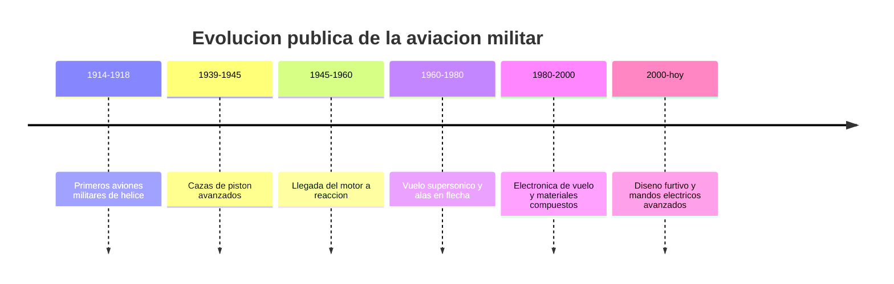

# 📜 Historia del avion de combate

[🏠 Inicio](../../../README.md) · [✈️ Curso: Aviones de combate](../README.md) · 📜 Historia

Historia publica y divulgativa de la aviacion militar. Este modulo trata la
evolucion tecnica y su contexto, sin doctrina, tactica ni sistemas de armas.

## Origen

La aviacion militar nacio pocos anos despues del primer vuelo motorizado. Al
principio los aviones se usaban para observacion; luego evolucionaron en
estructura, potencia y aerodinamica. Desde una perspectiva publica, su historia
es sobre todo una historia de avances en propulsion, materiales y control de vuelo.

## Linea de tiempo

| Periodo | Hito tecnico publico | Importancia |
| --- | --- | --- |
| 1914-1918 | Aviones militares de helice | Primer uso masivo de la aeronave. |
| 1939-1945 | Cazas de piston avanzados | Cabinas cerradas, mas potencia y velocidad. |
| 1945-1960 | Motor a reaccion | Salto de velocidad y altitud. |
| 1960-1980 | Vuelo supersonico | Alas en flecha y nuevos perfiles. |
| 1980-2000 | Avionica y compuestos | Mandos electricos y estructuras ligeras. |
| 2000-presente | Diseno furtivo | Formas y materiales que reducen la firma radar. |

## Evolucion tecnologica publica

- **Propulsion**: del motor a piston al turborreactor y el turbofan.
- **Aerodinamica**: de las alas rectas a las alas en flecha y delta.
- **Materiales**: del aluminio a los compuestos avanzados.
- **Control**: de los mandos mecanicos a los mandos electricos (fly-by-wire).
- **Instrumentos**: de los relojes analogicos a las pantallas y el HUD.
- **Estructura**: mayor resistencia para soportar cargas de maniobra.

## Generaciones (marco divulgativo)

| Generacion | Rasgo tecnico publico |
| --- | --- |
| Primera | Primeros reactores, ala recta, velocidad subsonica alta. |
| Segunda | Ala en flecha, acercamiento al vuelo supersonico. |
| Tercera | Vuelo supersonico establecido, mejores motores. |
| Cuarta | Avionica avanzada y mandos electricos. |
| Quinta | Diseno furtivo e integracion de sistemas. |

## Impacto en la aviacion general

Muchos avances probados en aviacion militar pasaron luego a la aviacion civil:
motores a reaccion, mandos electricos, materiales compuestos e instrumentos de
pantalla. Estudiar su historia publica ayuda a entender la evolucion tecnica de
toda la aviacion.

## Fuentes

- Registrar aqui las fuentes publicas consultadas.
- Enlazar cada fuente tambien en [`manuales/fuentes.md`](../../../manuales/fuentes.md).

---

[🎓 Portada del curso](../README.md) · [➡️ Siguiente: Caracteristicas](../operacion/caracteristicas-avion-combate.md)
