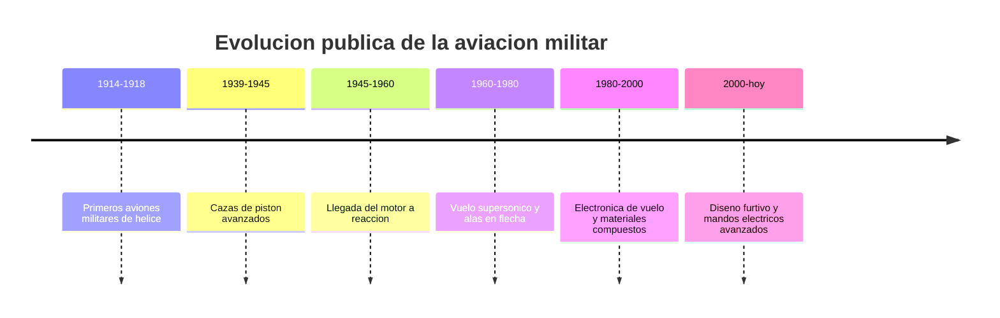

<!-- clase-meta
tipo_documento: clase
clase: 1
codigo: AVIONESCOMBA-01
curso: aviones-combate
titulo: "Historia del avión de combate"
modalidad: "teórica dialogada"
duracion_minutos: 45
nivel: introductorio
prerrequisito: ninguno
competencia: "contexto_historico"
resultados_aprendizaje:
  - "Explicar origen, evolución tecnológica, variantes representativas e impacto con vocabulario propio de Aviones de combate."
  - "Aplicar esos conceptos a una decisión segura o a un escenario de simulación de Aviones de combate."
evidencia: "Línea de tiempo comentada con cuatro hitos o más."
criterio_aprobacion: "Los hitos están ordenados, son pertinentes y dos relaciones de causa y efecto quedan justificadas."
fuentes: manuales/fuentes.md
ultima_revision: 2026-09-10
-->

# 📜 Historia del avión de combate

[🏠 Inicio](../../../README.md) · [✈️ Curso: Aviones de combate](../README.md) · 📜 Historia

Historia pública y divulgativa de la aviación militar. Esta clase trata la
evolución técnica y su contexto, sin doctrina, táctica ni sistemas de armas.

```mermaid
timeline
    title Evolucion publica de la aviacion militar
    1914-1918 : Primeros aviones militares de helice
    1939-1945 : Cazas de piston avanzados
    1945-1960 : Llegada del motor a reaccion
    1960-1980 : Vuelo supersonico y alas en flecha
    1980-2000 : Electronica de vuelo y materiales compuestos
    2000-hoy : Diseno furtivo y mandos electricos avanzados
```

## Origen

La aviación militar nació pocos años después del primer vuelo motorizado. Al
principio los aviones se usaban para observación; luego evolucionaron en
estructura, potencia y aerodinámica. Desde una perspectiva pública, su historia
es sobre todo una historia de avances en propulsión, materiales y control de vuelo.

## Línea de tiempo

| Periodo | Hito técnico público | Importancia |
| --- | --- | --- |
| 1914-1918 | Aviones militares de hélice | Primer uso masivo de la aeronave. |
| 1939-1945 | Cazas de pistón avanzados | Cabinas cerradas, más potencia y velocidad. |
| 1945-1960 | Motor a reacción | Salto de velocidad y altitud. |
| 1960-1980 | Vuelo supersónico | Alas en flecha y nuevos perfiles. |
| 1980-2000 | Avionica y compuestos | Mandos eléctricos y estructuras ligeras. |
| 2000-presente | Diseño furtivo | Formas y materiales que reducen la firma radar. |

## Evolución tecnológica pública

- **Propulsión**: del motor a pistón al turborreactor y el turbofan.
- **Aerodinámica**: de las alas rectas a las alas en flecha y delta.
- **Materiales**: del aluminio a los compuestos avanzados.
- **Control**: de los mandos mecánicos a los mandos eléctricos (fly-by-wire).
- **Instrumentos**: de los relojes analogicos a las pantallas y el HUD.
- **Estructura**: mayor resistencia para soportar cargas de maniobra.

## Generaciones (marco divulgativo)

| Generación | Rasgo técnico público |
| --- | --- |
| Primera | Primeros reactores, ala recta, velocidad subsonica alta. |
| Segunda | Ala en flecha, acercamiento al vuelo supersónico. |
| Tercera | Vuelo supersónico establecido, mejores motores. |
| Cuarta | Avionica avanzada y mandos eléctricos. |
| Quinta | Diseño furtivo e integración de sistemas. |

## Impacto en la aviación general

Muchos avances probados en aviación militar pasaron luego a la aviación civil:
motores a reacción, mandos eléctricos, materiales compuestos e instrumentos de
pantalla. Estudiar su historia pública ayuda a entender la evolución técnica de
toda la aviación.

## 🧭 Guía de estudio aplicada

### Pregunta guía

¿Cómo ayuda **Origen, Línea de tiempo, Evolución tecnológica pública y Generaciones (marco divulgativo)** a **explicar cómo la evolución hizo posibles alternativas como caza ligero monomotor frente a interceptor bimotor**?

### Explicación razonada

La evolución de Aviones de combate se comprende mejor como una sucesión de respuestas a problemas, no como una lista de fechas. Los cambios en motor, tobera, flujo y superficies y control de vuelo alteraron qué podía hacer la máquina, quién podía usarla y qué riesgos debían controlarse. El contraste «caza ligero monomotor frente a interceptor bimotor» permite observar qué decisiones de diseño permanecieron y cuáles cambiaron con la tecnología y el propósito.

Esta clase se conecta con el resto del curso mediante **intercambio entre energía cinética, altura, carga estructural y capacidad de giro**. El hilo de
seguridad consiste en reconocer a tiempo **exceder envolvente, perder energía o conciencia situacional** y poder justificar la decisión
**preservar margen de energía y carga antes de ordenar una maniobra**; en clases posteriores cambiará el ángulo de análisis, no esa relación causal.
La lectura funcional común sigue **motor → tobera → flujo → superficies y control de vuelo**, de modo que cada concepto pueda
ubicarse dentro del funcionamiento completo y no quede como un dato aislado.

**Apoyo documental:** [Aviation Handbooks and Manuals](https://www.faa.gov/regulations_policies/handbooks_manuals) aporta aerodinámica, sistemas y operación;
[Beginner's Guide to Aeronautics](https://www1.grc.nasa.gov/beginners-guide-to-aeronautics/) se usa para contraste con física y vuelo reales. Estas fuentes
se contrastan con el alcance de la clase y no sustituyen un manual de equipo concreto.

### Caso resuelto: de la observación a la decisión

1. **Situar:** ordena los hitos que explican cómo se llegó a **caza ligero monomotor frente a interceptor bimotor** y describe la necesidad que impulsó cada cambio.
2. **Relacionar:** explica qué se modificó en **motor**, **tobera**, **flujo** o **superficies y control de vuelo**; una fecha sin mecanismo no basta.
3. **Interpretar:** vincula el cambio con una capacidad nueva y también con el riesgo **exceder envolvente, perder energía o conciencia situacional**.
4. **Transferir:** usa la evolución para justificar por qué hoy conviene **preservar margen de energía y carga antes de ordenar una maniobra**.

### Comprueba tu comprensión

1. ¿Qué necesidad histórica impulsó un cambio en **motor** o **tobera**?
2. ¿Qué hito modificó la relación entre capacidad y **exceder envolvente, perder energía o conciencia situacional**?
3. ¿Por qué **caza ligero monomotor frente a interceptor bimotor** no puede explicarse como una simple diferencia estética?

Orientación para revisar tus respuestas

- La primera respuesta debe relacionar el eslabón elegido con un efecto posterior, no solo nombrarlo.
- La segunda debe proponer una señal medible u observable y explicar qué tendencia sería preocupante.
- La tercera debe cambiar al menos una variable de capacidad, mando, entorno o margen de seguridad.

## 🎓 Cierre de clase

- **Actividad:** Construye una línea de tiempo de Aviones de combate y explica cómo dos cambios históricos transformaron su función o su puesto de mando.
- **Evidencia:** Línea de tiempo comentada con cuatro hitos o más.
- **Criterio de aprobación:** Los hitos están ordenados, son pertinentes y dos relaciones de causa y efecto quedan justificadas.
- **Transferencia:** explica qué cambiaría al pasar a otra variante de esta máquina.

### Fuentes de esta clase

- [US-FAA-HANDBOOKS](https://www.faa.gov/regulations_policies/handbooks_manuals): Aviation Handbooks and Manuals, FAA. Uso: aerodinámica, sistemas y operación.
- [NASA-FLIGHT](https://www1.grc.nasa.gov/beginners-guide-to-aeronautics/): Beginner's Guide to Aeronautics, NASA. Uso: contraste con física y vuelo reales.

> Las fuentes sostienen el marco conceptual y normativo; esta clase no reemplaza el manual
> del fabricante, la formación certificada ni la habilitación exigida para operar equipos reales.

---

[🎓 Portada del curso](../README.md) · [➡️ Siguiente: Características](../operacion/caracteristicas-avion-combate.md)
