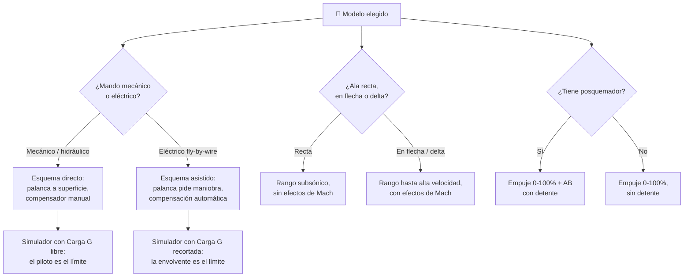

# 🧩 Modelos y variantes del avión de combate

[🏠 Inicio](../../../README.md) · [✈️ Curso: Aviones de combate](../README.md) · 🧩 Modelos

El [Módulo 2](../operacion/caracteristicas-avion-combate.md) ya dijo qué
generaciones y qué roles generales existen. Este módulo responde a lo siguiente:
**no todos se vuelan igual**, y esa diferencia no es de matiz. Cambia qué mandos
tiene la máquina y, por tanto, qué debe modelar el simulador.

> 🎯 **La idea que sostiene el módulo.** "Un avión de combate" no es una sola
> máquina desde el punto de vista del mando. En un primer reactor la palanca tira
> de la superficie por vía mecánica y el límite de carga G lo pone el piloto; con
> mandos eléctricos y envolvente protegida, la palanca **pide** una maniobra y el
> computador la recorta. No es el mismo control con otra sensibilidad: es otro
> control. Todo lo que sigue se mantiene en el marco público del curso: física
> del vuelo, historia y principios generales. Ni táctica, ni doctrina, ni armas,
> ni sistemas de misión.

---

## 🧭 Por qué el modelo decide el simulador

El [Módulo 5](../mandos/manual-mandos-avion-combate.md) describe un puesto de
mando donde la palanca "manda las superficies vía fly-by-wire" y el acelerador
"puede tener detente de posquemador". El
[Módulo 9](../simulacion/diseno-simulador-avion-combate.md) expone `Velocidad`
con rango `0-2.0 Mach`, `Carga G` con rango `-3..9 G` y `Empuje del motor` con
rango `0-100% + AB`. Los tres describen un reactor **de cuarta generación con
posquemador**.

En un primer reactor de ala recta no hay fly-by-wire que interponer: la palanca
llega a la superficie por cables y varillas, el `AB` del acelerador no tiene
detente porque no hay posquemador, y `Velocidad` no tiene valores que tomar por
encima del régimen subsónico. Si el simulador se construye sobre el esquema de
cuarta generación y luego se le "añade" un primer reactor, el resultado es un
caza de 1945 con envolvente protegida, que no existe.

---

## 🗂️ Qué cambia en el manejo

| Modelo | Qué cambia al pilotarlo |
| --- | --- |
| Cuarta generación (mandos eléctricos) | La referencia del curso: ala en flecha, fly-by-wire, compensación automática y posquemador. |
| Primeros reactores (ala recta) | Mando mecánico sin asistencia: el esfuerzo en la palanca crece con la velocidad y el piloto siente la carga. Sin envolvente que lo proteja, vigila él mismo el acelerómetro. |
| Ala en flecha subsónica alta | Mando ya asistido por hidráulica, pero sin computador: el avión hace lo que la palanca ordena, incluso si eso rompe algo. |
| Ala delta (interceptor) | Mucha superficie y estructura resistente: sostiene bien la alta velocidad y el ascenso, pero pierde energía rápido en la maniobra cerrada. |
| Quinta generación (diseño furtivo) | Vuela como la cuarta en cuanto a física del vuelo; su forma responde a la firma radar y no a la maniobra. |
| Entrenador avanzado | Menor complejidad y menor empuje: la aeronave perdona más y las fases de vuelo se suceden con más margen. |
| Propulsión sin posquemador | El empuje disponible es el que hay: no existe la reserva puntual para recuperar energía. |

---

## 🎛️ Qué cambia en el mando

| Modelo | Qué mando aparece o desaparece | Consecuencia |
| --- | --- | --- |
| Cuarta y quinta generación | Ninguno: el mapa de controles del Módulo 5 aplica tal cual. | Cambian los rangos, no los controles. |
| Primeros reactores (ala recta) | **Desaparece** el fly-by-wire entre la palanca y la superficie. **Aparece** el compensador (trim) como mando que el piloto ajusta a mano, porque no hay compensación automática que lo haga. | La palanca deja de pedir una maniobra y pasa a mover la superficie: el acelerómetro cambia de indicador informativo a límite que solo respeta el piloto. |
| Ala en flecha subsónica alta | **Desaparece** el fly-by-wire; el mando hidráulico asiste el esfuerzo pero no recorta nada. **Se mantiene** el compensador manual. | El esfuerzo desaparece, la protección no llega: sigue siendo el piloto quien no excede los límites. |
| Propulsión sin posquemador | **Desaparece** el detente de posquemador del acelerador. | El recorrido del acelerador termina en 100%: no hay entrada de empuje extra que asignar. |
| Entrenador avanzado | **Aparece** el segundo puesto de mando: los mismos controles, duplicados. | No es un mando nuevo, pero obliga a decidir qué puesto tiene la autoridad. |

---

## 🎮 Qué cambia en el simulador

Contrastado con las variables del
[Módulo 9](../simulacion/diseno-simulador-avion-combate.md):

| Modelo | Variables que cambian | Esquema de control |
| --- | --- | --- |
| Cuarta generación | Ninguna: es el caso base. | El del Módulo 5. |
| Primeros reactores (ala recta) | `Velocidad` **reduce** su rango al régimen subsónico: los efectos de Mach salen del modelo. `Carga G` **deja de estar recortada** y pasa a ser una salida libre que puede superar el límite estructural. | Sin fly-by-wire; entrada de compensador manual; el acelerómetro es el único freno. |
| Ala en flecha subsónica alta | `Velocidad` se acerca al régimen transónico sin superarlo del todo. `Carga G` sigue sin recorte. | Mando asistido, sin protección de envolvente; compensador manual. |
| Ala delta (interceptor) | `Energía total` se degrada más rápido en maniobra y se recupera mejor en ascenso. | El mismo. |
| Quinta generación | `Velocidad` y `Altitud` mantienen rango; ninguna variable de vuelo se añade ni se quita. | El mismo que la cuarta. |
| Entrenador avanzado | `Carga G` **reduce** su rango útil y `Empuje del motor` parte de un máximo menor. | El mismo, con respuesta más contenida. |
| Propulsión sin posquemador | `Empuje del motor` **pierde el tramo `+ AB`** y queda en `0-100%`. `Combustible` deja de tener un consumidor puntual de alto gasto. | Sin entrada de posquemador. |

---

## 🗺️ Del modelo al esquema de control

---

## ⚠️ Qué modelos no comparten simulador

Dos familias no se resuelven con un ajuste de parámetros, porque su esquema de
control es otro:

- **Los modelos de mando mecánico o hidráulico** frente a los de mandos
  eléctricos: falta la capa que interpreta la palanca y aparece una entrada de
  compensador. `Carga G` cambia de naturaleza — deja de ser un valor que el
  simulador recorta y pasa a ser una salida libre que el usuario puede llevar más
  allá del límite estructural. Es un modo de control distinto, no una dificultad
  distinta.
- **Los primeros reactores de ala recta** frente al resto: el bloque de alta
  velocidad no se "atenúa", sencillamente no tiene valores que tomar. Un modelo
  cuya `Velocidad` no llega al régimen transónico no necesita el cálculo de Mach
  del ciclo básico.

El resto de modelos sí caben en un mismo simulador ajustando rangos, tal como
plantean los [niveles de realismo](../../../docs/03-niveles-de-realismo.md): en
el nivel 1 casi todos se comportan igual, y las diferencias emergen a medida que
el nivel sube.

Todo lo anterior se refiere a cómo vuela la aeronave y a cómo se representa ese
vuelo. Los sistemas de misión quedan fuera de este curso por diseño, y ninguna
variante los introduce.

---

[⬅️ Anterior: Características](../operacion/caracteristicas-avion-combate.md) · [➡️ Siguiente: Sistemas mecánicos](../operacion/sistemas-mecanicos-avion-combate.md)
</content>
</invoke>
