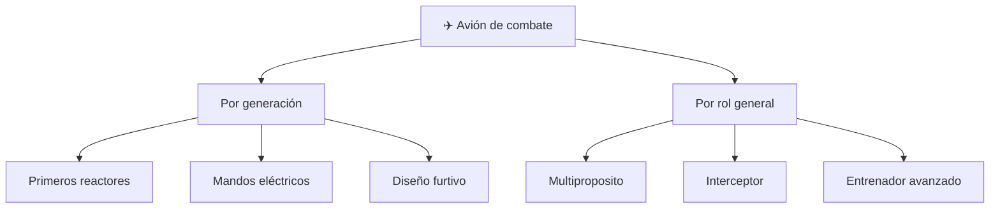

# 📋 Características funcionales del avión de combate

[🏠 Inicio](../../../README.md) · [✈️ Curso: Aviones de combate](../README.md) · 📋 Características

Que es un avión de combate, que generaciones existen y que roles generales cumple,
siempre en marco público y divulgativo. Este módulo da el contexto antes de abrir
los sistemas de la aeronave (Módulo 3).

---

## 🧭 Definición

Un avión de combate es una aeronave militar de ala fija, propulsada por uno o más
motores a reacción, disenada para volar a alta velocidad y con gran
maniobrabilidad. Desde el enfoque público de este curso interesa cómo vuela: su
aerodinámica, su propulsión y su control, no sus sistemas de misión.

---

## 🧬 Características clave

| Característica | Descripción |
| --- | --- |
| Alta velocidad | Muchos alcanzan o superan la velocidad del sonido. |
| Gran maniobrabilidad | Cambian de actitud con rapidez; soportan cargas G altas. |
| Relación empuje/peso alta | El motor a reacción entrega mucho empuje para su masa. |
| Estructura reforzada | Resiste las cargas de maniobra a alta velocidad. |
| Aerodinámica avanzada | Alas en flecha o delta para el vuelo rápido. |
| Control fino | Mandos eléctricos que ayudan a un vuelo estable. |

---

## 🗂️ Generaciones y roles (marco divulgativo)

| Categoría | Enfoque público | Rasgo destacado |
| --- | --- | --- |
| Primeros reactores | Histórico | Ala recta, velocidad subsonica alta. |
| Generación de mandos eléctricos | Técnico general | Fly-by-wire y avionica avanzada. |
| Diseño furtivo | Técnico general | Formas que reducen la firma radar. |
| Multiproposito | Rol general | Diseño flexible para varias misiones. |
| Interceptor | Rol general | Optimizado para velocidad y ascenso. |
| Entrenador avanzado | Formación | Prepara pilotos con menor complejidad. |

---

## 🎯 Para qué se usa (enfoque general)

- Formación avanzada de pilotos militares (entrenadores).
- Vigilancia y patrulla del espacio aéreo nacional.
- Demostraciones públicas y exhibiciones aéreas.
- Referencia técnica para estudiar aerodinámica de alta velocidad.
- Base histórica para entender la evolución de la aviación.

> Los usos operativos sensibles quedan fuera de este curso por diseño.

---

[⬅️ Anterior: Historia](../historia/historia-avion-combate.md) · [➡️ Siguiente: Sistemas mecánicos](sistemas-mecanicos-avion-combate.md)
