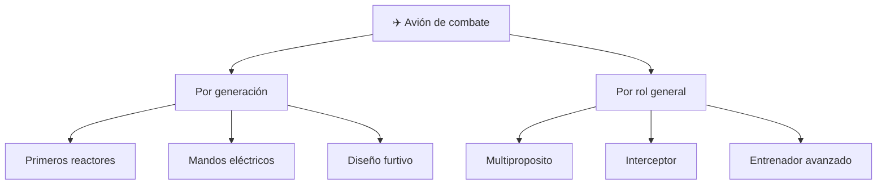

<!-- clase-meta
tipo_documento: clase
clase: 2
codigo: AVIONESCOMBA-02
curso: aviones-combate
titulo: "Características funcionales del avión de combate"
modalidad: "teórica aplicada"
duracion_minutos: 45
nivel: introductorio
prerrequisito: AVIONESCOMBA-01
competencia: "identificacion_funcional"
resultados_aprendizaje:
  - "Explicar definición, rasgos funcionales, tipos y usos con vocabulario propio de Aviones de combate."
  - "Aplicar esos conceptos a una decisión segura o a un escenario de simulación de Aviones de combate."
evidencia: "Matriz comparativa y decisión justificada."
criterio_aprobacion: "La elección considera función, límites, mando y efecto en la simulación; no se apoya solo en preferencias."
fuentes: manuales/fuentes.md
ultima_revision: 2026-09-10
-->

# 📋 Características funcionales del avión de combate

[🏠 Inicio](../../../README.md) · [✈️ Curso: Aviones de combate](../README.md) · 📋 Características

Que es un avión de combate, que generaciones existen y que roles generales cumple,
siempre en marco público y divulgativo. Esta clase da el contexto antes de abrir
los sistemas de la aeronave (Clase 4).

---

## 🧭 Definición

Un avión de combate es una aeronave militar de ala fija, propulsada por uno o más
motores a reacción, disenada para volar a alta velocidad y con gran
maniobrabilidad. Desde el enfoque público de este curso interesa cómo vuela: su
aerodinámica, su propulsión y su control, no sus sistemas de misión.

---

## 🧬 Características clave

| Característica | Descripción |
| --- | --- |
| Alta velocidad | Muchos alcanzan o superan la velocidad del sonido. |
| Gran maniobrabilidad | Cambian de actitud con rapidez; soportan cargas G altas. |
| Relación empuje/peso alta | El motor a reacción entrega mucho empuje para su masa. |
| Estructura reforzada | Resiste las cargas de maniobra a alta velocidad. |
| Aerodinámica avanzada | Alas en flecha o delta para el vuelo rápido. |
| Control fino | Mandos eléctricos que ayudan a un vuelo estable. |

---

## 🗂️ Generaciones y roles (marco divulgativo)

```mermaid
flowchart TD
    Caza[✈️ Avión de combate] --> Gen[Por generación]
    Caza --> Rol[Por rol general]
    Gen --> G1[Primeros reactores]
    Gen --> G4[Mandos eléctricos]
    Gen --> G5[Diseño furtivo]
    Rol --> Multi[Multiproposito]
    Rol --> Inter[Interceptor]
    Rol --> Entren[Entrenador avanzado]
```

| Categoría | Enfoque público | Rasgo destacado |
| --- | --- | --- |
| Primeros reactores | Histórico | Ala recta, velocidad subsonica alta. |
| Generación de mandos eléctricos | Técnico general | Fly-by-wire y avionica avanzada. |
| Diseño furtivo | Técnico general | Formas que reducen la firma radar. |
| Multiproposito | Rol general | Diseño flexible para varias misiones. |
| Interceptor | Rol general | Optimizado para velocidad y ascenso. |
| Entrenador avanzado | Formación | Prepara pilotos con menor complejidad. |

---

## 🎯 Para qué se usa (enfoque general)

- Formación avanzada de pilotos militares (entrenadores).
- Vigilancia y patrulla del espacio aéreo nacional.
- Demostraciones públicas y exhibiciones aéreas.
- Referencia técnica para estudiar aerodinámica de alta velocidad.
- Base histórica para entender la evolución de la aviación.

> Los usos operativos sensibles quedan fuera de este curso por diseño.

## 🧭 Guía de estudio aplicada

### Pregunta guía

¿Cómo ayuda **Definición, Características clave, Generaciones y roles (marco divulgativo) y Para qué se usa (enfoque general)** a **elegir una configuración adecuada para maniobra simulada de alta carga con combustible limitado**?

### Explicación razonada

Una característica solo es útil cuando permite anticipar comportamiento. En Aviones de combate, la relación entre motor, tobera, flujo y superficies y control de vuelo determina capacidad, respuesta y límites. Por eso «caza ligero monomotor frente a interceptor bimotor» no se compara por apariencia: se compara por misión, entorno, carga de trabajo y exposición al riesgo «exceder envolvente, perder energía o conciencia situacional».

Esta clase se conecta con el resto del curso mediante **intercambio entre energía cinética, altura, carga estructural y capacidad de giro**. El hilo de
seguridad consiste en reconocer a tiempo **exceder envolvente, perder energía o conciencia situacional** y poder justificar la decisión
**preservar margen de energía y carga antes de ordenar una maniobra**; en clases posteriores cambiará el ángulo de análisis, no esa relación causal.
La lectura funcional común sigue **motor → tobera → flujo → superficies y control de vuelo**, de modo que cada concepto pueda
ubicarse dentro del funcionamiento completo y no quede como un dato aislado.

**Apoyo documental:** [Aviation Handbooks and Manuals](https://www.faa.gov/regulations_policies/handbooks_manuals) aporta aerodinámica, sistemas y operación;
[Beginner's Guide to Aeronautics](https://www1.grc.nasa.gov/beginners-guide-to-aeronautics/) se usa para contraste con física y vuelo reales. Estas fuentes
se contrastan con el alcance de la clase y no sustituyen un manual de equipo concreto.

### Caso resuelto: de la observación a la decisión

1. **Definir la necesidad:** convierte «maniobra simulada de alta carga con combustible limitado» en requisitos de capacidad, entorno y respuesta.
2. **Comparar:** contrasta **caza ligero monomotor frente a interceptor bimotor** usando esos requisitos y la cadena **motor → tobera → flujo → superficies y control de vuelo**.
3. **Descartar:** elimina la alternativa que deja menos margen frente a **exceder envolvente, perder energía o conciencia situacional**.
4. **Elegir:** declara la variante escogida, la evidencia usada y una limitación que todavía debe respetarse.

### Comprueba tu comprensión

1. ¿Qué característica de **superficies y control de vuelo** condiciona primero el caso «maniobra simulada de alta carga con combustible limitado»?
2. ¿Qué requisito descartaría una de las alternativas **caza ligero monomotor frente a interceptor bimotor**?
3. ¿Qué límite debe declararse junto con la variante elegida?

Orientación para revisar tus respuestas

- La primera respuesta debe relacionar el eslabón elegido con un efecto posterior, no solo nombrarlo.
- La segunda debe proponer una señal medible u observable y explicar qué tendencia sería preocupante.
- La tercera debe cambiar al menos una variable de capacidad, mando, entorno o margen de seguridad.

## 🎓 Cierre de clase

- **Actividad:** Compara variantes de Aviones de combate mediante los ejes «definición, rasgos funcionales, tipos y usos» y elige una para un caso de uso razonado.
- **Evidencia:** Matriz comparativa y decisión justificada.
- **Criterio de aprobación:** La elección considera función, límites, mando y efecto en la simulación; no se apoya solo en preferencias.
- **Transferencia:** explica qué cambiaría al pasar a otra variante de esta máquina.

### Fuentes de esta clase

- [US-FAA-HANDBOOKS](https://www.faa.gov/regulations_policies/handbooks_manuals): Aviation Handbooks and Manuals, FAA. Uso: aerodinámica, sistemas y operación.
- [NASA-FLIGHT](https://www1.grc.nasa.gov/beginners-guide-to-aeronautics/): Beginner's Guide to Aeronautics, NASA. Uso: contraste con física y vuelo reales.

> Las fuentes sostienen el marco conceptual y normativo; esta clase no reemplaza el manual
> del fabricante, la formación certificada ni la habilitación exigida para operar equipos reales.

---

[⬅️ Anterior: Historia](../historia/historia-avion-combate.md) · [➡️ Siguiente: Modelos y variantes](../modelos/modelos-avion-combate.md)
