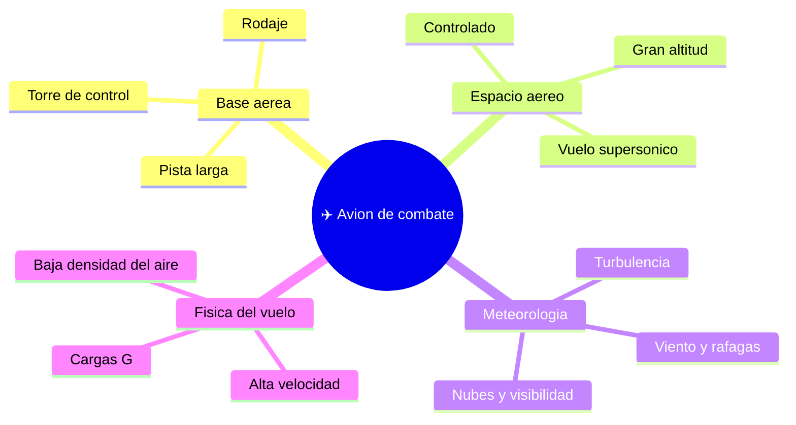

# 🌍 Entornos de trabajo del avion de combate

[🏠 Inicio](../../../README.md) · [✈️ Curso: Aviones de combate](../README.md) · 🌍 Entornos

Donde opera un avion de combate y como cambia el vuelo segun el entorno, en marco
publico y general. Cada entorno implica condiciones distintas que en simulacion se
traducen en escenarios de vuelo, sin contenido sensible.

---

## 🗺️ Entornos principales

| Entorno | Caracteristicas | Factores tipicos | Ajuste de vuelo |
| --- | --- | --- | --- |
| Base aerea | Pista larga, rodaje, control. | Trafico en tierra, viento. | Procedimientos de despegue y aterrizaje. |
| Espacio aereo controlado | Coordinacion por control aereo. | Otros vuelos, altitudes. | Seguir instrucciones y niveles asignados. |
| Gran altitud | Aire poco denso, frio. | Menor sustentacion, presurizacion. | Gestion de energia y sistemas de soporte. |
| Vuelo supersonico | Velocidad sobre el sonido. | Onda de choque, resistencia. | Control fino, respeto de limites. |
| Meteorologia adversa | Viento, nubes, turbulencia. | Perdida de referencias. | Volar por instrumentos, margenes amplios. |

---

## 🌦️ Factores del entorno

- **Altitud**: a gran altura el aire es poco denso; cambia el rendimiento y exige presurizacion.
- **Velocidad**: cerca y sobre el sonido aparecen efectos aerodinamicos nuevos.
- **Clima**: viento, turbulencia y visibilidad afectan despegue, vuelo y aterrizaje.
- **Cargas G**: las maniobras exigen a la estructura y al piloto.

---

## 🎮 Traduccion a simulacion

Cada entorno es un escenario con su altitud, su clima y su regimen de velocidad,
siempre en enfoque educativo. Ver como se modela en el
[Modulo 8: Diseno de simulacion](../simulacion/diseno-simulador-avion-combate.md).

---

[⬅️ Anterior: Principios y operacion](principios-avion-combate.md) · [➡️ Siguiente: Reglamentos](../reglamentos/reglamentos-avion-combate.md)
