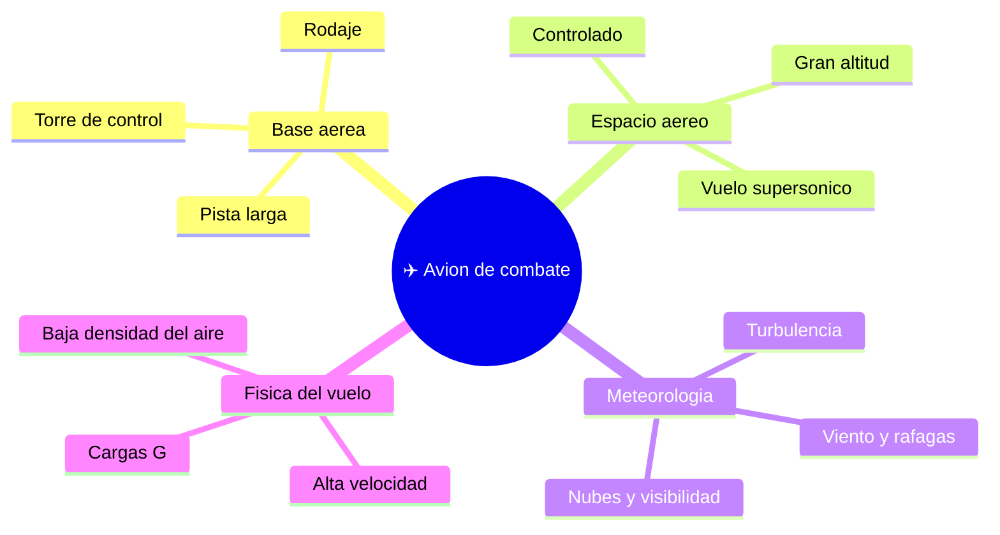

# 🌍 Entornos de trabajo del avión de combate

[🏠 Inicio](../../../README.md) · [✈️ Curso: Aviones de combate](../README.md) · 🌍 Entornos

Dónde opera un avión de combate y cómo cambia el vuelo según el entorno, en marco
público y general. Cada entorno implica condiciones distintas que en simulación se
traducen en escenarios de vuelo, sin contenido sensible.

---

## 🗺️ Entornos principales

| Entorno | Características | Factores típicos | Ajuste de vuelo |
| --- | --- | --- | --- |
| Base aérea | Pista larga, rodaje, control. | Tráfico en tierra, viento. | Procedimientos de despegue y aterrizaje. |
| Espacio aéreo controlado | Coordinación por control aéreo. | Otros vuelos, altitudes. | Seguir instrucciones y niveles asignados. |
| Gran altitud | Aire poco denso, frío. | Menor sustentación, presurización. | Gestión de energía y sistemas de soporte. |
| Vuelo supersónico | Velocidad sobre el sonido. | Onda de choque, resistencia. | Control fino, respeto de límites. |
| Meteorología adversa | Viento, nubes, turbulencia. | Pérdida de referencias. | Volar por instrumentos, margenes amplios. |

---

## 🌦️ Factores del entorno

- **Altitud**: a gran altura el aire es poco denso; cambia el rendimiento y exige presurización.
- **Velocidad**: cerca y sobre el sonido aparecen efectos aerodinámicos nuevos.
- **Clima**: viento, turbulencia y visibilidad afectan despegue, vuelo y aterrizaje.
- **Cargas G**: las maniobras exigen a la estructura y al piloto.

---

## 🎮 Traducción a simulación

Cada entorno es un escenario con su altitud, su clima y su régimen de velocidad,
siempre en enfoque educativo. Ver cómo se modela en el
[Módulo 8: Diseño de simulación](../simulacion/diseno-simulador-avion-combate.md).

---

[⬅️ Anterior: Principios y operación](principios-avion-combate.md) · [➡️ Siguiente: Reglamentos](../reglamentos/reglamentos-avion-combate.md)
