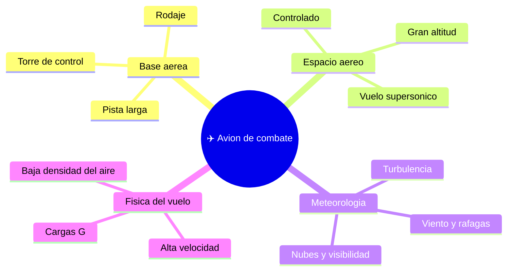

<!-- clase-meta
tipo_documento: clase
clase: 7
codigo: AVIONESCOMBA-07
curso: aviones-combate
titulo: "Entornos de trabajo del avión de combate"
modalidad: "análisis de escenarios"
duracion_minutos: 60
nivel: introductorio
prerrequisito: AVIONESCOMBA-06
competencia: "adaptacion_al_entorno"
resultados_aprendizaje:
  - "Explicar entornos, factores ambientales, riesgos y respuesta de simulación con vocabulario propio de Aviones de combate."
  - "Aplicar esos conceptos a una decisión segura o a un escenario de simulación de Aviones de combate."
evidencia: "Matriz entorno–cambio–riesgo–respuesta."
criterio_aprobacion: "Cada respuesta se adapta al entorno y distingue riesgos que no son intercambiables entre escenarios."
fuentes: manuales/fuentes.md
ultima_revision: 2026-09-10
-->

# 🌍 Entornos de trabajo del avión de combate

[🏠 Inicio](../../../README.md) · [✈️ Curso: Aviones de combate](../README.md) · 🌍 Entornos

Dónde opera un avión de combate y cómo cambia el vuelo según el entorno, en marco
público y general. Cada entorno implica condiciones distintas que en simulación se
traducen en escenarios de vuelo, sin contenido sensible.

---

## 🗺️ Entornos principales

```mermaid
mindmap
  root((✈️ Avion de combate))
    Base aerea
      Pista larga
      Rodaje
      Torre de control
    Espacio aereo
      Controlado
      Gran altitud
      Vuelo supersonico
    Meteorologia
      Viento y rafagas
      Nubes y visibilidad
      Turbulencia
    Fisica del vuelo
      Alta velocidad
      Cargas G
      Baja densidad del aire
```

| Entorno | Características | Factores típicos | Ajuste de vuelo |
| --- | --- | --- | --- |
| Base aérea | Pista larga, rodaje, control. | Tráfico en tierra, viento. | Procedimientos de despegue y aterrizaje. |
| Espacio aéreo controlado | Coordinación por control aéreo. | Otros vuelos, altitudes. | Seguir instrucciones y niveles asignados. |
| Gran altitud | Aire poco denso, frío. | Menor sustentación, presurización. | Gestión de energía y sistemas de soporte. |
| Vuelo supersónico | Velocidad sobre el sonido. | Onda de choque, resistencia. | Control fino, respeto de límites. |
| Meteorología adversa | Viento, nubes, turbulencia. | Pérdida de referencias. | Volar por instrumentos, margenes amplios. |

---

## 🌦️ Factores del entorno

- **Altitud**: a gran altura el aire es poco denso; cambia el rendimiento y exige presurización.
- **Velocidad**: cerca y sobre el sonido aparecen efectos aerodinámicos nuevos.
- **Clima**: viento, turbulencia y visibilidad afectan despegue, vuelo y aterrizaje.
- **Cargas G**: las maniobras exigen a la estructura y al piloto.

---

## 🎮 Traducción a simulación

Cada entorno es un escenario con su altitud, su clima y su régimen de velocidad,
siempre en enfoque educativo. Ver cómo se modela en el
[Clase 9: Diseño de simulación](../simulacion/diseno-simulador-avion-combate.md).

## 🧭 Guía de estudio aplicada

### Pregunta guía

¿Cómo ayuda **Entornos principales, Factores del entorno, Traducción a simulación y Guía de estudio aplicada** a **adaptar maniobra simulada de alta carga con combustible limitado a tres condiciones ambientales distintas**?

### Explicación razonada

El entorno no es decoración: modifica las fuerzas, la percepción y el tiempo disponible. En el caso «maniobra simulada de alta carga con combustible limitado», cambia el comportamiento de superficies y control de vuelo y aumenta la probabilidad de exceder envolvente, perder energía o conciencia situacional. La respuesta correcta empieza por reconocer qué variable cambió y después adaptar límites, ruta o misión.

Esta clase se conecta con el resto del curso mediante **intercambio entre energía cinética, altura, carga estructural y capacidad de giro**. El hilo de
seguridad consiste en reconocer a tiempo **exceder envolvente, perder energía o conciencia situacional** y poder justificar la decisión
**preservar margen de energía y carga antes de ordenar una maniobra**; en clases posteriores cambiará el ángulo de análisis, no esa relación causal.
La lectura funcional común sigue **motor → tobera → flujo → superficies y control de vuelo**, de modo que cada concepto pueda
ubicarse dentro del funcionamiento completo y no quede como un dato aislado.

**Apoyo documental:** [Aviation Handbooks and Manuals](https://www.faa.gov/regulations_policies/handbooks_manuals) aporta aerodinámica, sistemas y operación;
[Beginner's Guide to Aeronautics](https://www1.grc.nasa.gov/beginners-guide-to-aeronautics/) se usa para contraste con física y vuelo reales. Estas fuentes
se contrastan con el alcance de la clase y no sustituyen un manual de equipo concreto.

### Caso resuelto: de la observación a la decisión

1. **Escenario base:** conserva la misión «maniobra simulada de alta carga con combustible limitado» para poder comparar.
2. **Cambiar una condición:** modifica sucesivamente superficie o medio, visibilidad y perturbación externa.
3. **Recalcular margen:** explica cómo cada cambio afecta **superficies y control de vuelo** y acerca o aleja **exceder envolvente, perder energía o conciencia situacional**.
4. **Adaptar:** cambia límite, ruta, configuración o incluso cancela; no mantengas la misma respuesta por hábito.

### Comprueba tu comprensión

1. ¿Cómo cambiaría **superficies y control de vuelo** si empeora la perturbación externa?
2. ¿Qué condición ambiental acerca más el escenario a **exceder envolvente, perder energía o conciencia situacional**?
3. ¿Cuándo adaptarías la maniobra y cuándo la cancelarías?

Orientación para revisar tus respuestas

- La primera respuesta debe relacionar el eslabón elegido con un efecto posterior, no solo nombrarlo.
- La segunda debe proponer una señal medible u observable y explicar qué tendencia sería preocupante.
- La tercera debe cambiar al menos una variable de capacidad, mando, entorno o margen de seguridad.

## 🎓 Cierre de clase

- **Actividad:** Contrasta tres entornos de Aviones de combate a partir de entornos, factores ambientales, riesgos y respuesta de simulación y determina cómo cambian variables, percepción, riesgos y respuesta.
- **Evidencia:** Matriz entorno–cambio–riesgo–respuesta.
- **Criterio de aprobación:** Cada respuesta se adapta al entorno y distingue riesgos que no son intercambiables entre escenarios.
- **Transferencia:** explica qué cambiaría al pasar a otra variante de esta máquina.

### Fuentes de esta clase

- [US-FAA-HANDBOOKS](https://www.faa.gov/regulations_policies/handbooks_manuals): Aviation Handbooks and Manuals, FAA. Uso: aerodinámica, sistemas y operación.
- [NASA-FLIGHT](https://www1.grc.nasa.gov/beginners-guide-to-aeronautics/): Beginner's Guide to Aeronautics, NASA. Uso: contraste con física y vuelo reales.

> Las fuentes sostienen el marco conceptual y normativo; esta clase no reemplaza el manual
> del fabricante, la formación certificada ni la habilitación exigida para operar equipos reales.

---

[⬅️ Anterior: Principios y operación](principios-avion-combate.md) · [➡️ Siguiente: Reglamentos](../reglamentos/reglamentos-avion-combate.md)
