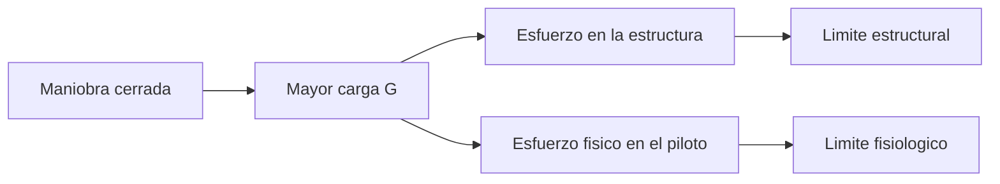

# 🧪 Principios y operacion del avion de combate

[🏠 Inicio](../../../README.md) · [✈️ Curso: Aviones de combate](../README.md) · 🧪 Principios

Documento general, publico y divulgativo. No sustituye entrenamiento real ni
manuales oficiales, y **no** describe tactica, doctrina ni sistemas de armas. Solo
trata la fisica del vuelo a reaccion y fases generales de vuelo.

## Principios de funcionamiento

- **Sustentacion**: las alas generan sosten al moverse por el aire, como en todo avion.
- **Empuje a reaccion**: el motor expulsa gases hacia atras e impulsa el avion adelante.
- **Vuelo a alta velocidad**: cerca del sonido cambian la resistencia y el control.
- **Cargas G**: en las maniobras la aceleracion multiplica el peso aparente.
- **Vuelo en tres ejes**: cabeceo, alabeo y guinada, asistidos por mandos electricos.

## Cargas G a nivel conceptual

Una maniobra cerrada aumenta la carga G: la estructura y el propio piloto sienten
un peso aparente varias veces mayor. Por eso el avion se disena reforzado y el
piloto usa equipo especial. En simulacion, esto se representa como un limite.

## Fases de operacion (marco general)

| Fase | Que ocurre | Puntos clave |
| --- | --- | --- |
| Prevuelo | Inspeccion y checklist | Estado de la aeronave y sistemas generales. |
| Rodaje | Mover el avion en tierra | Control con pedales y frenos. |
| Despegue | Acelerar y elevarse | Empuje alto, velocidad de rotacion, ascenso. |
| Ascenso | Ganar altitud | Gestion de empuje y energia. |
| Crucero | Vuelo sostenido | Navegar y mantener parametros estables. |
| Maniobra | Cambios de actitud | Controlar cargas G y no perder energia. |
| Descenso | Bajar de altitud | Reducir empuje y controlar velocidad. |
| Aterrizaje | Tomar tierra | Configurar, aproximar y frenar con control. |

## Energia y maniobra: idea general

1. La velocidad y la altitud son "energia" disponible para maniobrar.
2. Una maniobra cerrada gasta energia y sube la carga G.
3. Recuperar energia exige empuje o cambiar altitud por velocidad.
4. Volar suave conserva energia y control.
5. Respetar los limites estructurales y fisiologicos es prioritario.

## Errores comunes que la simulacion puede ensenar a evitar

- Exceder los limites de carga G en una maniobra.
- Perder energia y quedar lento a baja altura.
- Ignorar la velocidad cercana al sonido y sus efectos.
- No completar el checklist de cada fase.
- Descuidar el combustible en vuelo prolongado.

## Relacion con los niveles de realismo

- **Nivel 1 (educativo)**: despegar, volar, virar y aterrizar un reactor.
- **Nivel 2 (simplificado)**: agregar cargas G, energia y efectos de alta velocidad.
- **Nivel 3 (tecnico)**: sumar gestion de empuje, limites estructurales y Mach.

Ver [`docs/03-niveles-de-realismo.md`](../../../docs/03-niveles-de-realismo.md) para el detalle de cada nivel.

---

[⬅️ Anterior: Mandos](../mandos/manual-mandos-avion-combate.md) · [➡️ Siguiente: Entornos de trabajo](entornos-avion-combate.md)
