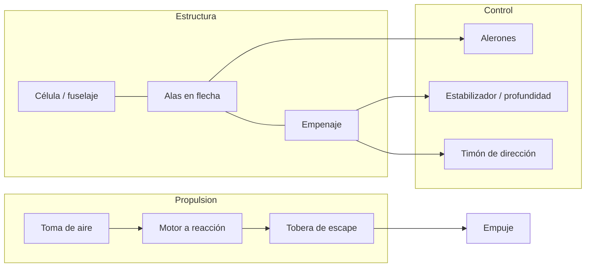
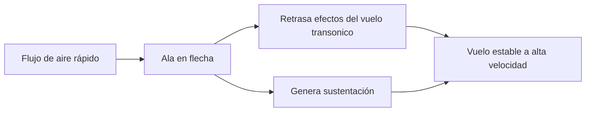
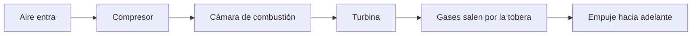

# 🔧 Sistemas mecánicos del avión de combate

[🏠 Inicio](../../../README.md) · [✈️ Curso: Aviones de combate](../README.md) · 🔧 Sistemas mecánicos

Este módulo abre el avión por dentro **solo** en su física de vuelo y sus sistemas
generales de aeronave: célula, alas, superficies de control y motor a reacción a
nivel divulgativo. **No** trata sistemas de armas ni de misión. Es la base técnica
para entender los mandos (Módulo 4) y la física del vuelo (Módulo 5).

---

## 1. 🧱 Célula y fuselaje

La célula soporta las altas cargas del vuelo rápido y las maniobras.

- **Fuselaje**: cuerpo central; aloja la cabina y une alas y empenaje.
- **Estructura reforzada**: resiste las cargas G de las maniobras.
- **Materiales**: aleaciones ligeras y compuestos avanzados.
- **Empenaje**: superficies de cola que estabilizan y controlan el vuelo.

---

## 2. ✈️ Alas y sustentación a alta velocidad

El ala genera sustentación, pero su forma se adapta al vuelo rápido.

| Elemento del ala | Función |
| --- | --- |
| Ala en flecha | Retrasa efectos del vuelo cercano al sonido. |
| Ala delta | Buena para alta velocidad y estructura resistente. |
| Ángulo de ataque | Relación entre ala y aire; define la sustentación. |
| Dispositivos de borde | Ajustan sustentación en despegue y aterrizaje. |
| Perfil delgado | Reduce la resistencia a alta velocidad. |

---

## 3. 🎚️ Superficies de control

Controlan la aeronave en sus tres ejes, como en cualquier avión.

| Eje | Movimiento | Superficie | Mando en cabina |
| --- | --- | --- | --- |
| Longitudinal | Alabeo (rolido) | Alerones | Palanca a izquierda / derecha. |
| Lateral | Cabeceo (subir / bajar morro) | Estabilizador / profundidad | Palanca adelante / atrás. |
| Vertical | Guiñada (nariz izq / der) | Timón de dirección | Pedales. |

- **Mandos eléctricos (fly-by-wire)**: la palanca envia señales a computadores que
  mueven las superficies, mejorando la estabilidad y suavizando el control.
- **Estabilizador móvil**: en muchos reactores la cola horizontal se mueve entera.
- **Compensación automática**: el sistema ayuda a mantener la actitud elegida.

---

## 4. ⚙️ Motor a reacción (divulgativo)

El motor a reacción impulsa el avión expulsando gases a gran velocidad.

| Etapa | Que hace |
| --- | --- |
| Toma de aire | Conduce el aire hacia el motor. |
| Compresor | Comprime el aire para la combustión. |
| Cámara de combustión | Mezcla aire y combustible y los quema. |
| Turbina | Los gases mueven la turbina, que gira el compresor. |
| Tobera | Los gases salen a gran velocidad y generan empuje. |
| Posquemador (afterburner) | Empuje extra quemando más combustible en la tobera. |

El principio es la tercera ley de Newton: expulsar masa hacia atrás impulsa el
avión hacia adelante.

---

## 5. 🛞 Tren de aterrizaje y sistemas generales

- **Tren retráctil**: se recoge en vuelo para reducir la resistencia.
- **Sistema hidráulico**: mueve tren, frenos y superficies de gran carga.
- **Sistema eléctrico**: alimenta instrumentos, pantallas y avionica.
- **Sistema de oxígeno y presurización**: sostiene al piloto a gran altitud.

---

## 6. 📟 Instrumentos y avionica (nivel general)

Informan al piloto y ayudan al control del vuelo.

| Sistema | Función general |
| --- | --- |
| Pantallas de vuelo | Muestran actitud, velocidad y altitud. |
| HUD (display frontal) | Proyecta datos de vuelo en el parabrisas. |
| Instrumentos de motor | Vigilan empuje, temperatura y combustible. |
| Sistemas de navegación | Ayudan a ubicar la aeronave en el espacio. |
| Alertas de vuelo | Avisan situaciones como baja velocidad. |

> Este módulo no describe sistemas de misión, sensores tacticos ni armamento.

---

## 🔁 Cómo se conecta todo

1. El **motor a reacción** produce **empuje** expulsando gases.
2. El empuje da **velocidad**, y las **alas** generan **sustentación**.
3. Las **superficies de control**, con **mandos eléctricos**, orientan la aeronave.
4. La **célula reforzada** resiste las cargas del vuelo rápido.
5. Los **sistemas generales** sostienen al piloto y al avión en altitud.
6. Los **instrumentos** informan para volar con seguridad.

Con esto entendido, el [Módulo 4: Mandos](../mandos/manual-mandos-avion-combate.md)
muestra como el piloto opera estos sistemas generales.

---

[⬅️ Anterior: Características](caracteristicas-avion-combate.md) · [➡️ Siguiente: Mandos e instrumentos](../mandos/manual-mandos-avion-combate.md)
