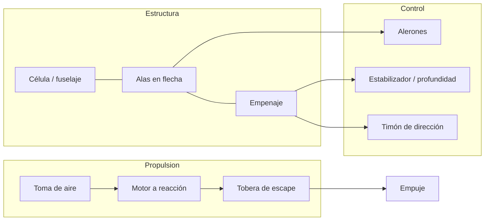
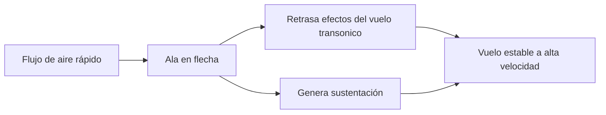
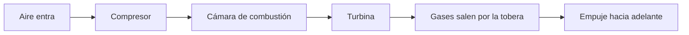
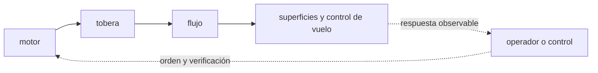

<!-- clase-meta
tipo_documento: clase
clase: 4
codigo: AVIONESCOMBA-04
curso: aviones-combate
titulo: "Sistemas mecánicos del avión de combate"
modalidad: "teórica aplicada"
duracion_minutos: 90
nivel: introductorio
prerrequisito: AVIONESCOMBA-03
competencia: "comprension_de_sistemas"
resultados_aprendizaje:
  - "Explicar Célula y fuselaje, Alas y sustentación a alta velocidad, Superficies de control y Motor a reacción (divulgativo) con vocabulario propio de Aviones de combate."
  - "Aplicar esos conceptos a una decisión segura o a un escenario de simulación de Aviones de combate."
evidencia: "Esquema con flujos de energía, materia o información anotados."
criterio_aprobacion: "Las conexiones esenciales son correctas y la consecuencia de la falla se propaga de manera coherente."
fuentes: manuales/fuentes.md
ultima_revision: 2026-09-10
-->

# 🔧 Sistemas mecánicos del avión de combate

[🏠 Inicio](../../../README.md) · [✈️ Curso: Aviones de combate](../README.md) · 🔧 Sistemas mecánicos

Esta clase abre el avión por dentro **solo** en su física de vuelo y sus sistemas
generales de aeronave: célula, alas, superficies de control y motor a reacción a
nivel divulgativo. **No** trata sistemas de armas ni de misión. Es la base técnica
para entender los mandos (Clase 5) y la física del vuelo (Clase 6).

```mermaid
flowchart LR
    subgraph Estructura
        Ce[Célula / fuselaje] --- Al[Alas en flecha]
        Al --- Emp[Empenaje]
    end
    subgraph Control
        Ale[Alerones]
        Prof[Estabilizador / profundidad]
        Dir[Timón de dirección]
    end
    subgraph Propulsion
        Toma[Toma de aire] --> Reactor[Motor a reacción]
        Reactor --> Tobera[Tobera de escape]
    end
    Al --> Ale
    Emp --> Prof
    Emp --> Dir
    Tobera --> Empuje[Empuje]
```

---

## 1. 🧱 Célula y fuselaje

La célula soporta las altas cargas del vuelo rápido y las maniobras.

- **Fuselaje**: cuerpo central; aloja la cabina y une alas y empenaje.
- **Estructura reforzada**: resiste las cargas G de las maniobras.
- **Materiales**: aleaciones ligeras y compuestos avanzados.
- **Empenaje**: superficies de cola que estabilizan y controlan el vuelo.

---

## 2. ✈️ Alas y sustentación a alta velocidad

El ala genera sustentación, pero su forma se adapta al vuelo rápido.

```mermaid
flowchart LR
    Aire[Flujo de aire rápido] --> Ala[Ala en flecha]
    Ala --> Retraso[Retrasa efectos del vuelo transonico]
    Ala --> Sust[Genera sustentación]
    Retraso --> Control[Vuelo estable a alta velocidad]
    Sust --> Control
```

| Elemento del ala | Función |
| --- | --- |
| Ala en flecha | Retrasa efectos del vuelo cercano al sonido. |
| Ala delta | Buena para alta velocidad y estructura resistente. |
| Ángulo de ataque | Relación entre ala y aire; define la sustentación. |
| Dispositivos de borde | Ajustan sustentación en despegue y aterrizaje. |
| Perfil delgado | Reduce la resistencia a alta velocidad. |

---

## 3. 🎚️ Superficies de control

Controlan la aeronave en sus tres ejes, como en cualquier avión.

| Eje | Movimiento | Superficie | Mando en cabina |
| --- | --- | --- | --- |
| Longitudinal | Alabeo (rolido) | Alerones | Palanca a izquierda / derecha. |
| Lateral | Cabeceo (subir / bajar morro) | Estabilizador / profundidad | Palanca adelante / atrás. |
| Vertical | Guiñada (nariz izq / der) | Timón de dirección | Pedales. |

- **Mandos eléctricos (fly-by-wire)**: la palanca envia señales a computadores que
  mueven las superficies, mejorando la estabilidad y suavizando el control.
- **Estabilizador móvil**: en muchos reactores la cola horizontal se mueve entera.
- **Compensación automática**: el sistema ayuda a mantener la actitud elegida.

---

## 4. ⚙️ Motor a reacción (divulgativo)

El motor a reacción impulsa el avión expulsando gases a gran velocidad.

```mermaid
flowchart LR
    Entra[Aire entra] --> Compresor[Compresor]
    Compresor --> Camara[Cámara de combustión]
    Camara --> Turbina[Turbina]
    Turbina --> Sale[Gases salen por la tobera]
    Sale --> Empuje[Empuje hacia adelante]
```

| Etapa | Que hace |
| --- | --- |
| Toma de aire | Conduce el aire hacia el motor. |
| Compresor | Comprime el aire para la combustión. |
| Cámara de combustión | Mezcla aire y combustible y los quema. |
| Turbina | Los gases mueven la turbina, que gira el compresor. |
| Tobera | Los gases salen a gran velocidad y generan empuje. |
| Posquemador (afterburner) | Empuje extra quemando más combustible en la tobera. |

El principio es la tercera ley de Newton: expulsar masa hacia atrás impulsa el
avión hacia adelante.

---

## 5. 🛞 Tren de aterrizaje y sistemas generales

- **Tren retráctil**: se recoge en vuelo para reducir la resistencia.
- **Sistema hidráulico**: mueve tren, frenos y superficies de gran carga.
- **Sistema eléctrico**: alimenta instrumentos, pantallas y avionica.
- **Sistema de oxígeno y presurización**: sostiene al piloto a gran altitud.

---

## 6. 📟 Instrumentos y avionica (nivel general)

Informan al piloto y ayudan al control del vuelo.

| Sistema | Función general |
| --- | --- |
| Pantallas de vuelo | Muestran actitud, velocidad y altitud. |
| HUD (display frontal) | Proyecta datos de vuelo en el parabrisas. |
| Instrumentos de motor | Vigilan empuje, temperatura y combustible. |
| Sistemas de navegación | Ayudan a ubicar la aeronave en el espacio. |
| Alertas de vuelo | Avisan situaciones como baja velocidad. |

> Esta clase no describe sistemas de misión, sensores tacticos ni armamento.

---

## 🔁 Cómo se conecta todo

1. El **motor a reacción** produce **empuje** expulsando gases.
2. El empuje da **velocidad**, y las **alas** generan **sustentación**.
3. Las **superficies de control**, con **mandos eléctricos**, orientan la aeronave.
4. La **célula reforzada** resiste las cargas del vuelo rápido.
5. Los **sistemas generales** sostienen al piloto y al avión en altitud.
6. Los **instrumentos** informan para volar con seguridad.

Con esto entendido, el [Clase 5: Mandos](../mandos/manual-mandos-avion-combate.md)
muestra como el piloto opera estos sistemas generales.

## 🧭 Guía de estudio aplicada

### Pregunta guía

¿Cómo ayuda **Célula y fuselaje, Alas y sustentación a alta velocidad, Superficies de control y Motor a reacción (divulgativo)** a **seguir una alteración desde motor hasta superficies y control de vuelo durante maniobra simulada de alta carga con combustible limitado**?

### Explicación razonada

El funcionamiento puede leerse como una cadena causal: motor entrega o transforma energía; tobera la adapta; flujo la transmite o gobierna; y superficies y control de vuelo produce el efecto observable. La cadena no es lineal en sentido estricto: sensores, estructura y operador cierran el lazo. Si un eslabón se degrada, la señal importante es cómo cambia el estado de superficies y control de vuelo y qué margen queda.

```mermaid
flowchart LR
    A["motor"] --> B["tobera"] --> C["flujo"] --> D["superficies y control de vuelo"]
    D -. respuesta observable .-> O["operador o control"]
    O -. orden y verificación .-> A
```

Esta clase se conecta con el resto del curso mediante **intercambio entre energía cinética, altura, carga estructural y capacidad de giro**. El hilo de
seguridad consiste en reconocer a tiempo **exceder envolvente, perder energía o conciencia situacional** y poder justificar la decisión
**preservar margen de energía y carga antes de ordenar una maniobra**; en clases posteriores cambiará el ángulo de análisis, no esa relación causal.
La lectura funcional común sigue **motor → tobera → flujo → superficies y control de vuelo**, de modo que cada concepto pueda
ubicarse dentro del funcionamiento completo y no quede como un dato aislado.

**Apoyo documental:** [Aviation Handbooks and Manuals](https://www.faa.gov/regulations_policies/handbooks_manuals) aporta aerodinámica, sistemas y operación;
[Beginner's Guide to Aeronautics](https://www1.grc.nasa.gov/beginners-guide-to-aeronautics/) se usa para contraste con física y vuelo reales. Estas fuentes
se contrastan con el alcance de la clase y no sustituyen un manual de equipo concreto.

### Caso resuelto: de la observación a la decisión

1. **Entrada:** identifica el estado inicial de **motor** durante **maniobra simulada de alta carga con combustible limitado**.
2. **Transformación:** explica qué hacen **tobera** y **flujo**, y qué magnitud cambia en cada paso.
3. **Salida:** comprueba el efecto esperado en **superficies y control de vuelo** y busca una desviación temprana.
4. **Falla razonada:** si aparece **exceder envolvente, perder energía o conciencia situacional**, retrocede por la cadena antes de ordenar otra acción.

### Comprueba tu comprensión

1. Si se degrada **tobera**, ¿qué efecto esperarías primero en **flujo** y después en **superficies y control de vuelo**?
2. ¿Qué observación ayudaría a diferenciar una falla de **motor** de una falla de **flujo**?
3. ¿Por qué una segunda orden podría agravar **exceder envolvente, perder energía o conciencia situacional**?

Orientación para revisar tus respuestas

- La primera respuesta debe relacionar el eslabón elegido con un efecto posterior, no solo nombrarlo.
- La segunda debe proponer una señal medible u observable y explicar qué tendencia sería preocupante.
- La tercera debe cambiar al menos una variable de capacidad, mando, entorno o margen de seguridad.

## 🎓 Cierre de clase

- **Actividad:** Dibuja un esquema funcional de Aviones de combate que conecte Célula y fuselaje, Alas y sustentación a alta velocidad, Superficies de control y Motor a reacción (divulgativo); después predice el efecto de una falla simulada.
- **Evidencia:** Esquema con flujos de energía, materia o información anotados.
- **Criterio de aprobación:** Las conexiones esenciales son correctas y la consecuencia de la falla se propaga de manera coherente.
- **Transferencia:** explica qué cambiaría al pasar a otra variante de esta máquina.

### Fuentes de esta clase

- [US-FAA-HANDBOOKS](https://www.faa.gov/regulations_policies/handbooks_manuals): Aviation Handbooks and Manuals, FAA. Uso: aerodinámica, sistemas y operación.
- [NASA-FLIGHT](https://www1.grc.nasa.gov/beginners-guide-to-aeronautics/): Beginner's Guide to Aeronautics, NASA. Uso: contraste con física y vuelo reales.

> Las fuentes sostienen el marco conceptual y normativo; esta clase no reemplaza el manual
> del fabricante, la formación certificada ni la habilitación exigida para operar equipos reales.

---

[⬅️ Anterior: Modelos y variantes](../modelos/modelos-avion-combate.md) · [➡️ Siguiente: Mandos e instrumentos](../mandos/manual-mandos-avion-combate.md)
