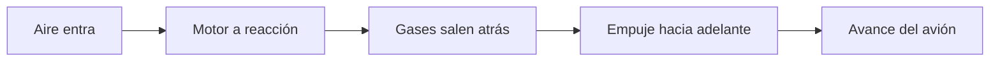

# 🧰 Recursos del avión de combate

[🏠 Inicio](../../../README.md) · [✈️ Curso: Aviones de combate](../README.md) · 🧰 Recursos

Glosario específico, enlaces y diagramas de apoyo del curso de aviones de combate,
en marco público y divulgativo. Amplia el
[glosario general](../../../docs/05-glosario-general.md).

---

## 📖 Glosario específico

| Término | Definición |
| --- | --- |
| Motor a reacción | Motor que impulsa expulsando gases a gran velocidad. |
| Posquemador | Etapa que da empuje extra quemando más combustible en la tobera. |
| Ala en flecha | Ala inclinada hacia atrás para el vuelo cercano al sonido. |
| Número de Mach | Velocidad respecto a la del sonido; Mach 1 es el sonido. |
| Carga G | Peso aparente que multiplica la maniobra sobre estructura y piloto. |
| Fly-by-wire | Mando eléctrico: la palanca envia señales a computadores de vuelo. |
| HUD | Pantalla frontal que proyecta datos de vuelo. |
| Energía total | Suma de velocidad y altitud disponible para maniobrar. |

---

## 🗺️ Diagrama del principio de reacción

---

## 🔗 Enlaces y fuentes

- Seguridad y límites: [🦺 docs/04-seguridad-y-limites.md](../../../docs/04-seguridad-y-limites.md)
- Marco legal: [⚖️ docs/07-marco-legal-chile.md](../../../docs/07-marco-legal-chile.md)
- Registro de fuentes: [📚 manuales/fuentes.md](../../../manuales/fuentes.md)

Registrar cada recurso nuevo con su origen y licencia, siguiendo
[`recursos/README.md`](../../../recursos/README.md). Usar solo fuentes públicas.

---

[🎓 Portada del curso](../README.md) · [⬅️ Anterior: Diseño de simulación](../simulacion/diseno-simulador-avion-combate.md) · [➡️ Siguiente: Ejercicios](../ejercicios/ejercicios-avion-combate.md)
