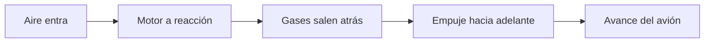

<!-- clase-meta
tipo_documento: clase
clase: 10
codigo: AVIONESCOMBA-10
curso: aviones-combate
titulo: "Recursos del avión de combate"
modalidad: "taller documental"
duracion_minutos: 45
nivel: introductorio
prerrequisito: AVIONESCOMBA-09
competencia: "alfabetizacion_tecnica"
resultados_aprendizaje:
  - "Explicar glosario, esquemas y trazabilidad de fuentes con vocabulario propio de Aviones de combate."
  - "Aplicar esos conceptos a una decisión segura o a un escenario de simulación de Aviones de combate."
evidencia: "Glosario aplicado y ficha breve de trazabilidad."
criterio_aprobacion: "Los términos permiten interpretar el curso y las fuentes se distinguen por autoridad, alcance y vigencia."
fuentes: manuales/fuentes.md
ultima_revision: 2026-09-10
-->

# 🧰 Recursos del avión de combate

[🏠 Inicio](../../../README.md) · [✈️ Curso: Aviones de combate](../README.md) · 🧰 Recursos

Glosario específico, enlaces y diagramas de apoyo del curso de aviones de combate,
en marco público y divulgativo. Amplia el
[glosario general](../../../docs/05-glosario-general.md).

---

## 📖 Glosario específico

| Término | Definición |
| --- | --- |
| Motor a reacción | Motor que impulsa expulsando gases a gran velocidad. |
| Posquemador | Etapa que da empuje extra quemando más combustible en la tobera. |
| Ala en flecha | Ala inclinada hacia atrás para el vuelo cercano al sonido. |
| Número de Mach | Velocidad respecto a la del sonido; Mach 1 es el sonido. |
| Carga G | Peso aparente que multiplica la maniobra sobre estructura y piloto. |
| Fly-by-wire | Mando eléctrico: la palanca envia señales a computadores de vuelo. |
| HUD | Pantalla frontal que proyecta datos de vuelo. |
| Energía total | Suma de velocidad y altitud disponible para maniobrar. |

---

## 🗺️ Diagrama del principio de reacción

```mermaid
flowchart LR
    Aire[Aire entra] --> Motor[Motor a reacción]
    Motor --> Gases[Gases salen atrás]
    Gases --> Empuje[Empuje hacia adelante]
    Empuje --> Vuelo[Avance del avión]
```

---

## 🔗 Enlaces y fuentes

- Seguridad y límites: [🦺 docs/04-seguridad-y-limites.md](../../../docs/04-seguridad-y-limites.md)
- Marco legal: [⚖️ docs/07-marco-legal-chile.md](../../../docs/07-marco-legal-chile.md)
- Registro de fuentes: [📚 manuales/fuentes.md](../../../manuales/fuentes.md)

Registrar cada recurso nuevo con su origen y licencia, siguiendo
[`recursos/README.md`](../../../recursos/README.md). Usar solo fuentes públicas.

## 🧭 Guía de estudio aplicada

### Pregunta guía

¿Cómo ayuda **Glosario específico, Diagrama del principio de reacción, Enlaces y fuentes y Guía de estudio aplicada** a **explicar con fuentes los términos motor, tobera, flujo y superficies y control de vuelo**?

### Explicación razonada

El vocabulario técnico organiza relaciones: motor, tobera, flujo y superficies y control de vuelo nombran partes distintas de una misma cadena funcional. Una fuente se usa para sostener una afirmación concreta —principio, límite, procedimiento o contexto— y debe distinguirse del manual particular de un fabricante o de una regla narrativa.

Esta clase se conecta con el resto del curso mediante **intercambio entre energía cinética, altura, carga estructural y capacidad de giro**. El hilo de
seguridad consiste en reconocer a tiempo **exceder envolvente, perder energía o conciencia situacional** y poder justificar la decisión
**preservar margen de energía y carga antes de ordenar una maniobra**; en clases posteriores cambiará el ángulo de análisis, no esa relación causal.
La lectura funcional común sigue **motor → tobera → flujo → superficies y control de vuelo**, de modo que cada concepto pueda
ubicarse dentro del funcionamiento completo y no quede como un dato aislado.

**Apoyo documental:** [Aviation Handbooks and Manuals](https://www.faa.gov/regulations_policies/handbooks_manuals) aporta aerodinámica, sistemas y operación;
[Beginner's Guide to Aeronautics](https://www1.grc.nasa.gov/beginners-guide-to-aeronautics/) se usa para contraste con física y vuelo reales. Estas fuentes
se contrastan con el alcance de la clase y no sustituyen un manual de equipo concreto.

### Caso resuelto: de la observación a la decisión

1. **Definir en contexto:** explica **motor**, **tobera**, **flujo** y **superficies y control de vuelo** por su función y relación.
2. **Respaldar:** enlaza cada afirmación importante con una fuente identificable y declara su alcance.
3. **Contrastar:** separa principios generales, requisitos locales, manual de fabricante y —si aplica— canon ficticio.
4. **Reformular:** convierte una definición copiada en una explicación propia con un ejemplo de **Aviones de combate**.

### Comprueba tu comprensión

1. Explica la diferencia funcional entre **tobera** y **flujo** sin copiar una definición.
2. ¿Qué fuente respalda el principio «intercambio entre energía cinética, altura, carga estructural y capacidad de giro» y cuál es su alcance?
3. ¿Qué dato exigiría un manual de fabricante en vez de una fuente general?

Orientación para revisar tus respuestas

- La primera respuesta debe relacionar el eslabón elegido con un efecto posterior, no solo nombrarlo.
- La segunda debe proponer una señal medible u observable y explicar qué tendencia sería preocupante.
- La tercera debe cambiar al menos una variable de capacidad, mando, entorno o margen de seguridad.

## 🎓 Cierre de clase

- **Actividad:** Selecciona términos de glosario, esquemas y trazabilidad de fuentes, explícalos en contexto de Aviones de combate y verifica la procedencia de las fuentes utilizadas.
- **Evidencia:** Glosario aplicado y ficha breve de trazabilidad.
- **Criterio de aprobación:** Los términos permiten interpretar el curso y las fuentes se distinguen por autoridad, alcance y vigencia.
- **Transferencia:** explica qué cambiaría al pasar a otra variante de esta máquina.

### Fuentes de esta clase

- [US-FAA-HANDBOOKS](https://www.faa.gov/regulations_policies/handbooks_manuals): Aviation Handbooks and Manuals, FAA. Uso: aerodinámica, sistemas y operación.
- [NASA-FLIGHT](https://www1.grc.nasa.gov/beginners-guide-to-aeronautics/): Beginner's Guide to Aeronautics, NASA. Uso: contraste con física y vuelo reales.

> Las fuentes sostienen el marco conceptual y normativo; esta clase no reemplaza el manual
> del fabricante, la formación certificada ni la habilitación exigida para operar equipos reales.

---

[🎓 Portada del curso](../README.md) · [⬅️ Anterior: Diseño de simulación](../simulacion/diseno-simulador-avion-combate.md) · [➡️ Siguiente: Ejercicios](../ejercicios/ejercicios-avion-combate.md)
