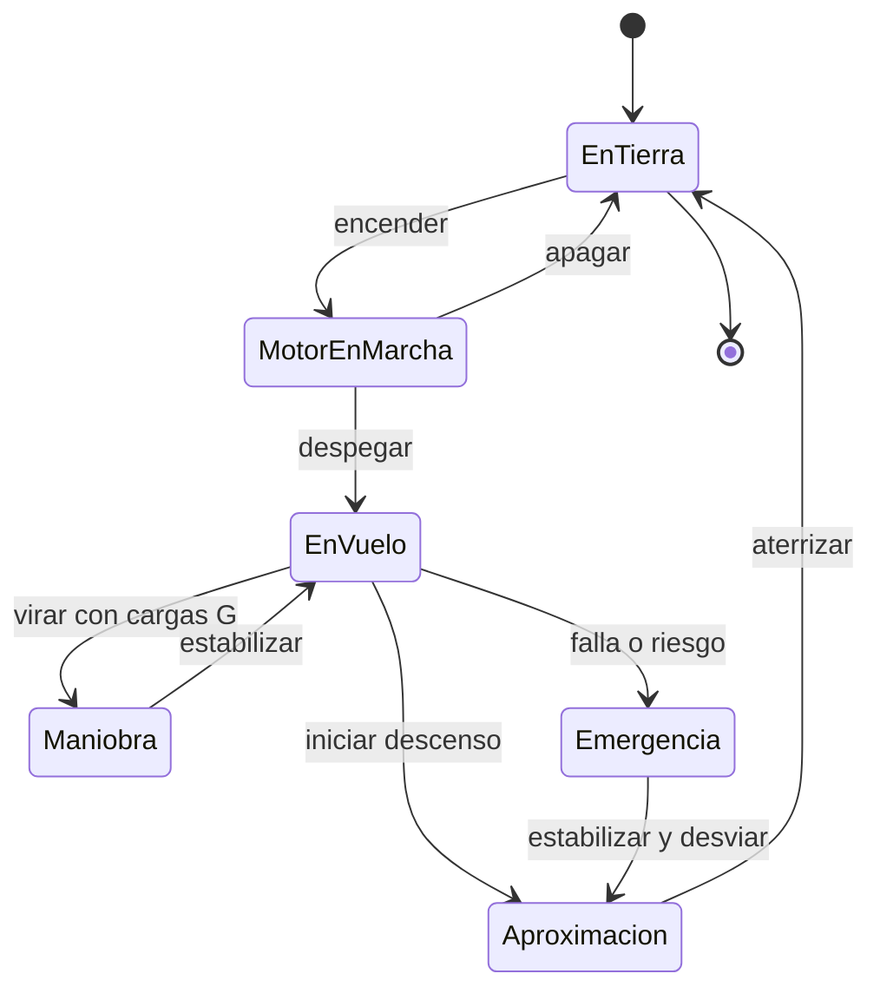

# 🎮 Diseno de simulacion del avion de combate

[🏠 Inicio](../../../README.md) · [✈️ Curso: Aviones de combate](../README.md) · 🎮 Simulacion

Simulacion **educativa** centrada en la fisica del vuelo a reaccion. No modela
sistemas de armas, tactica ni doctrina; su objetivo es ensenar como vuela un
reactor.

## Objetivo de la simulacion

Que el usuario aprenda a despegar, ascender, volar a alta velocidad, maniobrar
respetando las cargas G, gestionar la energia y aterrizar un avion a reaccion, de
forma educativa y sin contenido sensible.

## Nivel de realismo

- Nivel elegido: se ofrece del 1 al 3 (ver `docs/03-niveles-de-realismo.md`).
- Justificacion: agrega el vuelo a alta velocidad y las cargas G, por lo que se
  recomienda tras dominar la aviacion general.

## Variables principales

| Variable | Tipo | Rango | Afecta a | Comentarios |
| --- | --- | --- | --- | --- |
| Velocidad | numerica | 0-2.0 Mach | Sustentacion y resistencia | A alta velocidad se usa Mach. |
| Altitud | numerica | 0-50000 pies | Rendimiento y densidad | Ligada a la presion. |
| Actitud | numerica | -90..90 grados | Trayectoria de vuelo | Referencia del horizonte. |
| Carga G | numerica | -3..9 G | Estructura y piloto | Limite estructural y fisiologico. |
| Empuje del motor | numerica | 0-100% + AB | Aceleracion | AB es el posquemador. |
| Energia total | derivada | baja-alta | Capacidad de maniobra | Suma de velocidad y altitud. |
| Combustible | numerica | 0-100% | Autonomia | Incluye reserva. |

## Ciclo basico

1. Leer entrada del usuario (palanca, pedales, empuje, tren, aerofrenos).
2. Actualizar estado del motor y la configuracion aerodinamica.
3. Calcular fuerzas: sustentacion, peso, empuje y resistencia.
4. Aplicar cargas G, altitud y efectos de alta velocidad.
5. Actualizar velocidad, altitud, actitud y energia.
6. Refrescar instrumentos y alertas (baja velocidad, exceso de G).

## Modos de juego futuros

- Tutorial de cabina y fisica del vuelo a reaccion.
- Practica de despegue, maniobra y aterrizaje.
- Desafios de gestion de energia y cargas G.
- Circuitos de navegacion a gran altitud.
- Situaciones de emergencia controladas (falla de motor) sin contenido sensible.

## Elementos fuera de alcance

- Sistemas de armas, sensores tacticos o de mision.
- Tactica, doctrina o procedimientos operativos sensibles.
- Datos tecnicos que permitan replicar sistemas reales.
- Reproduccion de vuelo temerario como objetivo del juego.

## Pendientes

- [ ] Definir valores por defecto de cada variable de vuelo.
- [ ] Prototipar el modelo de cargas G y energia.
- [ ] Ajustar efectos de alta velocidad (Mach) de forma divulgativa.
- [ ] Agregar fuentes publicas a [`manuales/fuentes.md`](../../../manuales/fuentes.md).

---

[⬅️ Anterior: Reglamentos](../reglamentos/reglamentos-avion-combate.md) · [➡️ Siguiente: Recursos](../recursos/recursos-avion-combate.md)
