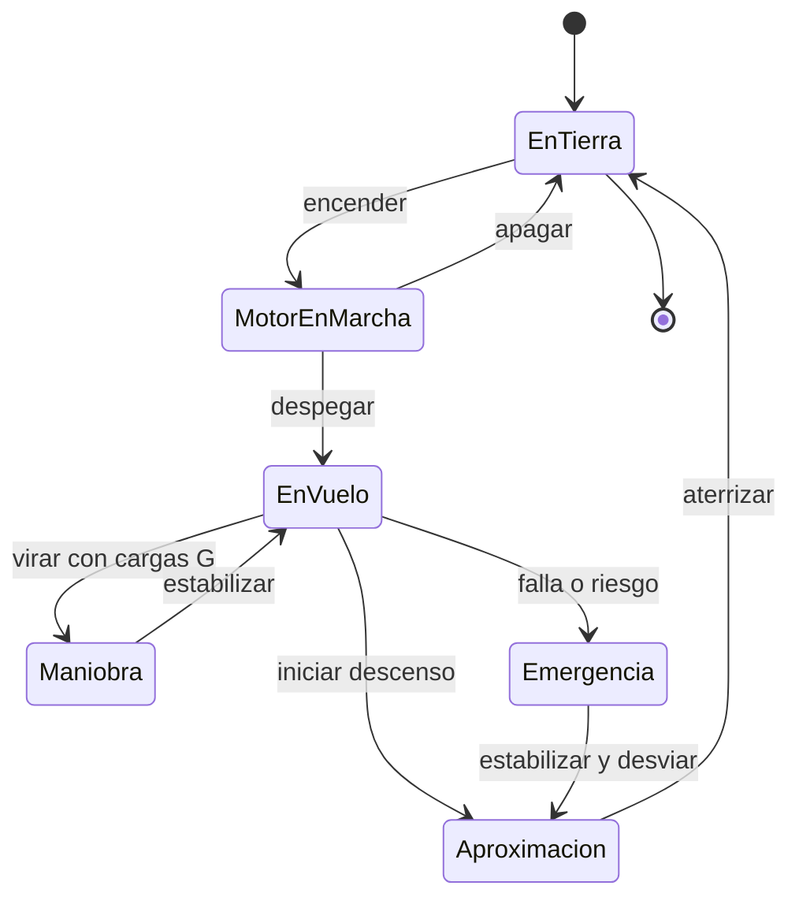

# 🎮 Diseño de simulación del avión de combate

[🏠 Inicio](../../../README.md) · [✈️ Curso: Aviones de combate](../README.md) · 🎮 Simulación

Simulación **educativa** centrada en la física del vuelo a reacción. No modela
sistemas de armas, táctica ni doctrina; su objetivo es enseñar cómo vuela un
reactor.

## Objetivo de la simulación

Que el usuario aprenda a despegar, ascender, volar a alta velocidad, maniobrar
respetando las cargas G, gestionar la energía y aterrizar un avión a reacción, de
forma educativa y sin contenido sensible.

## Nivel de realismo

- Nivel elegido: se ofrece del 1 al 3 (ver `docs/03-niveles-de-realismo.md`).
- Justificación: agrega el vuelo a alta velocidad y las cargas G, por lo que se
  recomienda tras dominar la aviación general.

## Variables principales

| Variable | Tipo | Rango | Afecta a | Comentarios |
| --- | --- | --- | --- | --- |
| Velocidad | numérica | 0-2.0 Mach | Sustentación y resistencia | A alta velocidad se usa Mach. |
| Altitud | numérica | 0-50000 pies | Rendimiento y densidad | Ligada a la presión. |
| Actitud | numérica | -90..90 grados | Trayectoria de vuelo | Referencia del horizonte. |
| Carga G | numérica | -3..9 G | Estructura y piloto | Límite estructural y fisiológico. |
| Empuje del motor | numérica | 0-100% + AB | Aceleración | AB es el posquemador. |
| Energía total | derivada | baja-alta | Capacidad de maniobra | Suma de velocidad y altitud. |
| Combustible | numérica | 0-100% | Autonomía | Incluye reserva. |

## Ciclo básico

1. Leer entrada del usuario (palanca, pedales, empuje, tren, aerofrenos).
2. Actualizar estado del motor y la configuración aerodinámica.
3. Calcular fuerzas: sustentación, peso, empuje y resistencia.
4. Aplicar cargas G, altitud y efectos de alta velocidad.
5. Actualizar velocidad, altitud, actitud y energía.
6. Refrescar instrumentos y alertas (baja velocidad, exceso de G).

## Modos de juego futuros

- Tutorial de cabina y física del vuelo a reacción.
- Práctica de despegue, maniobra y aterrizaje.
- Desafíos de gestión de energía y cargas G.
- Circuitos de navegación a gran altitud.
- Situaciones de emergencia controladas (falla de motor) sin contenido sensible.

## Elementos fuera de alcance

- Sistemas de armas, sensores tacticos o de misión.
- Táctica, doctrina o procedimientos operativos sensibles.
- Datos técnicos que permitan replicar sistemas reales.
- Reproducción de vuelo temerario como objetivo del juego.

## Pendientes

- [ ] Definir valores por defecto de cada variable de vuelo.
- [ ] Prototipar el modelo de cargas G y energía.
- [ ] Ajustar efectos de alta velocidad (Mach) de forma divulgativa.
- [ ] Agregar fuentes públicas a [`manuales/fuentes.md`](../../../manuales/fuentes.md).

---

[⬅️ Anterior: Reglamentos](../reglamentos/reglamentos-avion-combate.md) · [➡️ Siguiente: Recursos](../recursos/recursos-avion-combate.md)
